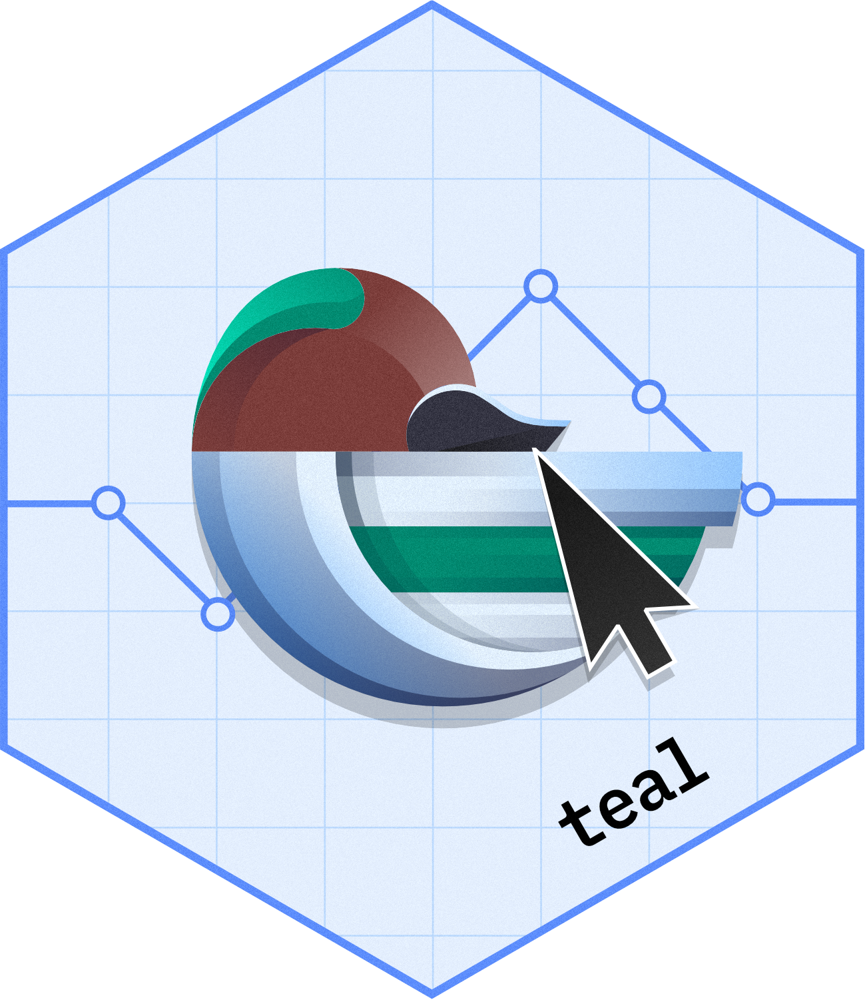
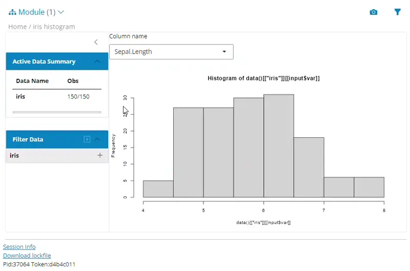

# `teal`: Interactive Exploratory Data Analysis with `Shiny` Web-Applications <a href='https://insightsengineering.github.io/teal/'></a  >

<!-- start badges -->
[](https://cran.r-project.org/package=teal)
[](https://cran.r-project.org/package=teal)
[](https://cran.r-project.org/package=teal)
[](https://cran.r-project.org/package=teal)

[](https://insightsengineering.github.io/teal/main/unit-test-report/)
[](https://insightsengineering.github.io/teal/)
[](https://insightsengineering.github.io/teal/main/coverage-report/)


[](https://www.repostatus.org/#active)
[](https://github.com/insightsengineering/teal/tree/main)
[](https://github.com/insightsengineering/teal/issues?q=is%3Aissue+is%3Aopen+sort%3Aupdated-desc)
<!-- end badges -->

`teal` is a `shiny`-based interactive exploration framework for analyzing data. `teal` applications require app developers to specify:

<!-- markdownlint-disable MD007 MD030 -->
-   Data, which can be:
    -    CDISC data, commonly used for clinical trial reporting
    -    Independent datasets, for example from a `data.frame`
    -    Related datasets, for example a set of `data.frames` with key columns to enable data joins
    -    `MultiAssayExperiment` objects which are `R` data structures for representing and analyzing multi-omics experiments
-   `teal` modules:
    -   `teal modules` are `shiny` modules built within the `teal` framework that specify analysis to be performed. For example, it can be a module for exploring outliers in the data, or a module for visualizing the data in line plots. Although these can be created from scratch, many `teal` modules have been released and we recommend starting with modules found in the following packages:
        -   [`teal.modules.general`](https://insightsengineering.github.io/teal.modules.general/latest-tag/): general modules for exploring relational/independent/CDISC data
        -   [`teal.modules.clinical`](https://insightsengineering.github.io/teal.modules.clinical/latest-tag/): modules specific to CDISC data and clinical trial reporting
        -   [`teal.modules.hermes`](https://insightsengineering.github.io/teal.modules.hermes/latest-tag/): modules for analyzing `MultiAssayExperiment` objects

<!-- markdownlint-enable MD007 MD030 -->

A lot of the functionality of the `teal` framework derives from the following packages:

<!-- markdownlint-disable MD007 MD030 -->
-   [`teal.data`](https://insightsengineering.github.io/teal.data/latest-tag/): creating and loading the data needed for `teal` applications.
-   [`teal.widgets`](https://insightsengineering.github.io/teal.widgets/latest-tag/): `shiny` components used within `teal`.
-   [`teal.slice`](https://insightsengineering.github.io/teal.slice/latest-tag/): provides a filtering panel to allow filtering of data.
-   [`teal.code`](https://insightsengineering.github.io/teal.code/latest-tag/): handles reproducibility of outputs.
-   [`teal.logger`](https://insightsengineering.github.io/teal.logger/latest-tag/): standardizes logging within `teal` framework.
-   [`teal.reporter`](https://insightsengineering.github.io/teal.reporter/latest-tag/): allows `teal` applications to generate reports.

<!-- markdownlint-enable MD007 MD030 -->

## Installation

```r
install.packages("teal")

# install.packages("pak")
pak::pak("insightsengineering/teal@*release")
```

Alternatively, you might also use the development version.

```r
install.packages("teal", repos = c("https://pharmaverse.r-universe.dev", getOption("repos")))

# install.packages("pak")
pak::pak("insightsengineering/teal")
```

## Usage

```r
library(teal)

app <- init(
  data = teal_data(iris = iris),
  modules = list(
    module(
      label = "iris histogram",
      server = function(input, output, session, data) {
        updateSelectInput(session = session,
                          inputId =  "var",
                          choices = names(data()[["iris"]])[1:4])

        output$hist <- renderPlot({
          req(input$var)
          hist(x = data()[["iris"]][[input$var]])
        })
      },
      ui = function(id) {
        ns <- NS(id)
        list(
          selectInput(inputId = ns("var"),
                      label =  "Column name",
                      choices = NULL),
          plotOutput(outputId = ns("hist"))
        )
      }
    )
  )
)

shinyApp(app$ui, app$server)
```



Please see [`teal.gallery`](https://insightsengineering.github.io/teal.gallery/) and [TLG Catalog](https://insightsengineering.github.io/tlg-catalog/) to see examples of `teal` apps.

Please start with the ["Technical Blueprint" article](https://insightsengineering.github.io/teal/latest-tag/articles/blueprint/index.html), ["Getting Started" article](https://insightsengineering.github.io/teal/latest-tag/articles/getting-started-with-teal.html), and then other [package vignettes](https://insightsengineering.github.io/teal/latest-tag/articles/index.html) for more detailed guide.

## Getting help

If you encounter a bug or have a feature request, please file an issue. For questions, discussions, and updates, use the `teal` channel in the [`pharmaverse` slack workspace](https://pharmaverse.slack.com).

## Acknowledgment

This package is a result of a joint efforts by many developers and stakeholders. We would like to thank everyone who contributed so far!

## Stargazers and Forkers

### Stargazers over time

[](https://starchart.cc/insightsengineering/teal)

### Stargazers

[](https://github.com/insightsengineering/teal/stargazers)

### Forkers

[](https://github.com/insightsengineering/teal/network/members)
