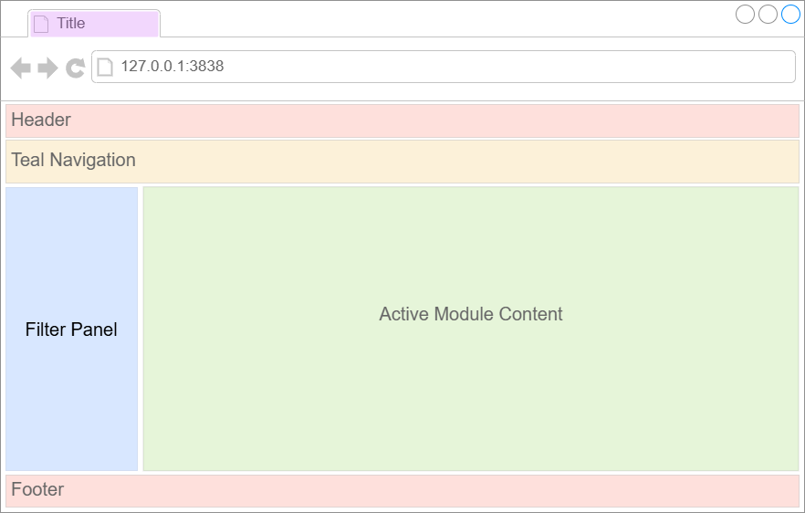

# Getting Started with teal

## Introduction

`teal` is a `shiny`-based interactive exploration framework for
analyzing data, with particular emphasis on CDISC clinical trial data.
`teal` applications allow their users to:

- “Pull” in data from external data sources
- Dynamically filter of data to be used in the analyses
- Generate reproducible code to regenerate the on-screen analyses
- Create and download reports containing results of analyses (for
  analysis modules which support reporting)

In addition, the `teal` framework provides application developers with:

- A large suite of custom-made standard analysis modules to be included
  in applications
- A logging framework to facilitate debugging of applications

More advanced users of the framework can also create new analysis
modules which can be added into any `teal` applications.

## Your first `teal` application:

This simple `teal` application takes the `iris` and `mtcars` datasets
and displays their contents:

``` r
library(teal)

app <- init(
  data = teal_data(IRIS = iris, MTCARS = mtcars),
  modules = modules(
    example_module("Module 1"),
    example_module("Module 2")
  ),
  filter = teal_slices(
    teal_slice(dataname = "IRIS", varname = "Species", selected = "setosa")
  )
) |>
  modify_title("My first teal application") |>
  modify_header(h3("My first teal application")) |>
  modify_footer(tags$div(a("Powered by teal", href = "https://insightsengineering.github.io/teal/latest-tag/")))

if (interactive()) {
  shinyApp(app$ui, app$server)
}
```

*Hovering* the image shows the `teal` application generated by this
code.



Every `teal` application is composed of the following elements, all of
which can be controlled by the app developer by passing arguments to the
`init` function:

- Application Title *(browser’s tab title)*: is the title of the
  application.
- Application Header and Footer *(the top and the bottom of the app)*:
  any content to be placed at the top and bottom of the application.
- Teal Navigation *(tabs under the header)*: drop-down widgets to
  navigate to different teal modules along with other application
  navigation buttons.
  - In the example code: there are two modules named “Module 1” and
    “Module 2”.
- Module Content *(panel on the middle)*: the outputs of the currently
  active module.
- Filter Panel *(panel on the right hand side)*: for filtering the data
  to be passed into all `teal` modules.
  - In the example code: the filter panel is being initialized with a
    filter for the `Species` variable in the `iris` dataset.

## Try the above app in `shinylive`

## Creating your own applications

The key function to use to create your `teal` application is `init`,
which requires two mandatory arguments: `data` and `modules`. There are
other optional arguments for `init`, which can be used to customize the
application. Please refer to the documentation for `init` for further
details.

### Application data

The `data` argument in the `init` function specifies the data used in
your application. All datasets which are about to be used in `teal`
application must be passed through `teal_data` object. It is also
possible to specify relationships between the datasets using the
`join_keys` argument but in this case the datasets are not related. See
[this
vignette](https://insightsengineering.github.io/teal/articles/including-data-in-teal-applications.md)
for details. If data is not available and has to be pulled from a remote
source, `init` must receive a `teal_data_module` that specifies how to
obtain the desired datasets and put them into a `teal_data` object. See
[this
vignette](https://insightsengineering.github.io/teal/articles/data-as-shiny-module.md)
for details.

In order to use CDISC clinical trial data in a `teal` application the
`cdisc_data` function is used instead. Custom `SDTM` standards can be
handled with `teal_data` and `join_keys`.

For further details, we recommend exploring the
[`teal.data`](https://insightsengineering.github.io/teal.data/) package
documentation.

### Modules

The `modules` argument to `init` consists of a list of `teal` modules
(which can be wrapped together using the function `modules`). Core
`teal` developers have created several universal `teal` modules that can
be useful in any `teal` application. To learn how to create your own
modules, please explore [Creating Custom Modules
vignette](https://insightsengineering.github.io/teal/articles/creating-custom-modules.md).
To use our predefined modules, see the references below for links to
these modules.

### Defining filters

The optional `filter` argument in `init` allows you to initialize the
application with predefined filters. For further details see [Filter
Panel
vignette](https://insightsengineering.github.io/teal/articles/filter-panel.md).

### Reporting

If any of the `modules` in your `teal` application support reporting
(see
[`teal.reporter`](https://insightsengineering.github.io/teal.reporter/)
for more details), users of your application can add the outputs of the
modules to a report. This report can then be downloaded and a special
*Report Previewer* module will be added to your application as an
additional tab, where users can view and configure their reports before
downloading them. See more details in [this
vignette](https://insightsengineering.github.io/teal/articles/adding-support-for-reporting.md).

### Reproducible code

`teal` hands over data with reproducible code to every module included
in the application. Note that `teal` does not display the code, that is
the modules’ responsibility. For example, the `example_module` function
used above shows the code in the main panel together with other outputs.
For more details see [this
vignette](https://insightsengineering.github.io/teal/articles/including-data-in-teal-applications.md).

### Embedding teal in shiny application

Advanced `shiny` users can include teal application in their `shiny`
application. For further details see [teal as a
module](https://insightsengineering.github.io/teal/articles/teal-as-a-shiny-module.md).

## Where to go next

To learn more about the `teal` framework we recommend first exploring
some of the available analysis modules.

For example see:

- [general analysis
  modules](https://insightsengineering.github.io/teal.modules.general/)
- [clinical trial reporting
  modules](https://insightsengineering.github.io/teal.modules.clinical/)
- [modules for analyzing `MultiAssayExperiment`
  objects](https://insightsengineering.github.io/teal.modules.hermes/)

For a demo of `teal` apps see:

- [The gallery of sample apps based on
  teal](https://insightsengineering.github.io/teal.gallery/)
- [A catalog of Tables, Listings and
  Graphs](https://insightsengineering.github.io/tlg-catalog/)
- [A catalog of Biomarker Analysis Templates of Tables And
  Graphs](https://insightsengineering.github.io/biomarker-catalog/)

The `teal` framework relies on a set of supporting packages whose
documentation provides more in-depth information. The packages which are
of most interest when defining `teal`applications are:

- [`teal.data`](https://insightsengineering.github.io/teal.data/):
  defining data for `teal` application.
- [`teal.slice`](https://insightsengineering.github.io/teal.slice/):
  defining data filtering before passing into `teal` modules.
