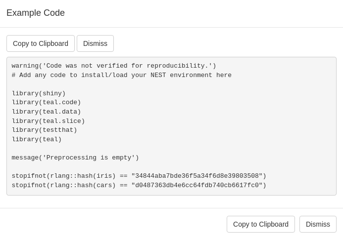
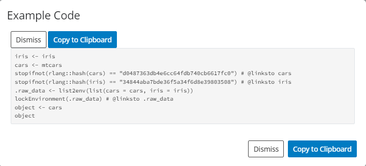

# Including Data in teal Applications

## Data in `teal` Applications

The `teal` framework readily accepts general, non-relational data.
Modules defined in the `teal.modules.general` package are designed to
work well with that kind of data. Relational data is handled just as
well and the mechanism of passing data to applications is virtually the
same. This includes clinical data that conforms to the `ADaM` standard.
We are working on making the framework extendable so that support for
other data structures can be added with relative ease. Currently some
support is offered for the `MultiAssayExperiment` class.

All applications use the `teal_data` class as a data container.
`teal_data` objects are passed to `init` to build the application, where
they are modified by the filter panel (if applicable) and passed on to
modules. Thus, the first step of building a `teal` app is creating a
`teal_data` object.

### General data

A `teal_data` object is created by calling the `teal_data` function and
passing data objects as `name:value` pairs.

[`library`](https://rdrr.io/r/base/library.html)`(`[`teal`](https://insightsengineering.github.io/teal/)`)`` `` ``# create teal_data`` ``data`` ``<-`` `[`teal_data`](https://insightsengineering.github.io/teal.data/latest-tag/reference/teal_data.html)`(``iris ``=`` ``iris``, cars ``=`` ``mtcars``)`

Note that `iris` and `cars` have been added to the `datanames` property
of `data` (see [`datanames` property](#teal_data-properties)).

This is sufficient to run a `teal` app.

`# build app`` ``app`` ``<-`` `[`init`](https://insightsengineering.github.io/teal/reference/init.md)`(`` `` data ``=`` ``data``,`` `` modules ``=`` `[`example_module`](https://insightsengineering.github.io/teal/reference/example_module.md)`(``)`` ``)`` `` ``# run app`` `[`shinyApp`](https://rdrr.io/pkg/shiny/man/shinyApp.html)`(``app``$``ui``, ``app``$``server``)`

### Reproducible data

A `teal_data` object stores data in a separate environment. Therefore,
modifying the stored datasets requires that processing code be evaluated
in that environment. Following that logic, one can create an empty
`teal_data` object and populate it by evaluating code. This can be done
using the `eval_code` function or, more conveniently, using the `within`
function.

`# create empty object`` ``data_empty`` ``<-`` `[`teal_data`](https://insightsengineering.github.io/teal.data/latest-tag/reference/teal_data.html)`(``)`` `` ``# run code in the object`` ``data_populated_1`` ``<-`` `[`eval_code`](https://insightsengineering.github.io/teal/reference/teal_data_module.md)`(``data_empty``, code ``=`` ``"iris <- iris`` `` cars <- mtcars"``)`` ``# alternative`` ``data_populated_2`` ``<-`` `[`within`](https://insightsengineering.github.io/teal/reference/teal_data_module.md)`(``data_empty``, ``{`` `` ``iris`` ``<-`` ``iris`` `` ``cars`` ``<-`` ``mtcars`` ``}``)`

The key difference between `eval_code` and `within` is that the former
accepts code as character vector or language objects (`call`s and
`expression`s), while `within` accepts *only* inline code. For a deeper
understanding check the low level class
[`?qenv`](https://insightsengineering.github.io/teal.code/latest-tag/reference/qenv.html)
for more details.

Note that in the first example `data` was created by passing data
objects. If it can be found on the base environment it will be processed
without errors:

However, if there isn’t code to generate the object they cannot be
reproduced. This creates an object with an error like in a interactive R
session (and will cause the application to fail). Inspecting object
reveals it:

`m`` ``<-`` `[`diag`](https://rdrr.io/r/base/diag.html)`(``5``)`` ``data_populated_3`` ``<-`` `[`eval_code`](https://insightsengineering.github.io/teal/reference/teal_data_module.md)`(``data_empty``, code ``=`` ``"D5 <- m"``)`` ``data_populated_3`` ``#> <qenv.error: object 'm' not found `` ``#> when evaluating qenv code:`` ``#> D5 <- m>`

The necessary code can be supplied to the `code` argument of the to the
`eval_code` function .

`data_populated_4`` ``<-`` `[`eval_code`](https://insightsengineering.github.io/teal/reference/teal_data_module.md)`(``data_empty``, code ``=`` ``"D5 <- diag(5)"``)`` ``data_populated_4`` ``#> ✅︎ code verified`` ``#> ``<environment: 0x55fdeff060e8>`` 🔒 `` ``#> Parent: <environment: package:teal> `` ``#> ``Bindings:`` ``#> ``- D5: [matrix]`

As you can see above the output shows that is a verified object. On an
application we don’t see that message but the reproducible code will be
shown, as we can see using the `data_populated_2` object:

#### code from file

The ability to pass code as a character vector to `eval_code` opens the
door to using code stored in a file.

`# not run`` ``data_from_file`` ``<-`` `[`teal_data`](https://insightsengineering.github.io/teal.data/latest-tag/reference/teal_data.html)`(``)`` ``data_from_file`` ``<-`` `[`eval_code`](https://insightsengineering.github.io/teal/reference/teal_data_module.md)`(``data``, `[`readLines`](https://rdrr.io/r/base/readLines.html)`(``"<path_to_file>"``)``)`

### Creating data in-app

The one departure from passing a `teal_data` object to `init` is when
the data does not exist in the environment where the app is run, *e.g.*
when it has to be pulled from a remote source. In those cases a
`teal_data_module` must be used. See [this
vignette](https://insightsengineering.github.io/teal/articles/data-as-shiny-module.md)
for a detailed description.

\

## Clinical data

Currently `teal` supports two specialized data formats.

### `ADaM` data

The `ADaM` data model, defined in CDISC standards, specifies
relationships between the subject-level parent dataset and
observation-level child datasets. The `cdisc_data` function takes
advantage of that fact to automatically set default joining keys (see
[`join_keys` property](#join_keys)). In the example below, two standard
`ADaM` datasets (`ADSL` and `ADTTE`) are passed to `cdisc_data`.

`# create cdisc_data`` ``data_cdisc`` ``<-`` `[`cdisc_data`](https://insightsengineering.github.io/teal.data/latest-tag/reference/cdisc_data.html)`(``ADSL ``=`` ``teal.data``::`[`rADSL`](https://insightsengineering.github.io/teal.data/latest-tag/reference/random_cdisc_data.html)`, ADTTE ``=`` ``teal.data``::`[`rADSL`](https://insightsengineering.github.io/teal.data/latest-tag/reference/random_cdisc_data.html)`)`` `` `[`names`](https://rdrr.io/r/base/names.html)`(``data_cdisc``)`` ``#> [1] "ADSL" "ADTTE"`` `[`join_keys`](https://insightsengineering.github.io/teal.data/latest-tag/reference/join_keys.html)`(``data_cdisc``)`` ``#> A join_keys object containing foreign keys between 2 datasets:`` ``#> ADSL: [STUDYID, USUBJID]`` ``#> <-- ADTTE: [STUDYID, USUBJID]`` ``#> ADTTE: [STUDYID, USUBJID, PARAMCD]`` ``#> --> ADSL: [STUDYID, USUBJID]`

`app`` ``<-`` `[`init`](https://insightsengineering.github.io/teal/reference/init.md)`(`` `` data ``=`` ``data_cdisc``,`` `` modules ``=`` `[`example_module`](https://insightsengineering.github.io/teal/reference/example_module.md)`(``)`` ``)`` `[`shinyApp`](https://rdrr.io/pkg/shiny/man/shinyApp.html)`(``app``$``ui``, ``app``$``server``)`

### `MultiAssayExperiment` data

The `MultiAssayExperiment` package offers a data structure for
representing and analyzing multi-omics experiments that involve
multi-modal, high-dimensionality data, such as DNA mutations, protein or
RNA abundance, chromatin occupancy, etc., in the same biological
specimens.

The `MultiAssayExperiment` class is described in detail
[here](https://www.bioconductor.org/packages/release/bioc/vignettes/MultiAssayExperiment/inst/doc/MultiAssayExperiment.html).

`MultiAssayExperiment` objects (MAEs) are placed in `teal_data` just
like normal objects.

[`library`](https://rdrr.io/r/base/library.html)`(`[`MultiAssayExperiment`](http://waldronlab.io/MultiAssayExperiment/)`)`` ``utils``::`[`data`](https://rdrr.io/r/utils/data.html)`(``miniACC``)`` `` ``data_mae`` ``<-`` `[`teal_data`](https://insightsengineering.github.io/teal.data/latest-tag/reference/teal_data.html)`(``MAE ``=`` ``miniACC``)`` `` ``app`` ``<-`` `[`init`](https://insightsengineering.github.io/teal/reference/init.md)`(`` `` data ``=`` ``data_mae``,`` `` modules ``=`` `[`example_module`](https://insightsengineering.github.io/teal/reference/example_module.md)`(``)`` ``)`` `[`shinyApp`](https://rdrr.io/pkg/shiny/man/shinyApp.html)`(``app``$``ui``, ``app``$``server``)`

Due to the unique structure of a MAE, `teal` requires special
considerations when building `teal` modules. Therefore, we cannot
guarantee that all modules will work properly with MAEs. The package
[`teal.modules.hermes`](https://insightsengineering.github.io/teal.modules.hermes/latest-tag/)
has been developed specifically with MAE in mind and will be more
reliable.

The filter panel supports MAEs out of the box.

\

## `teal_data` properties

##### `join_keys`

Using relational data requires specifying joining keys for each pair of
datasets. Primary keys are unique row identifiers in individual datasets
and thus should be specified for each dataset. Foreign keys describe
mapping of variables between datasets. Joining keys are stored in the
`join_keys` property, which can be set when creating a `teal_data`
object, using the `join_keys` argument, or using the `join_keys`
function.

`ds1`` ``<-`` `[`data.frame`](https://rdrr.io/r/base/data.frame.html)`(`` `` id ``=`` `[`seq`](https://rdrr.io/r/base/seq.html)`(``1``, ``10``)``,`` `` group ``=`` `[`rep`](https://rdrr.io/r/base/rep.html)`(`[`c`](https://rdrr.io/r/base/c.html)`(``"A"``, ``"B"``)``, each ``=`` ``5``)`` ``)`` ``ds2`` ``<-`` `[`data.frame`](https://rdrr.io/r/base/data.frame.html)`(`` `` group ``=`` `[`c`](https://rdrr.io/r/base/c.html)`(``"A"``, ``"B"``)``,`` `` condition ``=`` `[`c`](https://rdrr.io/r/base/c.html)`(``"condition1"``, ``"condition2"``)`` ``)`` ``keys`` ``<-`` `[`join_keys`](https://insightsengineering.github.io/teal.data/latest-tag/reference/join_keys.html)`(`` `` `[`join_key`](https://insightsengineering.github.io/teal.data/latest-tag/reference/join_key.html)`(``"DS1"``, keys ``=`` ``"id"``)``,`` `` `[`join_key`](https://insightsengineering.github.io/teal.data/latest-tag/reference/join_key.html)`(``"DS2"``, keys ``=`` ``"group"``)``,`` `` `[`join_key`](https://insightsengineering.github.io/teal.data/latest-tag/reference/join_key.html)`(``"DS1"``, ``"DS2"``, keys ``=`` `[`c`](https://rdrr.io/r/base/c.html)`(``"group"`` ``=`` ``"group"``)``)`` ``)`` ``data_relational1`` ``<-`` `[`teal_data`](https://insightsengineering.github.io/teal.data/latest-tag/reference/teal_data.html)`(``DS1 ``=`` ``ds1``, DS2 ``=`` ``ds2``, join_keys ``=`` ``keys``)`` ``data_relational2`` ``<-`` `[`teal_data`](https://insightsengineering.github.io/teal.data/latest-tag/reference/teal_data.html)`(``DS1 ``=`` ``ds1``, DS2 ``=`` ``ds2``)`` `[`join_keys`](https://insightsengineering.github.io/teal.data/latest-tag/reference/join_keys.html)`(``data_relational2``)`` ``<-`` ``keys`

For a detailed explanation of join keys, see [this `teal.data`
vignette](https://insightsengineering.github.io/teal.data/latest-tag/articles/join-keys.html).

[(back to `ADaM` Data)](#adam-data)

##### `verified`

`teal_data` allows for tracking code from data creation through data
filtering through data analysis so that the whole process can be
reproduced. The `verified` property designates whether or not
reproducibility has been confirmed. `teal_data` objects that are created
empty and only modified by evaluating code within them are considered
verified by default. Those created with data objects alone or with data
objects and code are not verified by default, but can become verified by
running the `verify` function.

`data_with_objects_and_code`` ``<-`` `[`teal_data`](https://insightsengineering.github.io/teal.data/latest-tag/reference/teal_data.html)`(``iris ``=`` ``iris``, cars ``=`` ``mtcars``, code ``=`` `[`expression`](https://rdrr.io/r/base/expression.html)`(``iris`` ``<-`` ``iris``, ``cars`` ``<-`` ``mtcars``)``)`` ``data_with_objects_and_code`` ``#> ✖ code unverified`` ``#> ``<environment: 0x55fdee408db0>`` 🔒 `` ``#> Parent: <environment: package:teal> `` ``#> ``Bindings:`` ``#> ``- cars: [data.frame]`` ``#> - iris: [data.frame]`` `` ``data_with_objects_and_code_ver`` ``<-`` `[`verify`](https://insightsengineering.github.io/teal.data/latest-tag/reference/verify.html)`(``data_with_objects_and_code``)`` ``data_with_objects_and_code_ver`` ``#> ✅︎ code verified`` ``#> ``<environment: 0x55fdee408db0>`` 🔒 `` ``#> Parent: <environment: package:teal> `` ``#> ``Bindings:`` ``#> ``- cars: [data.frame]`` ``#> - iris: [data.frame]`

For a detailed explanation of verification, see [this `teal.data`
vignette](https://insightsengineering.github.io/teal.data/latest-tag/articles/teal-data-reproducibility.html).

[(back to Reproducible Data)](#reproducible-data)

\

##### Hidden datasets

Objects which name starts with a dot (.) are hidden in teal_data and the
whole teal application. This can be used to pass auxiliary objects in
the `teal_data` instance, without exposing them to the app user. For
example:

- Proxy variables for column modifications
- Temporary datasets used to create final ones
- Connection objects

`my_data`` ``<-`` `[`teal_data`](https://insightsengineering.github.io/teal.data/latest-tag/reference/teal_data.html)`(``)`` ``my_data`` ``<-`` `[`within`](https://insightsengineering.github.io/teal/reference/teal_data_module.md)`(``my_data``, ``{`` `` ``.data1`` ``<-`` `[`data.frame`](https://rdrr.io/r/base/data.frame.html)`(``id ``=`` ``1``:``10``, x ``=`` ``11``:``20``)`` `` ``.data2`` ``<-`` `[`data.frame`](https://rdrr.io/r/base/data.frame.html)`(``id ``=`` ``1``:``10``, y ``=`` ``11``:``20``)`` `` ``data`` ``<-`` `[`merge`](https://rdrr.io/r/base/merge.html)`(``.data1``, ``.data2``)`` ``}``)`` `` `[`ls`](https://rdrr.io/r/base/ls.html)`(``my_data``)`` ``#> [1] "data"`` `[`names`](https://rdrr.io/r/base/names.html)`(``my_data``)`` ``#> [1] "data"`` `` ``app`` ``<-`` `[`init`](https://insightsengineering.github.io/teal/reference/init.md)`(``data ``=`` ``my_data``, modules ``=`` `[`example_module`](https://insightsengineering.github.io/teal/reference/example_module.md)`(``)``)`` `` ``if`` ``(`[`interactive`](https://rdrr.io/r/base/interactive.html)`(``)``)`` ``{`` `` `[`shinyApp`](https://rdrr.io/pkg/shiny/man/shinyApp.html)`(``app``$``ui``, ``app``$``server``)`` ``}`

## Further reading

For a complete guide to the `teal_data` class, please refer to the
[`teal.data`
package](https://insightsengineering.github.io/teal.data/latest-tag/).
