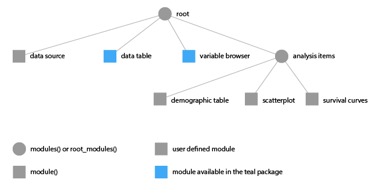

## Introduction

*teal* is a shiny based interactive exploration framework for analyzing clinical
trials data. `teal` currently provides a dynamic filtering facility and 
different data viewers. `teal` shiny applications are built using standard
[shiny modules][shiny_modules].

The introduction example in this document is very basic, you can study the code
for an actial application that we deployed to analyze ATEZO data. You can find
that application code
[here](https://github.roche.com/waddella/atezo-pooled-analysis-shinyapp).

## Initializing A Teal application

The workflow to create a shiny app using teal is as follows. The `teal::init` 
function is used to create a shiny `server` and `ui` function which in turn can 
then be passed to the `shiny::shinyApp` function to start a shiny application. 
The following code is sufficient for a [single file shiny 
app][shiny_single_file_app].

```{r, eval=FALSE} 
library(teal)

ASL <- generate_sample_data('ASL')
ARS <- generate_sample_data('ARS')
ATE <- generate_sample_data('ATE')

x <- teal::init(
  data =  list(ASL = ASL, ARS = ARS, ATE = ATE),
  modules = root_modules(
    module(
      "data source",
      server = function(input, output, session, datasets) {},
      ui = function(id) div(p("information about data source")),
      filters = NULL
    ),
    tm_data_table(),
    tm_variable_browser(),
    modules(
      label = "analysis items",
      tm_table(
        label = "demographic table",
        dataname = "ASL",
        xvar = "SEX",
        yvar = "RACE",
        yvar_choices = c("RACE", "AGEGR", "REGION")
      ),
      tm_scatterplot(
        label = "scatterplot",
        dataname = "ASL",
        xvar = "AGE",
        yvar = "BBMI",
        color_by = "_none_",
        color_by_choices = c("_none_", "STUDYID")
      ),
      module(
        label = "survival curves",
        server = function(input, output, session, datasets) {},
        ui = function(id) div(p("Kaplan Meier Curve")),
        filters = "ATE"
      )
    )
  ),
  header = tags$h1("Sample App"),
  footer = tags$p("Copyright 2017")
)

shinyApp(x$ui, x$server)
```


This will produce the following webapp (I switched to the data table tab):


That is, we see a web app with a navigation bar at the top, the filter elements 
on the right, and the data table viewer in the center. The data table and the 
variable browser are two items that we provide with teal. Other items can be added 
using shiny modules. Note that if you would like to deploy the above app to a
shiny server then place the code into an `app.R` file.

Note that each function in the teal package is documented. Run

```{r, eval=FALSE}
library(teal)
help(package = "teal")
```

In the remainder of this section we will discuss all the elements that we
specified to get to this application.

### General Layout

The following mackup shows an abstraction of the elements that are created in
each teal application:


These containers correspond to actual html block elements and we use shiny's 
default layout manager [bootstrap 3](http://getbootstrap.com) with a 
fluid-container. Web-app based on teal can control the following:

 - analysis data
 - header and footer content
 - the navbar menu items that define the tab content
 - and the content in the "Tab Content" element by using [shiny
modules](https://shiny.rstudio.com/articles/modules.html)
 - whether the filter panel is shown or not and what filters are shown

And the following items can currently not be controlled:

 - layout outside of the "Tab Contents" box
 - filter setup

### Data

In the code listing above we specified the analysis data with a named list that 
is passed to the `data` argument of `teal::init`. Because we filter every other 
data set with the ASL filters (more on this below) you always need to specify 
the `ASL` data with the `USUBJID` variable. Note that the dataset names are case
sensitive.


### Navigation Tabs, Application Content, Shiny Modules

The second argument of `teal::init` that we specified in the code listing above 
is the `modules` arguments. Modules define the elements displayed with tabs in
the *Navbar* and their corresponding content in the *Tabs Content* box. A
`modules` object can contain `module` and `modules` objects. For the app defined
above this tree looks as follows:



Note that we currently only allow a tree of depth 2 and we start the tree with
the `root_modules` function which is a wrapper around `modules` that sets the
`label` argument to `"root"`.

The [shiny modules][shiny_modules] are specified in the `module` function with
the `server` and `ui` argument. Both, `module` and `modules` are documented 
in the `teal` package, see `?module` and `?modules`.


## Accessing the Analysis Data in Shiny Modules

`teal` encaplulates all analysis datasets and provides the filtering facility. 
The filtered and unfiltered data is then made accessible via a `FilteredData` 
object that we usually assign to a `datasets` variable. The `FilteredData` class
is based on the [R6][R6] object system and we initally did not intend to expose 
that object to the `teal` package user. Hence there are some public methods to
the `FilteredData` class that are not safe to use. It's best to only use the
`get_data` method when writing [shiny modules][shiny_modules]. The `get_data`
method returns either a reactive or a static version of the filtered or
unfitered dataset of interest.

Assume we create the following `module` with the shiny modules

```{r, eval = FALSE}
module(
  label = "Frequency Table",
  ui = function(id) {
    ns <- NS(id)
    tableOutput(ns("freq_table"))
  },
  server = function(input, output, session, datasets) {
    output$freq_table <- renderTable({
      asl <- datasets$get_data("asl", reactive = TRUE, filtered=TRUE)
      table(asl$SEX)
    })
  }
)
```

This analysis item shows up as *Frequency Table* in the navbar and displays a 
table of the `ASL.SEX` variable in the *Tab Contents* section of the app. The 
`ui` function requires the `id` argument, as defined in [shiny 
modules][shiny_modules] and the `server` function requires the three arguments 
`input`, `output`, and `session`. The `dataset` argument is added to the 
`server` function call by `teal` based on the `server_args` argument list 
specified in the `module` function. The `server_args` expects a named list 
with additional arguments that should be passed to the server function. The list
names (e.g. `datasets` in the above code) map to the argument names and the 
content is usually mapped one-to-one with the expection of some keywords such as
`tead_datasets` which will be replaced by teal with the `FilteredData` object 
mentioned above. Note that when you extract a dataset from the `FilteredData`
object (here associated with the `datasets` variable) then you should always use
the argument `filtered=TRUE` in the `get_data` method to keep the application
interaction coherent.


## Filtering

Currently we apply a specific filtering mechanism that is useful for clinical 
trials data and that requires an `ASL` analysis dataset to be part of every 
`teal` app. That is, the filter framework provides lets the user dynamically 
specify which variables she/he wants to use for filtering (using ranges or 
categories). Teal then creates the `subset` code for each filter condition and
links them with an elementwise logical **AND**  operator (i.e. `&`). Further,
all datasets other then `ASL` will also be filtered with the remaining subjects
in `ASL` through the `ASL.USUBJID` and `ASL.STUDYID` variables. Hence, assume
you have the following three filters

 - `ASL.STUDYID %in% c('BP29392', 'WP29945')` 
 - `ASL.AGE > 15 & ASL.AGE < 35`
 - `ARS.ADY > 0 & ARS.ADY < 500`

Then then `FiteredData` object will perform the following operations to obtain
the filtered `ARS` object in one of your moduls:

```{r, eval=FALSE}
ASL_FILTERED <- subset(ASL, ASL.STUDYID %in% c('BP29392', 'WP29945') & ASL.AGE > 15 & ASL.AGE < 35)
ARS_FILTERED_ALONE <- subset(ARS, ARS.ADY > 0 & ARS.ADY < 500)

ARS_FILTERED <- merge(x = ASL_FILTERED,
                      y = ARS_FILTERED_ALONE, 
                      by = c("USUBJID", "STUDYID"), all.x = FALSE, all.y = FALSE)
```


## Additional Information

### Defining Custom Header and Footers

The `teal::init` function also has the `header` and `footer` arguments that 
expectes an object of class `shiny.tag` which can be created with the functions 
stored in the `tags` list (exported by shiny). So, a possible header could be
defined as follows:

```{r, eval=FALSE}
tags$div(tags$h1("My New Analysis Web-app"), tags$p(class="pull-left", "Logo"))
```


### Production Setup and Version Control

Teal is currently under active development and features and bug-fixes get added 
frequently and we also reserve the freedom to change the API. You can download
the latest `teal` versions from the [GithHub repository][teal_git] and
eventually we will release versions also on the [GRAN][gran] server that you can
install via `devtools::install_version`.

I recommend not to version control your whole shiny app with [packrat][packrat]
if not necessary. In order to version control teal for your deployed shiny app
you can install the teal version of choice into folder within the shiny app and
then load that `teal` package explicitly. To do so we 

```{bash, eval=FALSE}
ssh bee.roche.com

module load R-library/2017Q1-gompi-2017a-R-3.3.1
R 
```

In R install these packages if you havent already

```{r, eval = FALSE}
install.packages(c('roxygen2', 'whiksers', 'devtools'), dependencies = TRUE)
```

Then exit `R` with `q()` and back on the bash clone the teal repository, build it and install it locally

```{bash, eval = FALSE}
cd ~/
git clone https://github.roche.com/waddella/teal
R CMD BUILD teal

cd /srv/shiny-server/MY-APP

mkdir libs
R CMD INSTALL -l ./libs ~/teal_0.0.1.tar.gz
```

And then in your `app.R` file in the `/srv/shiny-server/MY-APP` folder add the
following code

```{r, eval=FALSE}
.libPaths(c(normalizePath("./libs"), .libPaths()))
```

before you load the `teal` library with `library(teal)`.

You may also watch the video
[here](https://github.roche.com/waddella/videos/raw/master/teal/getting_started_with_teal.mp4)
that explains these steps to set up a teal project.


[shiny_modules]: https://shiny.rstudio.com/articles/modules.html "Modularizing Shiny app code"
[shiny_single_file_app]: https://shiny.rstudio.com/articles/single-file.html "Single-file Shiny apps"
[R6]: https://cran.r-project.org/web/packages/R6/vignettes/Introduction.html "Introduction to R6 classes"
[teal_git]: https://github.roche.com/waddella/teal "Teal GitHub Repository"
[gran]: http://gran.roche.com "Roche R Package Server"
[packrat]: https://rstudio.github.io/packrat/ "Packrat is a dependency management system for R"
