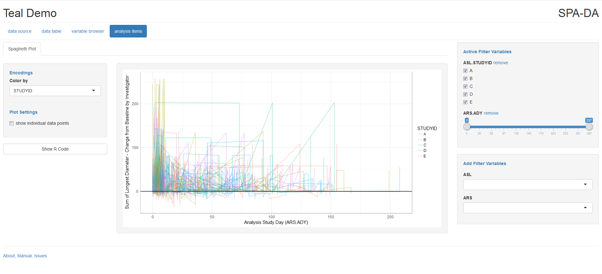
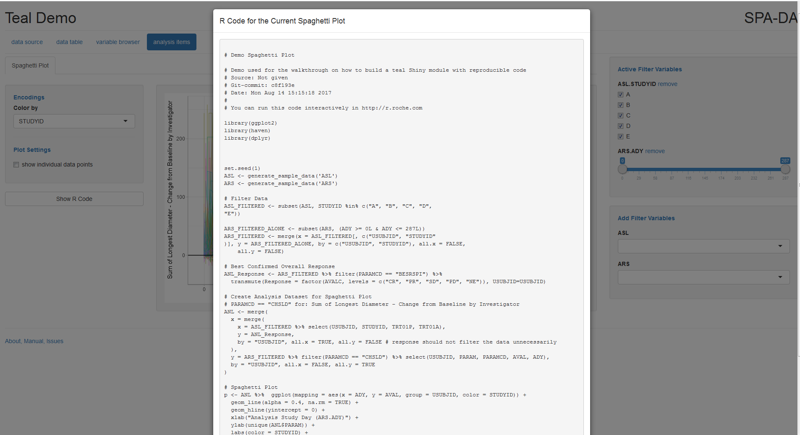

```{r, echo = F, warning = F, message = F}
library(teal)
```

## Introduction

This vignette details how to create visualizations in a teal/Shiny app with a 
"Show R Code" button that provides the exact code to reproduce the displayed 
outputs with an R-session. The demonstration for spaghetti plot (see screenshot 
below) in this vignette uses dummy data.

<br>




<br>

**Summary of steps:**     
 
1. Create the static visualization (don't think of it as being part of a Shiny
app just yet)     
 
2. Divide the analysis code into logical chunks and tag each chunk
with either *# @start_<chunkname>* and *# @end_<chunkname>* in case of
multi-line chunks, or *# @oneline_<chunkname>* for single-line chunks     
 
3. Convert the code chunks into a Shiny module by splitting them into [reactive]
expressions     
 
4. Incorporate dynamic plot encodings       
 
5. Use `parse_code_chunks` to create the reproducible R code     
 
The `parse_code_chunks` function reads a R script file, and returns a named list
with the tagged code chunks. The output from `parse_code_chunks` can then be
used to create the code used to re-produce the data visualization (or output in
general). For more details, please refer to the function documentation using
`?parse_code_chunks`.

The advantage of parsing code chunks is that the code lives within the module 
script, which can be debugged as long as the VADs are made available, such as by
saving from a Shiny session using `as_global` (see section on debugging).

## Demonstration on Spaghetti Plot

### Step 1: Create Static Visualization

The code to create the spaghetti plot is as follows:

```{r, eval = F}
library(teal)
library(dplyr)
library(ggplot2)

set.seed(1) # Ensures reproducible data produced

# Generates dummy data
ASL <- generate_sample_data("ASL", N = 1000)
ARS <- generate_sample_data("ARS", N = 1000)

# Apply filters to data
ASL_FILTERED <- subset(ASL, STUDYID %in% c("A", "B", "C", "D", "E")) 

ARS_FILTERED_ALONE <- subset(ARS, (ADY >= 0L & ADY <= 250L)) # Filters

ARS_FILTERED <- merge(x = ASL_FILTERED[, c("USUBJID", "STUDYID")], 
                      y = ARS_FILTERED_ALONE, by = c("USUBJID", "STUDYID"), 
                      all.x = FALSE, all.y = FALSE)

# Best Confirmed Overall Response
ANL_Response <- ARS_FILTERED %>% filter(PARAMCD == "BESRSPI") %>%
  transmute(Response = factor(AVALC, levels = c("CR", "PR", "SD", "PD", "NE")), USUBJID=USUBJID)

# Create Analysis Dataset for Spaghetti Plot
# PARAMCD == "CHSLD" for: Sum of Longest Diameter - Change from Baseline by Investigator
ANL <- merge(
  x = merge(
    x = ASL_FILTERED %>% select(USUBJID, STUDYID, TRT01P, TRT01A),
    y = ANL_Response,
    by = "USUBJID", all.x = TRUE, all.y = FALSE # response should not filter the data unnecessarily
  ),
  y = ARS_FILTERED %>% filter(PARAMCD == "CHSLD") %>% select(USUBJID, PARAM, PARAMCD, AVAL, ADY),
  by = "USUBJID", all.x = FALSE, all.y = TRUE
)

# Spaghetti Plot
p <- ANL %>%  ggplot(mapping = aes(x = ADY, y = AVAL, group = USUBJID, color = STUDYID)) + 
  geom_line(alpha=0.4, na.rm=TRUE) +
  geom_hline(yintercept = 0) +
  xlab("Analysis Study Day (ARS.ADY)") +
  ylab(unique(ANL$PARAM)) +
  labs(color = "STUDYID") +
  theme_light(base_size = 14)

p
```

### Step 2: Divide the Code into Logical Chunks

The reason for dividing the code into chunks is that when we make the code
reactive for Shiny, we want to re-calculate as little as possible when encodings
and filter conditions are changed in the individual chunks.

One way to divide the above code for spaghetti plot into logical chunks is as
follows:     
 
1. Load libraries and read in the data     
 
2. Filter the data     
 
3. Get the response values     
 
4. Merge the data           
 
5. Plot the data     
 
R code chunks can be tagged with *# @start_<chunkname>* and *#
@end_<chunkname>*, or with *# @oneline_<chunkname>* if we want to tag a single
line. The code chunks should be given unique and descriptive names. We begin by
tagging chunks 3 - 5:

```{r, eval = F}
library(teal)
library(dplyr)
library(ggplot2)

# Chunk #1
set.seed(1) # Ensures reproducible data produced

# Generates dummy data
ASL <- generate_sample_data("ASL", N = 1000)
ARS <- generate_sample_data("ARS", N = 1000)

# Chunk #2
# Apply filters to data
ASL_FILTERED <- subset(ASL, STUDYID %in% c("A", "B", "C", "D", "E")) 

ARS_FILTERED_ALONE <- subset(ARS, (ADY >= 0L & ADY <= 250L)) 

ARS_FILTERED <- merge(x = ASL_FILTERED[, c("USUBJID", "STUDYID")], 
                      y = ARS_FILTERED_ALONE, by = c("USUBJID", "STUDYID"), 
                      all.x = FALSE, all.y = FALSE)

# Chunk #3
# @start_ANL_Response
# Best Confirmed Overall Response
ANL_Response <- ARS_FILTERED %>% filter(PARAMCD == "BESRSPI") %>%
  transmute(Response = factor(AVALC, levels = c("CR", "PR", "SD", "PD", "NE")), USUBJID=USUBJID)
# @end_ANL_Response

# Chunk #4
# @start_ANL
# Create Analysis Dataset for Spaghetti Plot
# PARAMCD == "CHSLD" for: Sum of Longest Diameter - Change from Baseline by Investigator
ANL <- merge(
  x = merge(
    x = ASL_FILTERED %>% select(USUBJID, STUDYID, TRT01P, TRT01A),
    y = ANL_Response,
    by = "USUBJID", all.x = TRUE, all.y = FALSE # response should not filter the data unnecessarily
  ),
  y = ARS_FILTERED %>% filter(PARAMCD == "CHSLD") %>% select(USUBJID, PARAM, PARAMCD, AVAL, ADY),
  by = "USUBJID", all.x = FALSE, all.y = TRUE
)
# @end_ANL

# Chunk #5
# @start_plot
# Spaghetti Plot
p <- ANL %>%  ggplot(mapping = aes(x = ADY, y = AVAL, group = USUBJID, color = STUDYID)) + 
  geom_line(alpha=0.4, na.rm=TRUE) +
  geom_hline(yintercept = 0) +
  xlab("Analysis Study Day (ARS.ADY)") +
  ylab(unique(ANL$PARAM)) +
  labs(color = "STUDYID") +
  theme_light(base_size = 14)
# @end_plot

p
```

In this demo, there are three named code chunks - *ANL_Response*, *ANL*, and 
*plot*. This code should run locally without needing the teal package 
and produce the desired plot as long as the VADs are available.

Note that we don't need to tag chunk #1 as the header can be created using the 
`get_header` function in teal (see section on headers and filters). We also 
don't need to tag chunk #2 as it can be created using the `get_filter_txt`
function in teal.

Also note that each variable assignment (i.e. with `<-`) is tagged as a separate
code chunk. As a general rule of thumb, any variable assignment that reacts 
under user interactions should have its own code chunk. Saving the ggplot object
makes it easier to add additional lines of code to modify it, as you will see in
the later steps.

### Step 3: Transform Static Code to Reactive Form for Shiny Module

We now take the above static R code and create a teal module that reacts to 
changes in data filtering using the filter side panel. Note that the teal module
is in essence a Shiny module and we recommend reading this excellent Shiny 
documentation (https://shiny.rstudio.com/articles/modules.html).

Below is the template for the spaghetti plot teal module script. It contains the
following functions:

- `module_spaghetti_chunks`: specifies the new tab item for the teal app     
- `ui_spaghetti_chunks` and  `srv_spaghetti_chunks`: the ui and server functions
for the spaghetti plot Shiny module, respectively     

Additional arguments may be supplied to the above functions, but at a minimum, 
`module_spaghetti_chunks` should have the `label` argument, `ui_spaghetti_chunks`
should have the [id] argument, and `server_spaghetti_chunks` should have the 
`input`, `output`, `session` and `datasets` arguments.

Note that the code for getting the filtered datasets is now replaced with teal's
interactive data filtering functionality: `datasets$get_data("ASL", filtered = TRUE, reactive = TRUE)` and `datasets$get_data("ARS", filtered = TRUE, reactive = TRUE)`.

```{r, eval = F}
# Spaghetti Plot Teal Module
tm_spaghetti <- function(label = "Spaghetti Plot") {

  module(
    label = label,
    filters = "ARS",
    server = srv_spaghetti_chunks,
    server_args = list(datasets = "teal_datasets"),
    ui = ui_spaghetti_chunks
  )

}

ui_spaghetti_chunks <- function(id) {

  ns <- NS(id)

  standard_layout(
    output = plotOutput(ns("plot"))
  )
  
}

srv_spaghetti_chunks <- function(input, output, session, datasets) {

  # Plot output
  output$plot <- renderPlot({
    
    # Filter Data
    ASL_FILTERED <- datasets$get_data("ASL", filtered = TRUE, reactive = TRUE)
    ARS_FILTERED <- datasets$get_data("ARS", filtered = TRUE, reactive = TRUE)
    
    # @start_ANL_Response
    # Best Confirmed Overall Response
    ANL_Response <- ARS_FILTERED %>% filter(PARAMCD == "BESRSPI") %>%
      transmute(Response = factor(AVALC, levels = c("CR", "PR", "SD", "PD", "NE")), USUBJID=USUBJID)
    # @end_ANL_Response
    
    # @start_ANL
    # Create Analysis Dataset for Spaghetti Plot
    # PARAMCD == "CHSLD" for: Sum of Longest Diameter - Change from Baseline by Investigator
    ANL <- merge(
      x = merge(
        x = ASL_FILTERED %>% select(USUBJID, STUDYID, TRT01P, TRT01A),
        y = ANL_Response,
        by = "USUBJID", all.x = TRUE, all.y = FALSE # response should not filter the data unnecessarily
      ),
      y = ARS_FILTERED %>% filter(PARAMCD == "CHSLD") %>% select(USUBJID, PARAM, PARAMCD, AVAL, ADY),
      by = "USUBJID", all.x = FALSE, all.y = TRUE
    )
    # @end_ANL

    # @start_plot
    # Spaghetti Plot
    p <- ANL %>%  ggplot(mapping = aes(x = ADY, y = AVAL, group = USUBJID, color = STUDYID)) +
      geom_line(alpha = 0.4, na.rm = TRUE) +
      geom_hline(yintercept = 0) +
      xlab("Analysis Study Day (ARS.ADY)") +
      ylab(unique(ANL$PARAM)) +
      labs(color = "STUDYID") +
      theme_light(base_size = 14)
    # @end_plot

    p

  })
}
```

Save the above script to a file named `spaghetti_plot.R`, then create an `app.R`
file with the following code, and refer to the spaghetti plot script by its 
module label (i.e. `module_spaghetti_chunks(label = "spaghetti plot")`
under the "analysis items" tab.

Note that the code for reading data (and loading libraries) is now saved in 
`app.R` as they are applied across the app, not just to the spaghetti plot 
module.

```{r, eval = F}
library(teal)
library(dplyr)
library(ggplot2)
source('spaghetti_plot.R')

# Generating dummy data
set.seed(1)
  
ASL <- generate_sample_data("ASL", N = 1000)
ARS <- generate_sample_data("ARS", N = 1000)

## Initialize Teal
x <- teal::init(
  data = list(ASL = ASL, ARS = ARS),
  modules = root_modules(
    tm_data_table(),
    tm_variable_browser(),
    tm_spaghetti(label = "Spaghetti Plot") # Spaghetti Plot module
    )
  )

## Initiate Shiny App
shinyApp(ui = x$ui, server = x$server)
```

Now you have a working Shiny app!

That is, evaluate the lines one-by-one, and after evaluating the `shinyApp`
function call, the desired Shiny app should open.

Next, we optimize the server function by using reactive expressions so that not 
all of the code is re-ran every time the filters change.

To convert the static plot from Step 1 into a more interactive plot where the
user can change the encodings dynamically, it is good practice to convert each
code chunk into their own [reactive] forms in the `server` function, instead of
having all the code chunks embedded within the `renderPlot` expression.

For example, take the *ANL* code chunk, which should be wrapped in its own 
reactive expression as it needs to be dynamically updated when users modify 
filter settings. Since ANL depends on ASL_FILTERED, ARS_FILTERED and 
ANL_Response datasets, we first also need to obtain those values and [validate] 
these before they can be used in the analysis code. Here, ANL_Response is a 
reactive value from an earlier step, and we need to assign `ANL_Response <- 
ANL_Response()` so that we can refer to the dataset as `ANL_Response` directly, 
as in the static code (for purposes of producing the reproducible R code).

```{r, eval = F}
ANL <- reactive({
  
  # 1. Get dependent reactive values
  ASL_FILTERED <- datasets$get_data("ASL", filtered = TRUE, reactive = TRUE)
  ARS_FILTERED <- datasets$get_data("ARS", filtered = TRUE, reactive = TRUE)
    
  ANL_Response <- ANL_Response() # ANL_Response is a reactive expression
  
  # 2. Validate if correct
  validate(need(ASL_FILTERED, "Need ASL data"))
  validate(need(ARS_FILTERED, "Need ARS data"))
  validate(need(ANL_Response, "Need ANL_Response dataset"))
  
  # 3. Include executable analysis code
  # @start_ANL
  # Create Analysis Dataset for Spaghetti Plot
  # PARAMCD == "CHSLD" for: Sum of Longest Diameter - Change from Baseline by Investigator
  ANL <- merge(
    x = merge(
      x = ASL_FILTERED %>% select(USUBJID, STUDYID),
      y = ANL_Response,
      by = "USUBJID", all.x = TRUE, all.y = FALSE # response should not filter the data unnecessarily
    ),
    y = ARS_FILTERED %>% filter(PARAMCD == "CHSLD") %>% select(USUBJID, PARAM, PARAMCD, AVAL, ADY),
    by = "USUBJID", all.x = FALSE, all.y = TRUE
  )
  # @end_ANL

  # 4. Return value
  ANL
})
```

Note the points 1 - 4 in the code above. We advise to build every reactive
expression with that sequence:

1. Resolve reactive values     
 
2. Validate required input     
 
3. Perform the necessary computations of the reactive expression     
 
4. Return the value (which has the same variable name as the reactive expression).     
 
After adding reactive expressions, the full code for the `server` function
should look as follows:

```{r, eval = F}
srv_spaghetti_chunks <- function(input, output, session, datasets) {

  ANL_Response <- reactive({
    
    ARS_FILTERED <- datasets$get_data("ARS", filtered = TRUE, reactive = TRUE)
    validate(need(ARS_FILTERED, "Need ARS data"))
    
    # @start_ANL_Response
    # Best Confirmed Overall Response
    ANL_Response <- ARS_FILTERED %>% filter(PARAMCD == "BESRSPI") %>%
      transmute(Response = factor(AVALC, levels = c("CR", "PR", "SD", "PD", "NE")), USUBJID=USUBJID)
    # @end_ANL_Response
    
    ANL_Response
    
  })
  
  ANL <- reactive({
    
    ASL_FILTERED <- datasets$get_data("ASL", filtered = TRUE, reactive = TRUE)
    ARS_FILTERED <- datasets$get_data("ARS", filtered = TRUE, reactive = TRUE)
    ANL_Response <- ANL_Response()
    
    validate(need(ASL_FILTERED, "Need ASL data"))
    validate(need(ARS_FILTERED, "Need ARS data"))
    validate(need(ANL_Response, "Need ANL_Response dataset"))
    
    # @start_ANL
    # Create Analysis Dataset for Spaghetti Plot
    # PARAMCD == "CHSLD" for: Sum of Longest Diameter - Change from Baseline by Investigator
    ANL <- merge(
      x = merge(
        x = ASL_FILTERED %>% select(USUBJID, STUDYID, TRT01P, TRT01A),
        y = ANL_Response,
        by = "USUBJID", all.x = TRUE, all.y = FALSE # response should not filter the data unnecessarily
      ),
      y = ARS_FILTERED %>% filter(PARAMCD == "CHSLD") %>% select(USUBJID, PARAM, PARAMCD, AVAL, ADY),
      by = "USUBJID", all.x = FALSE, all.y = TRUE
    )
    # @end_ANL
    
    ANL
    
  })
  
  # Plot output
  output$plot <- renderPlot({
    
    ANL <- ANL()
    
    # @start_plot
    # Spaghetti Plot
    p <- ANL %>%  ggplot(mapping = aes(x = ADY, y = AVAL, group = USUBJID, color = STUDYID)) +
      geom_line(alpha = 0.4, na.rm = TRUE) +
      geom_hline(yintercept = 0) +
      xlab("Analysis Study Day (ARS.ADY)") +
      ylab(unique(ANL$PARAM)) +
      labs(color = "STUDYID") +
      theme_light(base_size = 14)
    # @end_plot
    
    p
    
  })
}
```

### Step 4: Incorporate Dynamic Plot Encodings

There are two types of plot encodings that can be added for when rendering the 
plot - the type that does not require dynamically modifying the number of lines 
of code to display and the type that does.

The first kind is simpler. To include this type of encoding, simply add a new 
encoding Shiny control widget (https://shiny.rstudio.com/tutorial/lesson3) to
the `ui` function and refer to it within the executable code in `server`; no
code chunks tags are required. For example, if we want to add a "color by"
variable to determine how the lines on the plot are colored, with a drop-down
menu with options users can choose from, then the code to implement this within
the module would be as follows:

```{r, eval = F}
tm_spaghetti <- function(label) {
  
  module(
    label = label,
    filters = "ARS",
    server = srv_spaghetti_chunks,
    server_args = list(datasets = "teal_datasets"),
    ui = ui_spaghetti_chunks,
    ui_args = list(
      choices = c("STUDYID", "TRT01P", "TRT01A", "Response")
    )
  )
  
}

# Defaults to coloring by STUDYID
ui_spaghetti_chunks <- function(id, color_by = "STUDYID", choices) {
  
  ns <- NS(id)
  
  standard_layout(
    output = plotOutput(ns("plot")),
    encoding = div(
      tags$label("Encodings", class = "text-primary"),
      selectInput(ns("spaghetti_color_by"), "Color by",
                  choices = choices,
                  selected = color_by)
    )
  )
  
}

srv_spaghetti_chunks <- function(input, output, session, datasets) {

  ANL_Response <- reactive({
    
    ARS_FILTERED <- datasets$get_data("ARS", filtered = TRUE, reactive = TRUE)
    validate(need(ARS_FILTERED, "Need ARS data"))
    
    # @start_ANL_Response
    # Best Confirmed Overall Response
    ANL_Response <- ARS_FILTERED %>% filter(PARAMCD == "BESRSPI") %>%
      transmute(Response = factor(AVALC, levels = c("CR", "PR", "SD", "PD", "NE")), USUBJID=USUBJID)
    # @end_ANL_Response
    
    ANL_Response
    
  })
  
  ANL <- reactive({
    
    ASL_FILTERED <- datasets$get_data("ASL", filtered = TRUE, reactive = TRUE)
    ARS_FILTERED <- datasets$get_data("ARS", filtered = TRUE, reactive = TRUE)
    ANL_Response <- ANL_Response()
    
    validate(need(ASL_FILTERED, "Need ASL data"))
    validate(need(ARS_FILTERED, "Need ARS data"))
    validate(need(ANL_Response, "Need ANL_Response dataset"))
    
    # @start_ANL
    # Create Analysis Dataset for Spaghetti Plot
    # PARAMCD == "CHSLD" for: Sum of Longest Diameter - Change from Baseline by Investigator
    ANL <- merge(
      x = merge(
        x = ASL_FILTERED %>% select(USUBJID, STUDYID, TRT01P, TRT01A),
        y = ANL_Response,
        by = "USUBJID", all.x = TRUE, all.y = FALSE # response should not filter the data unnecessarily
      ),
      y = ARS_FILTERED %>% filter(PARAMCD == "CHSLD") %>% select(USUBJID, PARAM, PARAMCD, AVAL, ADY),
      by = "USUBJID", all.x = FALSE, all.y = TRUE
    )
    # @end_ANL
    
    ANL
    
  })
  
  # Plot output
  output$plot <- renderPlot({
    
    ANL <- ANL()

    var_color_by <- input$spaghetti_color_by
    validate(need(var_color_by, "Need color by value"))
    
    # @start_plot
    # Spaghetti Plot
    p <- ANL %>%  ggplot(mapping = aes(x = ADY, y = AVAL, group = USUBJID, color = get(var_color_by))) +
      geom_line(alpha = 0.4, na.rm = TRUE) +
      geom_hline(yintercept = 0) +
      xlab("Analysis Study Day (ARS.ADY)") +
      ylab(unique(ANL$PARAM)) +
      labs(color = var_color_by) +
      theme_light(base_size = 14)
    # @end_plot
    
    p
    
  })
}
```

If the code to display varies (i.e. included/excluded depending on user 
selection), then conditional statements need to be added to the executable code 
for the plot. For example, if we wish to add an option for plotting data points 
via a checkbox (in addition to the existing lines plotted), then the `ui` and 
`server` functions need to be further modified as follows:

```{r, eval = F}
tm_spaghetti <- function(label) {
  
  module(
    label = label,
    filters = "ARS",
    server = srv_spaghetti_chunks,
    server_args = list(datasets = "teal_datasets"),
    ui = ui_spaghetti_chunks,
    ui_args = list(
      choices = c("STUDYID", "TRT01P", "TRT01A", "Response")
    )
  )
  
}

# Defaults to coloring by STUDYID and no points plotted
ui_spaghetti_chunks <- function(id, color_by = "STUDYID", choices, show_points = FALSE) {
  
  ns <- NS(id)
  
  
  standard_layout(
    output = plotOutput(ns("plot")),
    encoding = div(
        tags$label("Encodings", class = "text-primary"),
        selectInput(ns("spaghetti_color_by"), "Color by",
                    choices = choices,
                    selected = color_by),
        tags$hr(),
        tags$label("Plot Settings", class = "text-primary"),
        checkboxInput(ns("spaghetti_show_points"), "show individual data points", value = show_points)
      )
  )
}

srv_spaghetti_chunks <- function(input, output, session, datasets) {
  
  ANL_Response <- reactive({
    
    ARS_FILTERED <- datasets$get_data("ARS", filtered = TRUE, reactive = TRUE)
    
    validate(need(ARS_FILTERED, "Need ARS data"))
    
    # @start_ANL_Response
    # Best Confirmed Overall Response
    ANL_Response <- ARS_FILTERED %>% filter(PARAMCD == "BESRSPI") %>%
      transmute(Response = factor(AVALC, levels = c("CR", "PR", "SD", "PD", "NE")), USUBJID=USUBJID)
    # @end_ANL_Response
    
    ANL_Response
    
  })
  
  ANL <- reactive({
    
    ASL_FILTERED <- datasets$get_data("ASL", filtered = TRUE, reactive = TRUE)
    ARS_FILTERED <- datasets$get_data("ARS", filtered = TRUE, reactive = TRUE)
    ANL_Response <- ANL_Response()
    
    validate(need(ASL_FILTERED, "Need ASL data"))
    validate(need(ARS_FILTERED, "Need ARS data"))
    validate(need(ANL_Response, "Need ANL_Response dataset"))
    
    # @start_ANL
    # Create Analysis Dataset for Spaghetti Plot
    # PARAMCD == "CHSLD" for: Sum of Longest Diameter - Change from Baseline by Investigator
    ANL <- merge(
      x = merge(
        x = ASL_FILTERED %>% select(USUBJID, STUDYID, TRT01P, TRT01A),
        y = ANL_Response,
        by = "USUBJID", all.x = TRUE, all.y = FALSE # response should not filter the data unnecessarily
      ),
      y = ARS_FILTERED %>% filter(PARAMCD == "CHSLD") %>% select(USUBJID, PARAM, PARAMCD, AVAL, ADY),
      by = "USUBJID", all.x = FALSE, all.y = TRUE
    )
    # @end_ANL
    
    ANL
    
  })
  
  # Plot output
  output$plot <- renderPlot({
    
    ANL <- ANL()
    
    var_color_by <- input$spaghetti_color_by
    validate(need(var_color_by, "Need color by value"))
    
    show_points <- input$spaghetti_show_points
    
    # @start_plot
    # Spaghetti Plot
    p <- ANL %>%  ggplot(mapping = aes(x = ADY, y = AVAL, group = USUBJID, color = get(var_color_by))) +
      geom_line(alpha = 0.4, na.rm = TRUE) +
      geom_hline(yintercept = 0) +
      xlab("Analysis Study Day (ARS.ADY)") +
      ylab(unique(ANL$PARAM)) +
      labs(color = var_color_by) +
      theme_light(base_size = 14)
    # @end_plot
    
    
    # Detemines whether to add the line for adding points to plot
    if (show_points) { # User wants to show data points
      
      p <- p +
          # @oneline_showpoint
          geom_point(size = 0.8, alpha = 0.4)
        
    }
    
    p
    
  })
}
```

Note the use of *\@oneline* to tag the one-line code used for adding
data points to the plot (the start and end tags may also be used here).         

### Step 5: Create the Reproducible R Code

Within the module's `ui` function, a *Show R Code* [action button] should be 
added to the encodings panel (in this example, the button has the id
`show_rcode`):

```{r}
ui_spaghetti_chunks <- function(id, color_by = "STUDYID", choices, show_points = FALSE) {
  
  ns <- NS(id)
  
  standard_layout(
    output = plotOutput(ns("plot")),
    encoding = div(
        tags$label("Encodings", class = "text-primary"),
        selectInput(ns("spaghetti_color_by"), "Color by",
                    choices = choices,
                    selected = color_by),
        tags$hr(),
        tags$label("Plot Settings", class = "text-primary"),
        checkboxInput(ns("spaghetti_show_points"), "show individual data points", value = show_points)
    ),
    forms = actionButton(ns("show_rcode"), "Show R Code", width = "100%")
  )
}
```

Then, within the `server` function, an event on the "Show R Code" button will
produce a modal dialog that displays the reproducible code whenever user clicks
the button. Note the use of `get_rcode_header` (explained at the end of this
section) and `get_filter_txt` to create the text for the header and the code for
filtering datasets.

The file with the Shiny module script is passed to `parse_code_chunks` to obtain
the analysis code chunks. The code chunks are put together in the desired order 
using `paste`.

```{r, eval = F}
# Produce R code
observeEvent(input$show_rcode, {
  
  # Header
  str_head <- get_rcode_header(title = "Demo Spaghetti Plot",
                            description = "Demo used for the walkthrough on building a teal Shiny module with reproducible code")
  
  # Code for filtering datasets
  str_filter <- get_filter_txt(datasets = datasets)
  
  chunks <- parse_code_chunks("spaghetti_plot.R", reindent = TRUE)
  
  chunks_ANL_Response <- paste0(chunks$ANL_Response, collapse = "\n")
  chunks_ANL <- paste0(chunks$ANL, collapse = "\n")
  chunks_plot <- paste0(chunks$plot, collapse = "\n")
    
  code <- paste(str_head,
                paste("set.seed(1)", 
                      "ASL <- generate_sample_data('ASL', N = 1000)", 
                      "ARS <- generate_sample_data('ARS', N = 1000)", sep = "\n"),
                str_filter,
                chunks_ANL_Response,
                chunks_ANL,
                paste(chunks_plot, "\np", collapse = ""),
                sep = "\n\n")
    
  showModal(modalDialog(
    title = "R Code for the Current Spaghetti Plot",
    tags$pre(tags$code(class="R", code)),
    easyClose = TRUE,
    size = "l"
  ))
  
})
```

For plot encodings, again, the processing required depends on what type of plot 
encoding it is - the type that does not require dynamically modifying the number
of lines of code to display (e.g. selecting the color variable) and the type
that does (e.g. adding another graphical layer to a ggplot plot).

There are two methods of modifying the code text to incorporate the first type 
of encodings:     

1. Assign the reactive encoding to a variable, and then refer to that variable in
the static part of the reactive expression     
 
2. Substitute the static code with the reactive encodings when generating the
reproducible code.     
 
The first is perhaps easier for the coder to write, while the second method
produces more readable code for users. With the second method, special care must
be taken to ensure variable names are clearly distinguishable, as it relies on
regular expression pattern matching. See below:

```{r, eval = F}
####### Method 1 #######
observeEvent(input$show_rcode, {
  
  str_head <- get_rcode_header(title = "Demo Spaghetti Plot",
                            description = "Demo used for the walkthrough on building a teal Shiny module with reproducible code")
  
  str_filter <- get_filter_txt(datasets = datasets)
  
  var_color_by <- input$spaghetti_color_by # Obtains user input
  
  chunks <- parse_code_chunks("spaghetti_plot.R", reindent = TRUE)
    
  chunks_ANL_Response <- paste0(chunks$ANL_Response, collapse = "\n")
  chunks_ANL <- paste0(chunks$ANL, collapse = "\n")
  chunks_plot <- paste0(chunks$plot, collapse = "\n")
  
  code <- paste(str_head,
                paste("set.seed(1)", 
                      "ASL <- generate_sample_data('ASL', N = 1000)", 
                      "ARS <- generate_sample_data('ARS', N = 1000)", sep = "\n"),
                str_filter,
                chunks_ANL_Response,
                chunks_ANL,
                paste0("var_color_by <- '", var_color_by, "'"), 
                paste(chunks_plot, "\np", collapse = ""),
                sep = "\n\n")
    
  showModal(modalDialog(
    title = "R Code for the Current Spaghetti Plot",
    tags$pre(tags$code(class="R", code)),
    easyClose = TRUE,
    size = "l"
  ))
  
})


####### Method 2 #######
observeEvent(input$show_rcode, {
  
  str_head <- get_rcode_header(title = "Demo Spaghetti Plot",
                            description = "Demo used for the walkthrough on building a teal Shiny module with reproducible code")
  
  str_filter <- get_filter_txt(datasets = datasets)
  
  var_color_by <- input$spaghetti_color_by # Obtains user input
  
  chunks <- parse_code_chunks("spaghetti_plot.R", reindent = TRUE)
  
  # Update code for plot to replace text containing references to var_color_by with its value
  chunks_plot <- chunks$plot %>%
      sub("get[(]var_color_by[)]", var_color_by, .) %>%
      sub("var_color_by", paste0("'", var_color_by, "'"), .)
    
  chunks_ANL_Response <- paste0(chunks$ANL_Response, collapse = "\n")
  chunks_ANL <- paste0(chunks$ANL, collapse = "\n")
  chunks_plot <- paste0(chunks_plot, collapse = "\n")
    
  code <- paste(str_head,
                paste("set.seed(1)", 
                      "ASL <- generate_sample_data('ASL', N = 1000)", 
                      "ARS <- generate_sample_data('ARS', N = 1000)", sep = "\n"),
                str_filter,
                chunks_ANL_Response,
                chunks_ANL,
                paste0("var_color_by <- '", var_color_by, "'"), # Add new line to show var_color_by variable assignment
                paste(chunks_plot, "\np", collapse = ""),
                sep = "\n\n")
  
  code <- paste(str_head,
                paste("set.seed(1)", 
                      "ASL <- generate_sample_data('ASL', N = 1000)", 
                      "ARS <- generate_sample_data('ARS', N = 1000)", sep = "\n"),
                str_filter,
                chunks_ANL_Response,
                chunks_ANL,
                paste(chunks_plot, "\np", collapse = ""),
                sep = "\n\n")
  
  showRCodeModal(
    title = "R Code for the Current Spaghetti Plot",
    rcode = code
  )

})
```

When the code to display depends on user specifications, conditional code text 
are needed, as illustrated below for the show_points encoding example, where the
*showpoint* code chunk is included only if the show_points option is selected:

```{r, eval = F}
observeEvent(input$show_rcode, {
  
    str_head <- get_rcode_header(title = "Demo Spaghetti Plot",
                              description = "Demo used for the walkthrough on building a teal Shiny module with reproducible code")
  
    str_filter <- get_filter_txt(datasets = datasets)
    
    var_color_by <- input$spaghetti_color_by
    
    show_points <- input$spaghetti_show_points
    
    chunks <- parse_code_chunks("spaghetti_plot.R", reindent = TRUE)
    
    ll <- chunks$plot[length(chunks$plot)] # Last line of the plot code chunk
    ll_indent <- nchar(ll) - nchar(sub("^[[:space:]]*", "", ll)) # Count amount of indentation needed 
    
    
    chunks_ANL_Response <- paste0(chunks$ANL_Response, collapse = "\n")
    chunks_ANL <- paste0(chunks$ANL, collapse = "\n")
    chunks_plot <- paste0(chunks$plot, collapse = "\n")
    
    code <- paste(str_head,
                  paste("set.seed(1)", 
                        "ASL <- generate_sample_data('ASL', N = 1000)", 
                        "ARS <- generate_sample_data('ARS', N = 1000)", sep = "\n"),
                  str_filter,
                  chunks_ANL_Response,
                  chunks_ANL,
                  paste0("var_color_by <- '", var_color_by, "'"),
                  ifelse(show_points, paste0(chunks_plot, " +\n",
                                             reindent(chunks$showpoint, ll_indent),
                                             "\np"),
                         paste0(chunks_plot, "\np")),
                  sep = "\n\n")
    
    
    showRCodeModal(
      title = "R Code for the Current Spaghetti Plot",
      rcode = code
    )

})
```

### `get_rcode_header` function

The `get_rcode_header` function takes in the title, description (e.g. link to the 
Shiny app), packages/libraries needed, (optional) git repository of where the 
code is stored, and (optional) code lines (as a character vector, one element 
per dataset) for reading in the data needed for the module, and conveniently 
returns a single string containing the header text for the analysis item.

If the datasets used are not from *"/opt/BIOSTAT/..."*, then `get_rcode_header` 
would not generate the code for reading in the data, so users need to manually 
add those lines when putting together the code chunks to display, as 
demonstrated here:

```{r, comment = ""}
ASL <- generate_sample_data("ASL", N = 10)
ARS <- generate_sample_data("ARS", N = 10)

# The call produces the header text below
cat(get_rcode_header(
  title = "Demo Spaghetti Plot",
  description = "Demo used for the walkthrough on building a teal Shiny module with reproducible code",
  libraries = c("ggplot2", "dplyr", "haven"),
  git_repo = "https://github.roche.com/Rpackages/teal",
  data = list(ASL = ASL, ARS=ARS)
))
```

### Complete Scripts

To recap, here is the complete script for the spaghetti plot demo module:

```{r, eval = F}
tm_spaghetti <- function(label) {
  
  module(
    label = label,
    filters = "ARS",
    server = srv_spaghetti_chunks,
    server_args = list(datasets = "teal_datasets"),
    ui = ui_spaghetti_chunks,
    ui_args = list(
      choices = c("STUDYID", "TRT01P", "TRT01A", "Response")
    )
  )
  
}

ui_spaghetti_chunks <- function(id, color_by = "STUDYID", choices, show_points = FALSE) {
  
  ns <- NS(id)
  
  standard_layout(
    output = plotOutput(ns("plot")),
    encoding = div(
        tags$label("Encodings", class = "text-primary"),
        selectInput(ns("spaghetti_color_by"), "Color by",
                    choices = choices,
                    selected = color_by),
        tags$hr(),
        tags$label("Plot Settings", class = "text-primary"),
        checkboxInput(ns("spaghetti_show_points"), "show individual data points", value = show_points)
    ),
    forms = actionButton(ns("show_rcode"), "Show R Code", width = "100%")
  )
}

srv_spaghetti_chunks <- function(input, output, session, datasets) {

    ANL_Response <- reactive({
    
    ARS_FILTERED <- datasets$get_data("ARS", filtered = TRUE, reactive = TRUE)
    
    validate(need(ARS_FILTERED, "Need ARS data"))
    
    # @start_ANL_Response
    # Best Confirmed Overall Response
    ANL_Response <- ARS_FILTERED %>% filter(PARAMCD == "BESRSPI") %>%
      transmute(Response = factor(AVALC, levels = c("CR", "PR", "SD", "PD", "NE")), USUBJID=USUBJID)
    # @end_ANL_Response
    
    ANL_Response
    
  })
  
  ANL <- reactive({
    
    ASL_FILTERED <- datasets$get_data("ASL", filtered = TRUE, reactive = TRUE)
    ARS_FILTERED <- datasets$get_data("ARS", filtered = TRUE, reactive = TRUE)
    ANL_Response <- ANL_Response()
    
    validate(need(ASL_FILTERED, "Need ASL data"))
    validate(need(ARS_FILTERED, "Need ARS data"))
    validate(need(ANL_Response, "Need ANL_Response dataset"))
    
    # @start_ANL
    # Create Analysis Dataset for Spaghetti Plot
    # PARAMCD == "CHSLD" for: Sum of Longest Diameter - Change from Baseline by Investigator
    ANL <- merge(
      x = merge(
        x = ASL_FILTERED %>% select(USUBJID, STUDYID, TRT01P, TRT01A),
        y = ANL_Response,
        by = "USUBJID", all.x = TRUE, all.y = FALSE # response should not filter the data unnecessarily
      ),
      y = ARS_FILTERED %>% filter(PARAMCD == "CHSLD") %>% select(USUBJID, PARAM, PARAMCD, AVAL, ADY),
      by = "USUBJID", all.x = FALSE, all.y = TRUE
    )
    # @end_ANL
    
    ANL
    
  })
  
  # Plot output
  output$plot <- renderPlot({
    
    ANL <- ANL()
    
    var_color_by <- input$spaghetti_color_by
    validate(need(var_color_by, "Need color by value"))
    
    show_points <- input$spaghetti_show_points
    
    # @start_plot
    # Spaghetti Plot
    p <- ANL %>%  ggplot(mapping = aes(x = ADY, y = AVAL, group = USUBJID, color = get(var_color_by))) +
      geom_line(alpha = 0.4, na.rm = TRUE) +
      geom_hline(yintercept = 0) +
      xlab("Analysis Study Day (ARS.ADY)") +
      ylab(unique(ANL$PARAM)) +
      labs(color = var_color_by) +
      theme_light(base_size = 14)
    # @end_plot
    
    if (show_points) {
      
      p <- p +
        # @oneline_showpoint
        geom_point(size = 0.8, alpha = 0.4)
  
    } 
    
    p
    
  })

  
  # Produce R Code
  observeEvent(input$show_rcode, {
    
    str_head <- get_rcode_header(title = "Demo Spaghetti Plot",
                              description = "Demo used for the walkthrough on building a teal Shiny module with reproducible code")
    
    str_filter <- get_filter_txt(datasets = datasets)
    
    var_color_by <- input$spaghetti_color_by
    
    show_points <- input$spaghetti_show_points
    
    chunks <- parse_code_chunks("spaghetti_plot.R", reindent = TRUE)
    
    chunks_plot <- chunks$plot %>%
      sub("get[(]var_color_by[)]", var_color_by, .) %>%
      sub("var_color_by", paste0("'", var_color_by, "'"), .)
    
    ll <- chunks$plot[length(chunks$plot)] 
    ll_indent <- nchar(ll) - nchar(sub("^[[:space:]]*", "", ll)) 
    
    
    chunks_ANL_Response <- paste0(chunks$ANL_Response, collapse = "\n")
    chunks_ANL <- paste0(chunks$ANL, collapse = "\n")
    chunks_plot <- paste0(chunks_plot, collapse = "\n")
    
    code <- paste(str_head,
                  paste("set.seed(1)", 
                        "ASL <- generate_sample_data('ASL', N = 1000)", 
                        "ARS <- generate_sample_data('ARS', N = 1000)", sep = "\n"),
                  str_filter,
                  chunks_ANL_Response,
                  chunks_ANL,
                  ifelse(show_points, paste0(chunks_plot, " +\n",
                                             reindent(chunks$showpoint, ll_indent),
                                             "\np"),
                         paste0(chunks_plot, "\np")),
                  sep = "\n\n")
    
    showRCodeModal(
      title = "R Code for the Current Spaghetti Plot",
      rcode = code
    )
}
```

And here is the content of the `app.R` script:

```{r, eval = F}
library(teal)
library(dplyr)
library(ggplot2)
source('spaghetti_plot.R')

# Generating dummy data
set.seed(1)
  
ASL <- generate_sample_data("ASL", N = 1000)
ARS <- generate_sample_data("ARS", N = 1000)

## Initialize Teal
x <- teal::init(
  data = list(ASL = ASL, ARS = ARS),
  modules = root_modules(
    tm_data_table(),
    tm_variable_browser(),
    tm_spaghetti(label = "Spaghetti Plot") # Spaghetti Plot module
  )
)

## Initiate Shiny App
shinyApp(ui = x$ui, server = x$server)
```

## Debugging

The `as.global` function (part of the `teal` package) can be used to save VADs 
and other values of reactive expressions from an active teal Shiny app session 
into the user's workspace, so that these variables are available for inspection 
after the app has closed. The data can then be used for line-by-line debugging. 
To use `as.global`, insert the following code into the `server` function.

```{r, eval = F}
observe({
  
  ANL_Response <- ANL_Response()
  ASL_FILTERED <- datasets$get_data("ASL", reactive = TRUE, filtered = TRUE)
  ARS_FILTERED <- datasets$get_data("ARS", reactive = TRUE, filtered = TRUE)
  ANL <- ANL()
    
  teal:::as.global(ANL_Response)
  teal:::as.global(ASL_FILTERED)
  teal:::as.global(ARS_FILTERED)
  teal:::as.global(ANL)
  
})
```


[id]: https://shiny.rstudio.com/articles/modules.html "namespace for the module"
[validate]: https://shiny.rstudio.com/articles/validation.html "Write error messages for your UI with validate"
[reactive]: https://shiny.rstudio.com/tutorial/lesson6/ "Use reactive expressions"
[action button]: https://shiny.rstudio.com/articles/action-buttons.html "Use Action Buttons"
