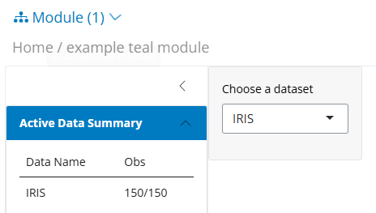

## Introduction

The `teal` package offers an integrated reporting feature utilizing the `teal.reporter` package.
For a comprehensive explanation of the reporting functionality itself, please refer to the documentation therein.

This article is *intended for module developers* and aims to provide guidance on enhancing a custom `teal` module with an automatic reporting feature.
This enhancement enables users to incorporate snapshots of the module outputs into a report which can then be reviewed in another module automatically provided by `teal`.
Thus the app user can interact with the report.

The responsibilities of a module developer include:

-   Choosing whether reporting of their module is needed.
-   Specifying the outputs that constitute a snapshot of their module.

The entire life cycle of objects involved in creating the report and configuring the module to preview the report is handled by `teal`.

## Custom module

```{r setup, include=FALSE}
library(teal)
library(teal.reporter)
```

```{r as_interactive, eval=FALSE, echo=FALSE}
interactive <- function() TRUE
```

Let us consider an example module, based on the example module from `teal`:

```{r module_1}
library(teal)
library(teal.reporter)

my_module <- function(label = "example teal module") {
  module(
    label = label,
    server = function(id, data) {
      checkmate::assert_class(isolate(data()), "teal_data")

      moduleServer(id, function(input, output, session) {
        updateSelectInput(session, "dataname", choices = isolate(names(data())))
        output$dataset <- renderPrint({
          req(input$dataname)
          data()[[input$dataname]]
        })
      })
    },
    ui = function(id) {
      ns <- NS(id)
      sidebarLayout(
        sidebarPanel(selectInput(ns("dataname"), "Choose a dataset", choices = NULL)),
        mainPanel(verbatimTextOutput(ns("dataset")))
      )
    }
  )
}
```

Using `teal`, you can launch this example module with the following:

```{r app_1}
app <- init(
  data = teal_data(IRIS = iris, MTCARS = mtcars),
  modules = my_module()
)

if (interactive()) {
  shinyApp(app$ui, app$server)
}
```

```{r shinylive_iframe_1, echo = FALSE, out.width = '150%', out.extra = 'style = "position: relative; z-index:1"', eval = requireNamespace("roxy.shinylive", quietly = TRUE) && knitr::is_html_output() && identical(Sys.getenv("IN_PKGDOWN"), "true")}
code <- paste0(c(
  knitr::knit_code$get("as_interactive"),
  knitr::knit_code$get("module_1"),
  knitr::knit_code$get("app_1")
), collapse = "\n")

url <- roxy.shinylive::create_shinylive_url(code)
knitr::include_url(url, height = "800px")
```

## Add support for reporting

### Modify the declaration of the server function

First we need to prepare the code inside the module to be added to the report.
See below:

```{r module_2}
my_module_with_card <- function(label = "example teal module") {
  module(
    label = label,
    server = function(id, data) {
      moduleServer(id, function(input, output, session) {
        updateSelectInput(session, "dataname", choices = isolate(names(data())))

        # Prepare the report:
        report <- reactive({
          req(obj <- data())
          teal_card(obj) <-
            c(
              teal_card("# Module with reporting"),
              teal_card(obj),
              teal_card("## Module's code")
            )
          obj
        })

        # Add to the report the code of the module
        data_r <- reactive({
          req(teal_data <- report(), input$dataname)
          within(teal_data, table, table = as.name(input$dataname))
        })

        output$dataset <- renderPrint({
          req(teal_data <- data_r())
          teal_data[[input$dataname]]
        })
      })
    },
    ui = function(id) {
      ns <- NS(id)
      sidebarLayout(
        sidebarPanel(selectInput(ns("dataname"), "Choose a dataset", choices = NULL)),
        mainPanel(verbatimTextOutput(ns("dataset")))
      )
    }
  )
}
```

With these modifications, the module is now ready to be launched with `teal`:

```{r app_2}
app <- init(
  data = teal_data(IRIS = iris, MTCARS = mtcars),
  modules = my_module_with_card()
)

if (interactive()) {
  shinyApp(app$ui, app$server)
}
```

```{r shinylive_iframe_2, echo = FALSE, out.width = '150%', out.extra = 'style = "position: relative; z-index:1"', eval = requireNamespace("roxy.shinylive", quietly = TRUE) && knitr::is_html_output() && identical(Sys.getenv("IN_PKGDOWN"), "true")}
code <- paste0(c(
  knitr::knit_code$get("as_interactive"),
  knitr::knit_code$get("setup"),
  knitr::knit_code$get("module_2"),
  knitr::knit_code$get("app_2")
), collapse = "\n")

url <- roxy.shinylive::create_shinylive_url(code)
knitr::include_url(url, height = "800px")
```

The output hasn't changed (yet).
The final step is to have the server return the reporter object, enabling the module to be reported.

### Return the reporter object

```{r module_3}
my_module_with_reporting <- function(label = "example teal module") {
  module(
    label = label,
    server = function(id, data) {
      moduleServer(id, function(input, output, session) {
        updateSelectInput(session, "dataname", choices = isolate(names(data())))

        # Prepare the report:
        report <- reactive({
          req(obj <- data())
          teal_card(obj) <-
            c(
              teal_card("# Module with reporting"),
              teal_card(obj),
              teal_card("## Module's code")
            )
          obj
        })

        # Add to the report the code of the module
        data_r <- reactive({
          req(rtd <- report(), input$dataname)
          within(rtd, table, table = as.name(input$dataname))
        })

        output$dataset <- renderPrint({
          req(dr <- data_r())
          dr[[input$dataname]]
        })

        # the reactive teal_report is returned by the module
        data_r
      })
    },
    ui = function(id) {
      ns <- NS(id)
      sidebarLayout(
        sidebarPanel(selectInput(ns("dataname"), "Choose a dataset", choices = NULL)),
        mainPanel(verbatimTextOutput(ns("dataset")))
      )
    }
  )
}
```

With these modifications, the module is now ready to be launched with `teal`:

```{r app_3}
app <- init(
  data = teal_data(IRIS = iris, MTCARS = mtcars),
  modules = my_module_with_reporting()
)

if (interactive()) {
  shinyApp(app$ui, app$server)
}
```

```{r shinylive_iframe_3, echo = FALSE, out.width = '150%', out.extra = 'style = "position: relative; z-index:1"', eval = requireNamespace("roxy.shinylive", quietly = TRUE) && knitr::is_html_output() && identical(Sys.getenv("IN_PKGDOWN"), "true")}
code <- paste0(c(
  knitr::knit_code$get("as_interactive"),
  knitr::knit_code$get("setup"),
  knitr::knit_code$get("module_3"),
  knitr::knit_code$get("app_3")
), collapse = "\n")

url <- roxy.shinylive::create_shinylive_url(code)
knitr::include_url(url, height = "800px")
```

The key step is to return a reactive `teal_report` object containing everything.
This informs `teal` that the module provides a `reporter`, and teal will add a button `+ Add to Report` to add the modules' content to the report.
The user can now add a card to the report with the current state of the module.
The report can be seen after clicking `Preview report` under the `Report` button.

### Add content to the card

The user can modify the text of a card or add new text with the button `+ Add text block` present at the bottom of the card.
Text can also be added inside the module by appending a `teal_card()` to the card of the report.

As the module writer, you can also add any other content to the report you'd like: titles, text.

### Add non-text content to the card

`teal.reporter` supports the addition of tables, charts, and more.
For more information, explore the API of `teal_report()` to learn about the supported content types.


## Removing support for displaying reproducible code

If your module supports a report but you want to disable the button that allows to display the module's reproducible code ("Show R code"), use `disable_src()`:

```{r app_4}
app <- init(
  data = teal_data(IRIS = iris, MTCARS = mtcars),
  modules = my_module_with_reporting() |> disable_src()
)

if (interactive()) {
  shinyApp(app$ui, app$server)
}
```

```{r shinylive_iframe_4, echo = FALSE, out.width = '150%', out.extra = 'style = "position: relative; z-index:1"', eval = requireNamespace("roxy.shinylive", quietly = TRUE) && knitr::is_html_output() && identical(Sys.getenv("IN_PKGDOWN"), "true")}
code <- paste0(c(
  knitr::knit_code$get("as_interactive"),
  knitr::knit_code$get("setup"),
  knitr::knit_code$get("module_3"),
  knitr::knit_code$get("app_4")
), collapse = "\n")

url <- roxy.shinylive::create_shinylive_url(code)
knitr::include_url(url, height = "800px")
```


You can use `disable_src()` on multiple modules at the same time and nested modules too.
For example on:

```{r eval = FALSE}
app <- init(
  data = teal_data(IRIS = iris, MTCARS = mtcars),
  modules = c(
    modules(
      label = "One nested module disabled",
      example_module(label = "Module 1"),
      example_module(label = "Module 2"),
      example_module(label = "Module 3") |> disable_src()
    ),
    modules(
      label = "Nested modules without source",
      example_module(label = "Module 1"),
      example_module(label = "Module 2")
    ) |> disable_src()
  )
)
```

## Removing reporting

If a module has the reporter functionality the teal app developer can disable it with `disable_report()`.

```{r app_5}
app <- init(
  data = teal_data(IRIS = iris, MTCARS = mtcars),
  modules = my_module_with_reporting() |> disable_report()
)

if (interactive()) {
  shinyApp(app$ui, app$server)
}
```

```{r shinylive_iframe_5, echo = FALSE, out.width = '150%', out.extra = 'style = "position: relative; z-index:1"', eval = requireNamespace("roxy.shinylive", quietly = TRUE) && knitr::is_html_output() && identical(Sys.getenv("IN_PKGDOWN"), "true")}
code <- paste0(c(
  knitr::knit_code$get("as_interactive"),
  knitr::knit_code$get("setup"),
  knitr::knit_code$get("module_3"),
  knitr::knit_code$get("app_5")
), collapse = "\n")

url <- roxy.shinylive::create_shinylive_url(code)
knitr::include_url(url, height = "800px")
```

To remove reporting from the whole application, set `reporter = NULL` in `init()`.
This will completely disable all the reporter related buttons on the application:




## Customizing the reporter

A template can be set for the report; when a template is used each card added to the report contains the template's default content.
Additionally, cards can be added to the report before the application starts.

```{r reporter_6}
reporter <- Reporter$new()
template_fun <- function(document) {
  header <- teal_card("Here comes header text.")
  footer <- teal_card("Here comes footer text. Report generated with teal {height=70}")
  c(header, document, footer)
}
reporter$set_template(template_fun)

card1 <- teal_card("## Header 2 text", "Regular text")
metadata(card1, "title") <- "Welcome card"
reporter$append_cards(card1)
```

Once the reporter is created we can use in the teal application.
We can also extend a report for a specific module using `after()`:

```{r app_6}
app <- init(
  data = within(teal_data(), iris <- iris),
  modules = modules(
    example_module(),
    example_module(label = "extend reporter") |>
      after(server = function(data) {
        teal_card(data) <-
          c(teal_card(data), teal_card("## New title", "text"))
        data
      })
  ),
  reporter = reporter
)

if (interactive()) {
  shinyApp(app$ui, app$server)
}
```

```{r shinylive_iframe_6, echo = FALSE, out.width = '150%', out.extra = 'style = "position: relative; z-index:1"', eval = requireNamespace("roxy.shinylive", quietly = TRUE) && knitr::is_html_output() && identical(Sys.getenv("IN_PKGDOWN"), "true")}
code <- paste0(c(
  knitr::knit_code$get("as_interactive"),
  knitr::knit_code$get("setup"),
  knitr::knit_code$get("reporter_6"),
  knitr::knit_code$get("app_6")
), collapse = "\n")

url <- roxy.shinylive::create_shinylive_url(code)
knitr::include_url(url, height = "800px")
```
