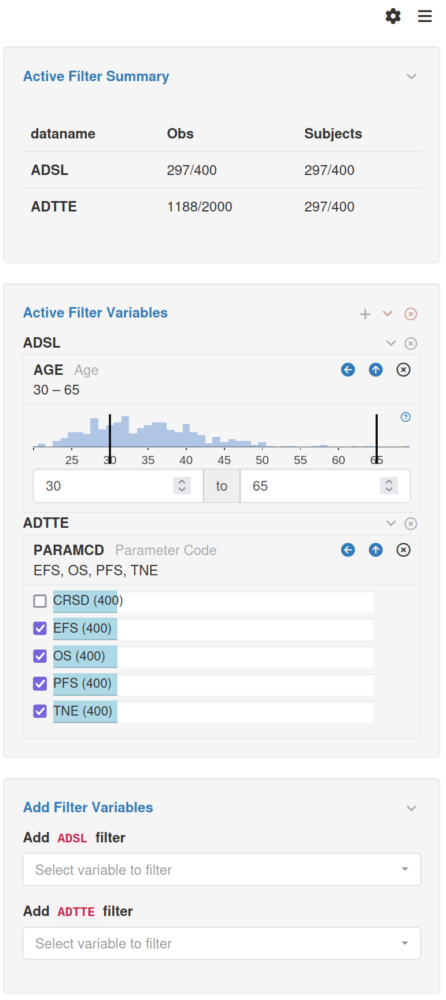

## Introduction

<a href="../../reference/figures/filterpanel.png" target="_blank">
  
</a>

The `teal.slice` package provides `teal` applications with the **filter panel**, a powerful tool for exploring and analyzing data, and a key component of the `teal` framework.

One of the great things about the filter panel is that it comes built-in with `teal`, requiring no programming knowledge to use.

The filter panel provides a convenient way for users to subset their data, simplifying the process of exploration and comprehension.
Moreover, users can activate or deactivate filter states interactively, either individually or globally, using the filter panel.


<div style="clear: both"></div>

## Filter flow

```{r, child="_setup.Rmd"}
```

```{r dataflow_mermaid1, echo=FALSE}
shiny::pre(
  class = "mermaid",
  "
%% This is a mermaid diagram, if you see this the plot failed to render. Sorry.
sequenceDiagram
    autonumber
    data->teal.slice: processed by
    teal.slice->>shiny inputs: creates
    Note over teal.slice,shiny inputs: based on data type
    shiny inputs->>reactive dataset: updates
    reactive dataset->>teal modules: processed by
"
)
```

The filter panel creates subsets of data. Subsetting is achieved by creating filter states, each of which holds a logical predicate (filter condition) that is applied to single variables. These filter conditions are composed into a single expression, a call to a particular function (e.g. `dplyr::filter`), and that expression is evaluated to create a filtered data subset.

The process is entirely interactive. Filter states can be created, removed, and changed at will, however, the app developer may choose to constrain or even restrict them.

When a filter state is created, the filter panel generates a _filter card_ with `shiny` inputs appropriate to the type of the variable, e.g. range selectors for numeric columns and sets of checkboxes or drop-down menus for categorical ones. 

As users interact with the filter cards, the subsetting complete expression is updated and filtered data is recomputed.

The filtered data is passed to `teal` modules for downstream analysis. The subsetting expression is returned along with the data, ensuring an unbroken track record of the entire analysis. Signature of the data are also stored to ensure reproducible results.

