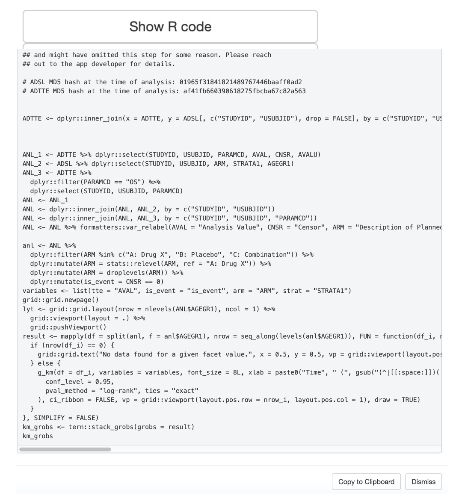
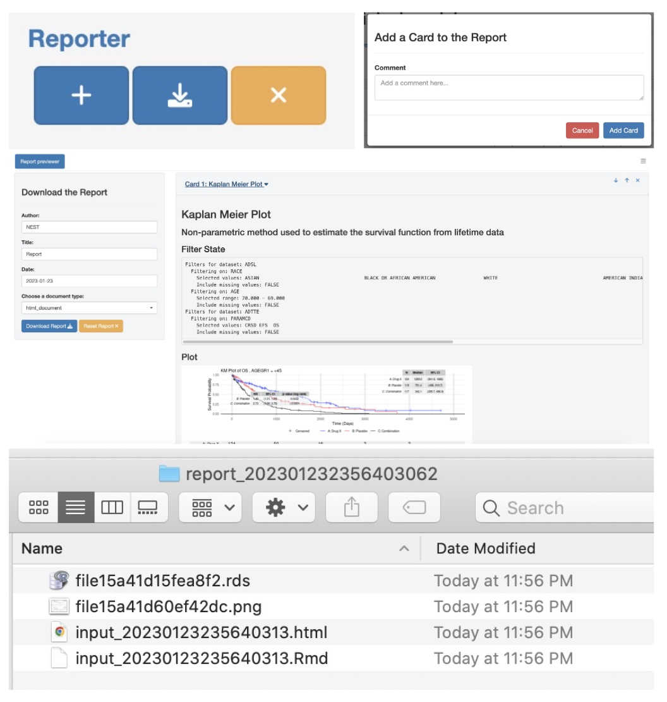

## Introduction

Reproducibility is paramount in the pharmaceutical industry.
Accurate and consistent results are essential to ensure high-quality research and the safety of patients.
By prioritizing reproducibility, researchers can validate their methods, confirm their findings, and contribute to the advancement of the field.

The `teal.code` package provides the [`qenv` class](https://insightsengineering.github.io/teal.code/latest-tag/articles/qenv.html) that facilitates code reproducibility.
Code is passed to a `qenv` object, where is evaluated in a specific environment.
`qenv` also stores the code so that it can be retrieved on request.

The `teal_data` class, which serves as the primary data interface for `teal` applications, inherits this code tracking behavior from `qenv`.

## Preparing data for a `teal` application

All `teal` applications run on data provided in a `teal_data` object.
Data objects are stored and modified within the environment of the `teal_data` object and all `R` code used is tracked, which allows for the code to be evaluated and executed in the `teal` application, and reproduced outside the `teal` application.
This includes data loading, preprocessing, filtering, transformations, and plotting, etc.

The `teal_data` object makes it easy for users to reproduce and validate the results of their analyses.

```{dot teal_data_dot_diagram, echo=FALSE}
digraph G {
    teal_data [label = "teal_data"];
    node [shape=box];
    teal_modules [label = "teal modules analysis R code"];
    library [label = "R library() calls"];
    filter_states [label = "filter states R code"];
    data [label = "data preprocessing R code"];
    teal_modules -> teal_data;
    library -> teal_data;
    edge [dir="back"];
    teal_data -> filter_states;
    teal_data -> data;
}
```

Learn more about the use of `teal_data` in the [`teal.data` package vignettes](https://insightsengineering.github.io/teal.data/latest-tag/articles).

## `Show R Code` and `Reporter`

In both the `teal.modules.clinical` and `teal.modules.general` packages, you'll find that most modules include a convenient `Show R Code` button.
When this button is clicked, a modal window appears, revealing the `R` code responsible for generating the module's output.
This functionality is achieved by inspecting the `teal_data` object and retrieving code from it.
With the `Show R Code` button, users can easily copy and independently run the code to reproduce the analysis presented in the teal module.

{width=50%}

The Reporter feature also leverages the `teal_data` object in its operation.
Much like the `Show R Code` mechanism, the code displayed in a Reporter Card is extracted from the `teal_data` object.

{width=50%}

To learn more about the `Reporter` feature, please visit the [`teal.reporter` documentation](https://insightsengineering.github.io/teal.reporter/latest-tag/index.html).

Overall, `qenv` from `teal.code` and its child class, `teal_data`, are powerful tools for ensuring code reproducibility and promoting high-quality research in the `R` programming language.
