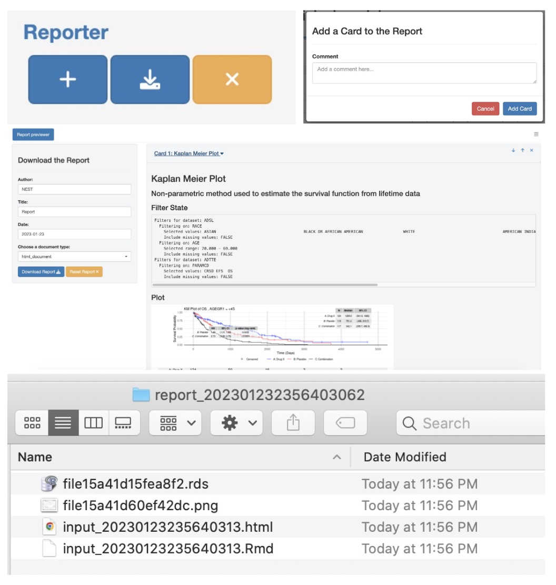

## Introduction

Reproducibility is paramount in the pharmaceutical industry.
Accurate and consistent results are essential to ensure high-quality research and the safety of patients.
By prioritizing reproducibility, researchers can validate their methods, confirm their findings, and contribute to the advancement of the field.

[`qenv`](https://insightsengineering.github.io/teal.code/latest-tag/articles/qenv.html) is an essential feature provided by the `teal.code` package that facilitates code reproducibility.
It is a class that stores both data and code, which enables tracking of the analytical process, and thus allows for sharing and replication of R code.
Code is passed to a `qenv` object, where it is evaluated in a specific environment and stored, and can be retrieved on request.

## `qenv` in a `teal` application

In a `teal` application, a `qenv` object is created by the module developer in the module's server function. All data operations and their R code are appended and stored within the `qenv`'s environment, which allows for the code to be evaluated and executed in the `teal` application, and reproduced outside the `teal` application. This includes data loading, preprocessing, filtering, transformations, and plotting, etc.

The `qenv` object makes it easy for users to reproduce and validate the results of their analyses.

```{dot qenv_dot_diagram, echo=FALSE}
digraph G {
    qenv [label = "qenv"];
    node [shape=box];
    teal_modules [label = "teal modules analysis R code"];
    library [label = "R library() calls"];
    filter_states [label = "filter states R code"];
    data [label = "data preprocessing R code"];
    teal_modules -> qenv;
    library -> qenv;
    edge [dir="back"];
    qenv -> filter_states;
    qenv -> data;
}
```

#### `Show R Code` and `Reporter`

The `qenv` object is used to support the module's visualizations, such as textual information, tables and plots. Additionally it also supports:

1. The `Show R Code` button
1. The `Reporter` feature

The former allows users to inspect the contents of the `qenv` object, enabling them to closely analyze and replicate the module's analysis.
The latter utilizes the `qenv` object to merge multiple `qenv` objects from various `teal` modules, resulting in a downloadable report with reproducible results that ensures accurate and consistent data presentations.

<a href="../../reference/figures/showrcode.jpg" target="_blank">
  
</a>

<a href="./reporter.jpg" target="_blank">
  
</a>

<div style="clear: both;"></div>

Overall, `qenv` from `teal.code` is a powerful tool for ensuring code reproducibility and promoting high-quality research in the R programming language.
