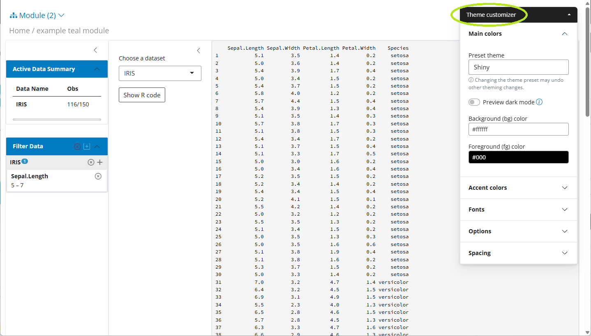
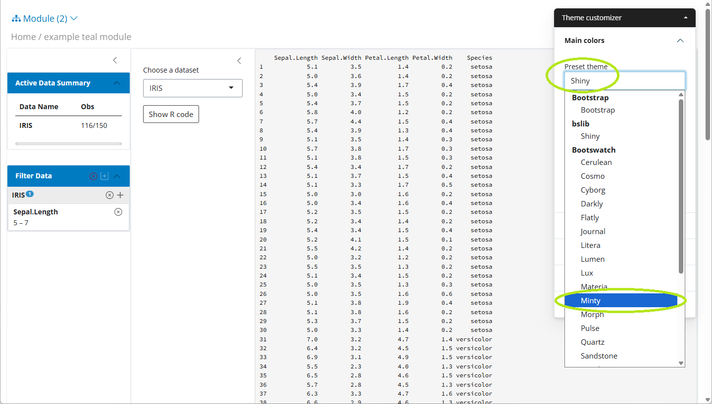
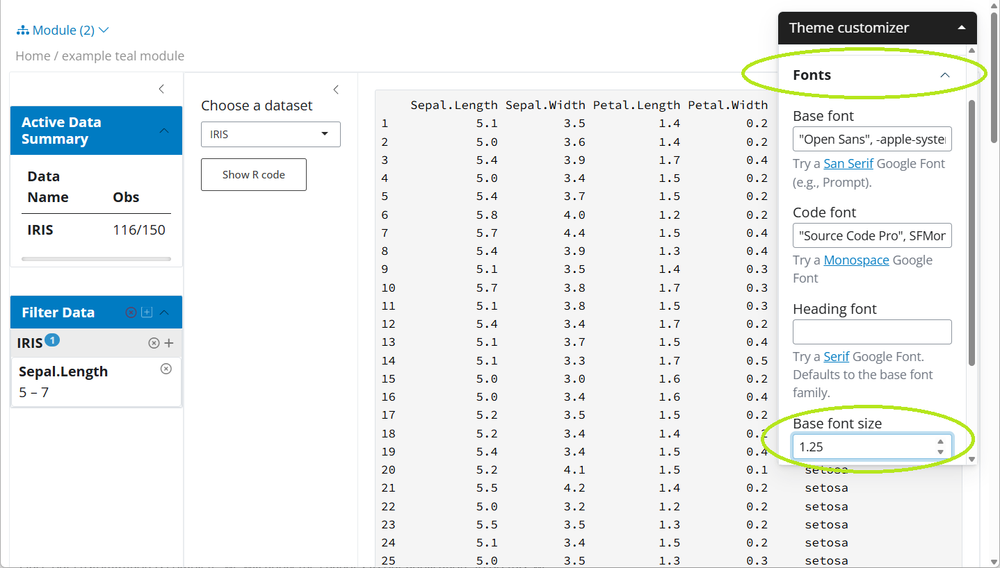

```{r, include=FALSE}
knitr::opts_template$set(
  remove_linter_comments = list(tidy = function(code, ...) gsub(pattern = "#\\s?nolint.*", replacement = "", code))
)
```


## Introduction

We offer an easy application of a custom Bootstrap theme in a `teal` app. `teal` uses the `bslib` `R` package which provides tools for customizing Bootstrap themes, including those of `shiny` apps.

## Usage

`teal` app developers can specify custom Bootstrap themes by setting the `teal.bs_theme` `R` option, which has to be set to `bslib::bs_theme` object. The `bslib::bs_theme(...)` function creates a Bootstrap theme object, where one specifies the (major) Bootstrap version (default or one of 3, 4, or 5). Optionally one can choose a **`bootswatch` theme** and **customize the app CSS** with functions like `bslib::bs_add_rules`. Please read more about custom themes in [the `bslib` getting started vignette](https://rstudio.github.io/bslib/articles/bslib.html). The `teal.bs_theme` `R` option has to be specified at the top of the code script.

Please install `bslib` package before you run the code below.

### `teal.bs_theme` `R` option

```
options("teal.bs_theme" = bslib::bs_theme("Custom Options"))

#######################
# teal::init() app code
#######################
```

### Bootstrap version and themes

The best and recommended ways to **explore** the Bootstrap themes are to use `bslib::run_with_themer(shinyApp(app$ui, app$server))` or `bslib::bs_theme_preview()`, both of which offer an interactive explore mode (not supported for Bootstrap 3). The `bslib::bs_theme_preview()` is recommended when the end user does not have any `shiny` app yet. When you already have a `shiny` app and you want to test different Bootstrap themes (and `CSS` styling) then `bslib::run_with_themer(shinyApp(app$ui, app$server))` is recommended.

Available Bootstrap versions could be checked with `bslib::versions()` and Bootstrap themes (`bootswatch`) with `bslib::bootswatch_themes(version = "5")`.

```
# bslib::versions()
# bslib::bootswatch_themes(version = "5")
options("teal.bs_theme" = bslib::bs_theme(version = "5", bootswatch = "lux"))
# or
options("teal.bs_theme" = bslib::bs_theme_update(bslib::bs_theme(version = "5"), bootswatch = "lux"))
```

### Default Bootstrap theme

When using the default `bslib` theme for any version (3, 4 or 5), its styling might not be as expected. Please run the interactive themer (recommended) or apply a custom theme to explore all the theme options. **In many scenarios updating only the theme might not be enough and e.g. font color and other specifications should be updated too.**

```
# instead of
options("teal.bs_theme" =  bslib::bs_theme(version = "5"))
# try non-default themes
options("teal.bs_theme" = bslib::bs_theme(version = "5", bootswatch = "THEME NAME". ...))
# or run the app inside bslib::run_with_themer
```

### Reset the Bootstrap theme

Please use the `options("teal.bs_theme" = NULL)` call to return to the default `shiny` Bootstrap for `teal` apps.

### Theme not updated

One reason the theme is not updated could be that the web browser caches the previous one, especially when different themes are run one after another. Please, use the `Cmd+Shift+R` (Mac) or `Ctrl+F5` (Windows) to hard refresh the webpage.

### Custom `teal` `CSS`

The most important HTML tags in `teal` have a specific id or class, so they can be directly styled. The `bslib::bs_add_rules` function could be used around the `bslib::bs_theme` object to apply custom `CSS` rules.

```
library(magrittr)
options("teal.bs_theme" = bslib::bs_add_rules(
  bslib::bs_theme(version = "5"),
  "Anything understood by sass::as_sass()"
))
```

Other `bslib::bs_add_*` family functions could be used to specify low-level Bootstrap elements.

### Bootstrap NULL vs Bootstrap 3

It is important to note that the statements `options("teal.bs_theme" = NULL)` and `options("teal.bs_theme" = bslib::bs_theme(version = "3")` are not equivalent as the `bslib` approximation of the default `shiny` theme for Bootstrap version 3 can introduce some discrepancies. One important difference is that when using `bslib::bs_theme(version = "3", bootswatch = "THEME NAME")` one can apply the custom Bootstrap theme. Another one is that the usage of `bslib::bs_theme(version = "3")` requires the installation of the `shinyWidgets` package of minimum version 0.7.4.

### Regular `shiny::fluidPage`

If you want to update the theme in a regular `shiny::fluidPage`-like app, you do not need the `teal.bs_theme` option. Simply provide the `bslib::bs_theme` directly: `shiny::fluidPage(theme = bslib::bs_theme(...), ...)`.

### Interactive theming guide

In this section we provide a step-by-step guide to customizing a `teal` application theme interactively with `bslib::run_with_themer()`. We recommend starting with a simple case and once you are satisfied, verifying with your full application. To that end we will use the `teal` application below. For this example we assume that we want to use Bootstrap 5. To start, we launch the app with `bslib::run_with_themer(app$ui, app$server)` instead of `shiny::shinyApp`.


```{r, eval = FALSE, opts.label=c("remove_linter_comments")}
options("teal.bs_theme" = bslib::bs_theme(version = "5"))

library(teal)

app <- init(
  data = teal_data(IRIS = iris), # nolint: line_length.
  filter = teal_slices(teal_slice("IRIS", "Sepal.Length", selected = c(5, 7))),
  modules = modules(example_module(), example_module()),
)

bslib::run_with_themer(shinyApp(app$ui, app$server))
```

This gives us a `Theme Customizer` similar to what is shown below.



Note the `Theme Customizer` section on the right hand side. This was added by `bslib` and is how we customize our theme.

#### Set overall app theme

Instead of starting from scratch, we want to start with a [`Bootswatch`](https://bootswatch.com/) theme. Let us select the Minty theme in the "Overall theme" drop-down.



`bslib` has updated our `CSS` styles to use our new theme, including the `customizer` theme. Additionally, if we look at our `R` console, we will see

```{r eval = FALSE}
####  Update your bs_theme() R code with:  #####
bs_theme_update(theme, bootswatch = "minty")
```

This is a helpful guide that provides code to update our theme. For `teal` applications we don't actually use `bs_theme_update` and opt for `bs_theme` instead. However, the printed code will still be helpful.

#### Customize a `bootswatch` theme

Our base theme (Minty) is close to what we want but let's make a few modifications. To start, we will increase the base font size. To do this, we choose the "Fonts" section of the `customizer` theme and then set a value in the "Base font size" input. We use 1.25 here, which means all our fonts will be increased by a factor of 1.25. If we check the `R` console, we will see `bslib` has printed `bs_theme_update(theme, font_scale = 1.25, bootswatch = "minty")`, which now includes our font size adjustment.



Finally, suppose we do not want borders to be rounded. In our `customizer` theme, we can go to "Options" and then uncheck the "Rounded corners" box.


As expected, our corners are no longer rounded. If we look at our `R` console, we will now see `bs_theme_update(theme, font_scale = 1.25, `enable-rounded` = FALSE, bootswatch = "minty")`.

#### Apply the customized theme

Once our customization is complete, we will apply the changes to our application. To do this, we use the option `teal.bs_theme` like before but this time we will expand on our `bslib::bs_theme` call to include our changes. Luckily, the arguments that were printed to the `R` console when running our app in the themer can be plugged right in.

```{r setup, include=FALSE}
library(teal)
```
```{r app}
options(
  "teal.bs_theme" = bslib::bs_theme(
    version = "5",
    font_scale = 1.25,
    `enable-rounded` = FALSE,
    bootswatch = "minty"
  )
)

library(teal)

app <- init(
  data = teal_data(IRIS = iris),
  filter = teal_slices(teal_slice("IRIS", "Sepal.Length", selected = c(5, 7))),
  modules = modules(example_module(), example_module())
)

if (interactive()) {
  shinyApp(app$ui, app$server)
}
```

Now the application has our custom theme applied.

### Try the above app in `shinylive`

```{r shinylive_iframe, echo = FALSE, out.width = '150%', out.extra = 'style = "position: relative; z-index:1"', eval = requireNamespace("roxy.shinylive", quietly = TRUE) && knitr::is_html_output() && identical(Sys.getenv("IN_PKGDOWN"), "true")}
code <- paste0(c(
  "interactive <- function() TRUE",
  knitr::knit_code$get("app")
), collapse = "\n")

url <- roxy.shinylive::create_shinylive_url(code)
knitr::include_url(url, height = "800px")
```

Please note the interactive themer only contains the most commonly applied options.
For more customization options, review the `bslib` documentation.


## Sources

- https://rstudio.github.io/bslib/
