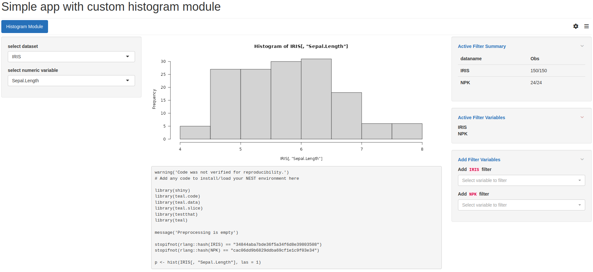

## Introduction

The `teal` framework provides a large catalog of plug-in-ready analysis modules to be incorporated into `teal` applications.
However, it is also possible to create your own modules using the `module` function.

## Components of a module

### UI function

This function contains the UI required for the module.
It should be a function with at least the argument `id`.
See the server section below for more details.

### Server function

This function contains the `shiny` server logic for the module and should be of the form:

```{r, eval=FALSE}
function(
    id,
    data, # optional; use if module needs access to application data
    filter_panel_api, # optional; use if module needs access to filter panel; see teal.slice
    reporter, # optional; use if module supports reporting; see reporting vignette
    ...) {
  moduleServer(id, function(input, output, session) {
    # module code here
  })
}
```

The data that arrives in the module is a `teal_data` object, the data container used throughout the `teal` application.
`teal_data` is passed to the `init` function when building the application and, after filtering by the filter panel, it is passed to modules, wrapped in a reactive expression.
The `teal_data` class allows modules to track the `R` code that they execute so that module outputs can be reproduced.
See the `teal.data` package for a [detailed explanation](https://insightsengineering.github.io/teal.data/latest-tag/articles/teal-data-reproducibility.html).

## Example modules

### Viewing data

Here is a minimal module that allows the user to select and view one dataset at a time.
By default, filtering is enabled for all datasets.
Note that dataset choices are specified by the `datanames` property of the `teal_data` container.

```{r, message=FALSE}
library(teal)

example_module <- function(label = "example teal module") {
  checkmate::assert_string(label)

  module(
    label = label,
    server = function(id, data) {
      checkmate::assert_class(data, "reactive")
      checkmate::assert_class(isolate(data()), "teal_data")

      moduleServer(id, function(input, output, session) {
        updateSelectInput(session, "dataname", choices = isolate(datanames(data())))
        output$dataset <- renderPrint({
          req(input$dataname)
          data()[[input$dataname]]
        })
      })
    },
    ui = function(id) {
      ns <- NS(id)
      sidebarLayout(
        sidebarPanel(selectInput(ns("dataname"), "Choose a dataset", choices = NULL)),
        mainPanel(verbatimTextOutput(ns("dataset")))
      )
    }
  )
}
```

### Interacting with data and viewing code

The example below allows the user to interact with the data to create a simple visualization.
In addition, it prints the code that can be used to reproduce that visualization.

```{r}
library(teal)

# ui function for the module
# allows for selecting dataset and one of its numeric variables
ui_histogram_example <- function(id) {
  ns <- NS(id)
  sidebarLayout(
    sidebarPanel(
      selectInput(ns("datasets"), "select dataset", choices = NULL),
      selectInput(ns("numerics"), "select numeric variable", choices = NULL)
    ),
    mainPanel(
      plotOutput(ns("plot")),
      verbatimTextOutput(ns("code"))
    ),
  )
}

# server function for the module
# presents datasets and numeric variables for selection
# displays a histogram of the selected variable
# displays code to reproduce the histogram
srv_histogram_example <- function(id, data) {
  checkmate::assert_class(data, "reactive")
  checkmate::assert_class(isolate(data()), "teal_data")

  moduleServer(id, function(input, output, session) {
    # update dataset and variable choices
    # each selection stored in separate reactive expression
    updateSelectInput(inputId = "datasets", choices = isolate(datanames(data())))
    observe({
      req(dataset())
      nums <- vapply(data()[[dataset()]], is.numeric, logical(1L))
      updateSelectInput(inputId = "numerics", choices = names(nums[nums]))
    })
    dataset <- reactive(input$datasets)
    selected <- reactive(input$numerics)

    # add plot code
    plot_code_q <- reactive({
      validate(need(length(dataset()) == 1L, "Please select a dataset"))
      validate(need(length(selected()) == 1L, "Please select a variable"))
      req(selected() %in% names(data()[[dataset()]]))

      # evaluate plotting expression within data
      # inject input values into plotting expression
      within(
        data(),
        p <- hist(dataset[, selected], las = 1),
        dataset = as.name(dataset()), selected = selected()
      )
    })

    # view plot
    output$plot <- renderPlot({
      plot_code_q()[["p"]]
    })

    # view code
    output$code <- renderPrint({
      plot_code_q() %>%
        get_code() %>%
        cat()
    })
  })
}

# function that creates module instance to use in `teal` app
tm_histogram_example <- function(label) {
  module(
    label = label,
    server = srv_histogram_example,
    ui = ui_histogram_example,
    datanames = "all"
  )
}
```

This module is ready to be used in a `teal` app.

```{r}
app <- init(
  data = teal_data(IRIS = iris, NPK = npk),
  modules = tm_histogram_example(label = "Histogram Module"),
  header = "Simple app with custom histogram module"
)

if (interactive()) {
  shinyApp(app$ui, app$server)
}
```



## Adding reporting to a module
Refer to [this vignette](adding-support-for-reporting.html) to read about adding support for reporting in your `teal` module.

## Using standard widgets in your custom module

The [`teal.widgets`](https://insightsengineering.github.io/teal.widgets/latest-tag/) package provides various widgets which can be leveraged to quickly create standard elements in your custom module.
