```{r setup, include = FALSE, echo=FALSE}
knitr::opts_chunk$set(
  collapse = TRUE,
  comment = "#>"
)
```

### Motivation
There are times when an app developer wants to showcase more than just one fixed slice of their dataset in their hand-crafted module. Relinquishing control of the application to a user demands the developer gives their users a degree of freedom. In case of analyzing data, `teal` allows app developers to open up their applications to users, letting them decide exactly what app data to analyze in the module. One of the simplest example can be: given the well-known `R` dataset `iris` and a module that shows a histogram of a variable, the app developer wants to let the user specify which variable should be shown on the histogram. This vignette covers this and some more complex use cases of `data_extract_spec`.

A lot of `teal` modules use `data_extract_spec` objects to tackle user input. You can find many examples in e.g. `teal.modules.general` and `teal.modules.clinical`.

This vignette describes `data_extract_spec` objects, their constructors, parameters, use cases and their intended life-cycle.

### Piece of a puzzle
`data_extract_spec`'s task is two-fold: create a UI component in a `shiny` application and pass the user input from the UI to the module itself. Having that formulated, let's have a look at how it supports both its responsibilities.

#### Example module
In order to showcase different initialization options of `data_extract_spec`, first we define a `teal` module which accepts a `data_extract_spec` object. Let's define a simple module and since this section focuses mostly on `data_extract_spec`, it skips the detailed explanation of the code. You can find more about developing a module using `data_extract_spec` in the section below.
```{r}
library(teal)

library(magrittr)
#' A new awesome module
#'
#' @param variable `data_extract_spec` object defining a slice of data
#'
awesome_module <- function(label = "Awesome Module", variable) {
  module(
    label = label,
    server = awesome_srv,
    ui = awesome_ui,
    ui_args = list(variable),
    server_args = list(variable = variable),
    filters = "all"
  )
}

awesome_ui <- function(id, datasets, variable) {
  ns <- shiny::NS(id)
  teal.widgets::standard_layout(
    output = teal.widgets::white_small_well(
      shiny::plotOutput(ns("histogram"))
    ),
    encoding = shiny::div(teal.transform::data_extract_ui(ns("variable"), label = "variable", variable))
  )
}

awesome_srv <- function(id, datasets, variable) {
  moduleServer(id, function(input, output, session) {
    # teal.transform::data_merge_module is a way of combining the `data_extract_spec` objects
    # and producing appropriate slices of data
    merged_data <- teal.transform::data_merge_module(data_extract = list(variable = variable), datasets = datasets)
    output$histogram <- shiny::renderPlot({
      req(merged_data()$data()[[1]])
      validate(need(is.numeric(merged_data()$data()[[1]]), "Please select numeric column"))
      hist(merged_data()$data()[[1]])
    })
  })
}
```

#### Example data
Let's use `iris` for the application's data input.
```{r}
iris_dataset <- teal.data::dataset("example_iris", iris)
data <- teal.data::teal_data(iris_dataset)
```

#### The simplest UI `data_extract_spec`
The simplest way to instantiate a `data_extract_spec` is to call it with the `dataname` argument:
```{r}
simple_data_extract_spec <- teal.transform::data_extract_spec(dataname = "example_iris")
```
When passed to `awesome_module`, `simple_data_extract_spec` will create two sections on the left-hand side of the application. One for **filtering** data and one for **selecting** variables.

```{r eval=FALSE}
app <- init(data = data, modules = list(awesome_module(variable = simple_data_extract_spec)))
shiny::shinyApp(app$ui, app$server)
```
Notice the `data_extract_spec` object created earlier is passed to the `variable` parameter of `awesome_module`.
```{r echo=FALSE, out.width='100%'}
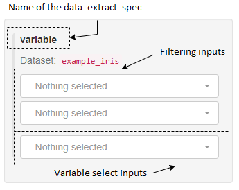
```
The filtering and selecting works similarly to `dplyr`'s functions of the same name ([dplyr::filter](https://dplyr.tidyverse.org/reference/filter.html), [dplyr::select](https://dplyr.tidyverse.org/reference/select.html)). Users can craft the filtering condition choosing the variable and its values. The records matching the condition are included in the slice passed to the module. Analogous to `dplyr::select`, users can also specify which variables from the data should be selected and passed to the module. In the picture below,  the user selected the column `Sepal.Length` and chose records from the data with value `setosa` of the variable `Species`. The resulting histogram shows the data from the defined slice of the original `data.frame`.
```{r echo=FALSE, out.width='100%'}
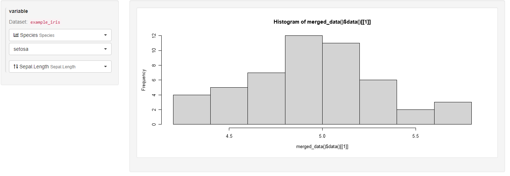
```

The UI created using the simplest constructor of `data_extract_spec` allows choosing a single variable for filtering and multiple variables for selection.
```{r echo=FALSE, out.width='100%'}
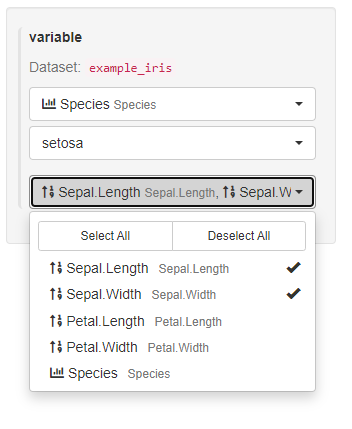
```

In the case of `awesome_module`, the module only uses one variable to plot the histogram anyway, so it makes little sense to allow passing two of them. Moreover, the developer of `awesome_module` might want to allow filtering on more than one variable only. Both of these use cases are not covered by the UI created in this example using the simplest `data_extract_spec` constructor, but they are possible using other parameters of `data_extract_spec`.

#### Modifications of UI using `data_extract_spec`
`data_extract_spec` supports refined control over the UI elements for filtering and selection via the parameters `filter` and `select` accepting `filter_spec` and `select_spec` objects respectively. The overall syntax looks like this:
```
data_extract_spec(dataname = "name of the dataset", filter = <filter_spec definition>, select = <select_spec definition>)
```
The following examples all define a `custom_des`, which can be passed as the module argument:
```{r eval=FALSE}
app <- init(data = data, modules = list(awesome_module(variable = custom_des)))
shiny::shinyApp(app$ui, app$server)
```

##### Modify the variable selection input
The `select` parameter of `data_extract_spec` expects a `select_spec` object passed to it. `select_spec`'s constructor offers a range of customizations of the UI inputs.

1. Show all variables in the drop-down menu.
```{r}
custom_des <- teal.transform::data_extract_spec(
  dataname = "example_iris",
  select = teal.transform::select_spec(choices = teal.transform::variable_choices("example_iris"))
)
```
```{r echo=FALSE, out.width='100%'}
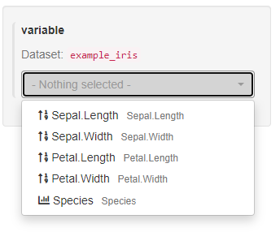
```

2. Pre-select a set of variables in the drop-down menu.
```{r}
custom_des <- teal.transform::data_extract_spec(
  dataname = "example_iris",
  select = teal.transform::select_spec(
    choices = teal.transform::variable_choices("example_iris"), selected = "Sepal.Width"
  )
)
```
```{r echo=FALSE, out.width='100%'}
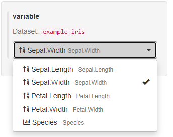
```

3. Allow choosing more than one variable.
This option is managed by the `multiple` parameter of `filter_spec`. When `FALSE` it's not possible to choose multiple variables from the drop-down menu. By default, it is set to `FALSE` if only a single variable is passed to selected and it is set to `TRUE` if an array of variables is passed to `selected`.
```{r}
custom_des <- teal.transform::data_extract_spec(
  dataname = "example_iris",
  select = teal.transform::select_spec(
    choices = teal.transform::variable_choices("example_iris"),
    selected = "Sepal.Width",
    multiple = TRUE
  )
)
```
```{r echo=FALSE, out.width='100%'}
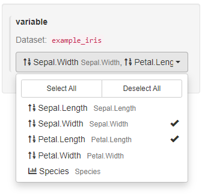
```

4. Forbid making any changes to the pre-selected variable.
This option is governed by the `fixed` parameter. By default, it's `FALSE`, allowing the application users to make changes to the selection.
```{r}
custom_des <- teal.transform::data_extract_spec(
  dataname = "example_iris",
  select = teal.transform::select_spec(
    choices = teal.transform::variable_choices("example_iris"), selected = "Sepal.Width", fixed = TRUE
  )
)
```
```{r echo=FALSE, out.width='100%'}
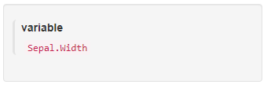
```

##### Modify the filtering inputs
The `filter` parameter of `data_extract_spec` expects a `filter_spec` object passed to it. `filter_spec`'s constructor offers a range of customizations of the UI inputs.

1. Change the set of variables available to the user in the filtering UI.
```{r}
custom_des <- teal.transform::data_extract_spec(
  dataname = "example_iris",
  filter = teal.transform::filter_spec(vars = c("Species"))
)
```
As a result, the application user can only choose between values of the `Species` variable. Notice as well that the created UI panel does not have any label.
```{r echo=FALSE, out.width='100%'}
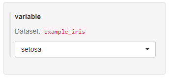
```

2. Add a label to the filtering UI.
```{r}
custom_des <- teal.transform::data_extract_spec(
  dataname = "example_iris",
  filter = teal.transform::filter_spec(vars = c("Species"), label = "Species var")
)
```
Notice the new label `Species var` at the top of the drop-down menu.
```{r echo=FALSE, out.width='100%'}
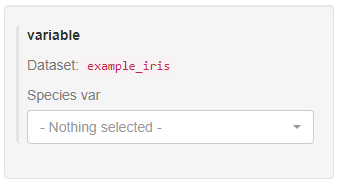
```

3. Change the set of variables available filtered by in the UI to all variables from a dataset.
```{r}
custom_des <- teal.transform::data_extract_spec(
  dataname = "example_iris",
  filter = teal.transform::filter_spec(vars = variable_choices("example_iris"))
)
```
```{r echo=FALSE, out.width='100%'}
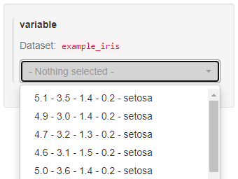
```
Notice that only one choice from the drop-down menu can be active at any given time.

4. Change the set of choices of values available to the user in the UI.
```{r}
custom_des <- teal.transform::data_extract_spec(
  dataname = "example_iris",
  filter = teal.transform::filter_spec(vars = "Species", choices = c("Setosa"))
)
```
```{r echo=FALSE, out.width='100%'}
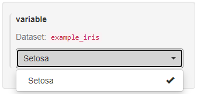
```

5. Set the available choices to all possible values of a variable.
```{r}
custom_des <- teal.transform::data_extract_spec(
  dataname = "example_iris",
  filter = teal.transform::filter_spec(
    vars = "Species", choices = teal.transform::value_choices("example_iris", "Species")
  )
)
```
```{r echo=FALSE, out.width='100%'}

```

6. Pre-select a choice for a user (this will be the starting value in the UI, but it can be changed by the user later).
```{r}
custom_des <- teal.transform::data_extract_spec(
  dataname = "example_iris",
  filter = teal.transform::filter_spec(
    vars = "Species",
    choices = teal.transform::value_choices("example_iris", "Species"),
    selected = c("versicolor")
  )
)
```
```{r echo=FALSE, out.width='100%'}
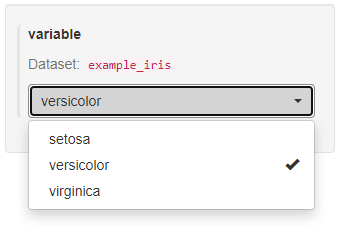
```

7. Allow multiple values of the chosen variables to be selected in the filtering UI.
By default, `filter_spec` creates a UI where only one value from the cartesian product of all values present in the chosen variables can be selected at a time. To allow for multiple values, set the parameter `multiple` to `TRUE`.
```{r}
custom_des <- teal.transform::data_extract_spec(
  dataname = "example_iris",
  filter = teal.transform::filter_spec(vars = teal.transform::variable_choices("example_iris"), multiple = TRUE)
)
```

```{r echo=FALSE, out.width='100%'}
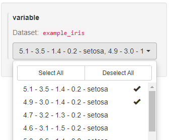
```

8. Pre-select all possible values of the chosen variables in the UI (possible to change it by the user later).
```{r}
custom_des <- teal.transform::data_extract_spec(
  dataname = "example_iris",
  filter = teal.transform::filter_spec(
    vars = "Species",
    choices = teal.transform::value_choices("example_iris", "Species"),
    selected = teal.transform::all_choices()
  )
)
```

```{r echo=FALSE, out.width='100%'}
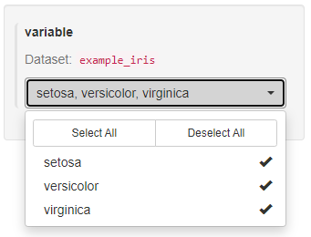
```

Notice that contrary to the basic example of `data_extract_spec` shown in the section `The simplest use...` all of the previous UIs did not allow to change the variables for filtering, only values.

8. Allow users to select a variable used for filtering.
```{r}
custom_des <- teal.transform::data_extract_spec(
  dataname = "example_iris",
  filter = teal.transform::filter_spec(
    vars = teal.transform::choices_selected(
      choices = teal.transform::variable_choices("example_iris"),
      selected = "Species", fixed = FALSE
    ),
    choices = teal.transform::value_choices("example_iris", "Species"),
    selected = teal.transform::all_choices()
  )
)
```

The `choices` parameter of `choices_selected` determines the choice of variables in the filtering inputs, the `selected` parameter determines the pre-selected variable (possible to change by the application user).

```{r echo=FALSE, out.width='100%'}
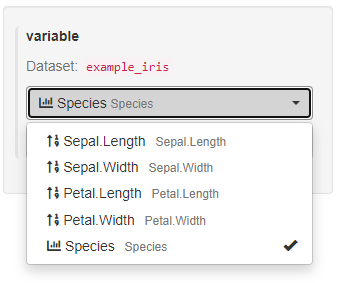
```

##### Support multiple datasets in a single `data_extract_spec`
Using `data_extract_spec`, it is possible to modify the UI and allow users to select variables and filter records from two different datasets. As a simple example, let's modify the input to `awesome_module` to allow users to choose the plotted variable not only from `iris` but from `mtcars` as well.

```{r}
iris_dataset <- teal.data::dataset("example_iris", iris)
mtcars_dataset <- teal.data::dataset("example_mtcars", mtcars)
data <- teal.data::teal_data(iris_dataset, mtcars_dataset)

custom_des <- list(
  teal.transform::data_extract_spec(
    dataname = "example_iris",
    select = teal.transform::select_spec(teal.transform::variable_choices("example_iris"))
  ),
  teal.transform::data_extract_spec(
    dataname = "example_mtcars",
    select = teal.transform::select_spec(teal.transform::variable_choices("example_mtcars"))
  )
)
```

```{r eval=FALSE}
app <- init(data = data, modules = list(awesome_module(variable = custom_des)))
shiny::shinyApp(app$ui, app$server)
```

```{r echo=FALSE, out.width='100%'}
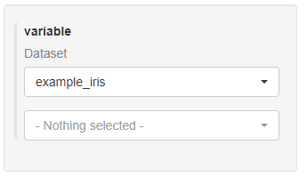
```

The above code enables the selection of the dataset in the upper drop-down menu and the selection of the variable in the bottom menu. All other `filter_spec` and `filter_spec` modifications can be applied to each `data_extract_spec` object as well.

##### More modifications
Have a look at the documentation of `data_extract_spec`, `filter_spec` and `filter_spec` for more information and more examples of the UI configuration.
