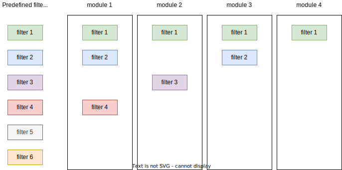

## `teal` apps with the filter panel

The filter panel is an integral part of all `teal` applications and is included on the right side.
Based on the selections made in the filter panel, filter expressions are executed before passing data to `teal` modules.
The technical details of the filter panel are extensively described in [`teal.slice` documentation](https://insightsengineering.github.io/teal.slice/latest-tag/).

By default, `init` initializes the filter panel without any active filters but allows the user to add filters on any column.
To start a `teal` application with predefined filters, one must specify the `filter` argument.
In the following example four filters are specified using the `teal_slice` function and wrapped together with `teal_slices`.

```{r message=FALSE, warning=FALSE}
library(teal)

app <- init(
  data = teal_data(IRIS = iris, CARS = mtcars),
  modules = example_module(),
  filter = teal_slices(
    teal_slice(dataname = "IRIS", varname = "Sepal.Length"),
    teal_slice(dataname = "IRIS", varname = "Species", selected = "setosa"),
    teal_slice(dataname = "CARS", varname = "mpg", selected = c(20, Inf)),
    teal_slice(dataname = "CARS", expr = "qsec < 20", title = "1/4 mile under 20 sec", id = "qsec_20")
  )
)

if (interactive()) {
  shinyApp(app$ui, app$server)
}
```

## Extending `teal.slice`

### Filter panel respective to `teal_module`

Each `teal_module` (see `?module`) object contains the `datanames` attribute that determines which data sets are to be sent to that module.
The filter panel will display only those data sets and hide the rest when this module is active.

```{r message=FALSE, warning=FALSE}
library(teal)

app <- init(
  data = teal_data(IRIS = iris, CARS = mtcars),
  modules = modules(
    example_module(label = "all datasets"),
    example_module(label = "IRIS only", datanames = "IRIS"),
    example_module(label = "CARS only", datanames = "CARS"),
    example_module(label = "no filter panel", datanames = NULL)
  )
)
if (interactive()) {
  shinyApp(app$ui, app$server)
}
```

### Global and module specific filter panel

`teal` contains the `teal_slices` function that extends the original `teal_slices` found in `teal.slice` by adding two arguments: `module_specific` and `mapping`.
By default `init` initializes the app with a "global" filter panel, where all modules use the same filters.
Setting `module_specific = TRUE` switches to a "module-specific" filter panel, where each module can have a different set of filters active at any time.
It is still possible to set global filters that will be shared among modules.

One possible scenario is depicted in the figure below:

- `filter 1` is shared by all modules
- `filter 2` is shared by `module 1` and `module 3`  
- `filter 3` is used only by `module 2`
- `filter 4` is used only by `module 1`
- `filter 5` and `filter 6` are not active in any of the modules

<!-- This image is generated using the diagram inside `inst/design`  -->


To achieve the described setup, one must set the `module_specific` argument to `TRUE` and use the `mapping` argument to match filters to modules.
`mapping` takes a named list where element names correspond to module labels, and elements are vectors of `teal_slice` `id`s applied to that module at startup.
`teal_slice`s listed the element called `"global_filters"` will be applied to all modules.

For a detailed explanation about the filter states, see [this `teal.slice` vignette](https://insightsengineering.github.io/teal.slice/latest-tag/articles/filter-panel-for-developers.html).

```{r app, message=FALSE, warning=FALSE}
library(teal)

app <- init(
  data = teal_data(mtcars = mtcars),
  modules = modules(
    example_module(label = "module 1"),
    example_module(label = "module 2"),
    example_module(label = "module 3"),
    example_module(label = "module 4")
  ),
  filter = teal_slices(
    # filters created with id
    teal_slice(dataname = "mtcars", varname = "mpg", id = "filter 1"),
    teal_slice(dataname = "mtcars", varname = "cyl", id = "filter 2"),
    teal_slice(dataname = "mtcars", varname = "disp", id = "filter 3"),
    teal_slice(dataname = "mtcars", varname = "hp", id = "filter 4"),
    teal_slice(dataname = "mtcars", varname = "drat", id = "filter 5"),
    teal_slice(dataname = "mtcars", varname = "wt", id = "filter 6"),
    # module-specific filtering enabled
    module_specific = TRUE,
    # filters mapped to modules
    mapping = list(
      "module 1" = c("filter 2", "filter 4"),
      "module 2" = "filter 3",
      "module 3" = "filter 2",
      global_filters = "filter 1"
    )
  )
)

if (interactive()) {
  shinyApp(app$ui, app$server)
}
```

```{r shinylive_iframe, echo = FALSE, out.width = '150%', out.extra = 'style = "position: relative; z-index:1"', eval = requireNamespace("roxy.shinylive", quietly = TRUE) && knitr::is_html_output() && identical(Sys.getenv("IN_PKGDOWN"), "true")}
code <- paste0(c(
  "interactive <- function() TRUE",
  knitr::knit_code$get("app")
), collapse = "\n")

url <- roxy.shinylive::create_shinylive_url(code)
knitr::include_url(url, height = "800px")
```
