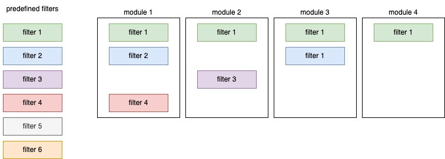

## `teal` apps with filter panel

Filter panel was always integral part of `teal` applications and is included on the right side. Depending on filter panel's selections respective filter expression is executed before passing data to `teal` modules. Technical details of filter panel are extensively described in [`teal.slice` documentation](https://insightsengineering.github.io/teal.slice/latest-tag/).

`teal::init` by default initializes filter panel without any active filters but with possibility to filter by any column. To start `teal` application with predefined filters one need to specify `filter` argument.
In the following example four filters are initialized, each set with `teal_slice` function. `teal_slices` wraps a collection of `teal_slice`. 

```r
library(teal)

app <- init(
  data = teal_data(
    dataset("IRIS", iris, code = "IRIS <- iris"),
    dataset("CARS", mtcars, code = "CARS <- mtcars")
  ),
  modules = example_module(),
  filter = teal_slices(
    teal_slice(dataname = "IRIS", varname = "Sepal.Length"),
    teal_slice(dataname = "IRIS", varname = "Species", selected = "setosa"),
    teal_slice(dataname = "CARS", varname = "mpg", selected = c(20, Inf)),
    teal_slice(dataname = "CARS", expr = "qsec < 20", title = "1/4 mile under 20 sec", id = "qsec_20")
  )
)

if (interactive()) {
  runApp(app)
}
```

## Extending `teal.slice`

### Filter panel respective to `teal_module`

Each `teal_module` (see `module()`) object contains `filters` attribute which determines which datasets are displayed in filter panel and then are sent to the module.

```r
library(teal)

app <- init(
  data = teal_data(
    dataset("IRIS", iris, code = "IRIS <- iris"),
    dataset("CARS", mtcars, code = "CARS <- mtcars")
  ),
  modules = modules(
    example_module(label = "all datasets"),
    example_module(label = "IRIS only", filters = "IRIS"),
    example_module(label = "CARS only", filters = "CARS"),
    example_module(label = "no filter panel", filters = NULL)
  )
)
if (interactive()) {
  runApp(app)
}
```

### Global and module specific filter panel

`teal` contains `teal_slices` function which extends original `teal.slice::teal_slices` by `module_specific` argument. By default `teal::init` initializes app with so called "global" filter panel where each module uses the same filters.
Setting `module_specific = TRUE` enables module specific filter panel where each module can have a different set of filters active. In the same time, with `module_specific = TRUE` it is possible to share some "global" filters.

Possible scenario depicted on the image below. 
- All modules share `filter 1`
- `module 1` and `module 3` share `filter 2`  
- `module 2` is the only module which uses `filter 3`
- `module 1` is the only module which uses `filter 4`
- `filter 5` and `filter 6` are not activated in any of the modules. 



Described setup can be achieved by `mapping` each `teal_module` with respective `teal_slice`. `list` provided to `mapping` should link modules' `label` with `teal_slice` `id`

```r
library(teal)

app <- init(
  data = list(mtcars = mtcars),
  modules = modules(
    example_module(label = "module 1"),
    example_module(label = "module 2"),
    example_module(label = "module 3"),
    example_module(label = "module 4")
  ),
  filter = teal_slices(
    # each filter with id
    teal_slice(dataname = "mtcars", varname = "mpg", id = "filter 1"),
    teal_slice(dataname = "mtcars", varname = "cyl", id = "filter 2"),
    teal_slice(dataname = "mtcars", varname = "disp", id = "filter 3"),
    teal_slice(dataname = "mtcars", varname = "hp", id = "filter 4"),
    teal_slice(dataname = "mtcars", varname = "drat", id = "filter 5"),
    teal_slice(dataname = "mtcars", varname = "wt", id = "filter 6"),

    # filters mapped to modules
    mapping = list(
      global_filters = "filter 1",
      `module 1` = c("filter 2", "filter 4"),
      `module 2` = "filter 3",
      `module 3` = "filter 2"
    )
  )
)

if (interactive()) {
  runApp(app)
}
```
