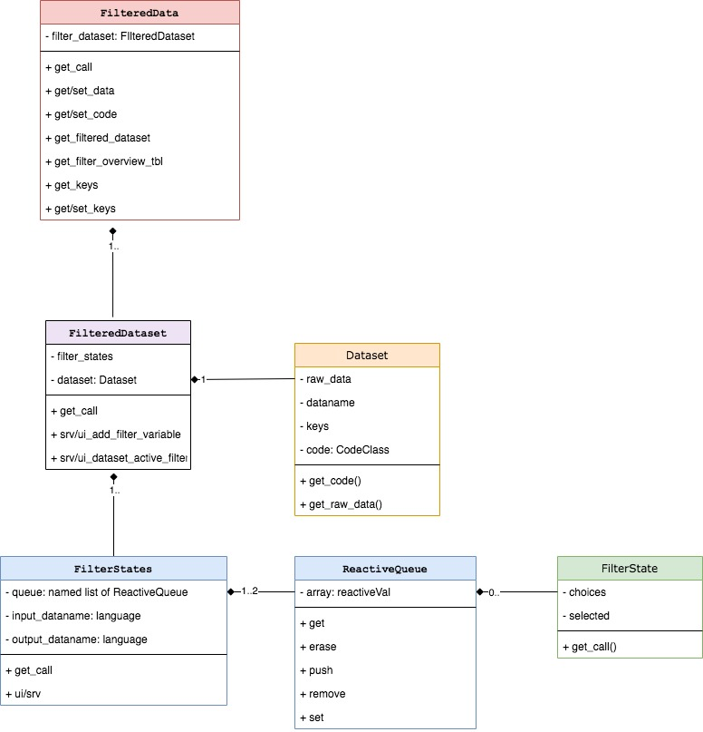
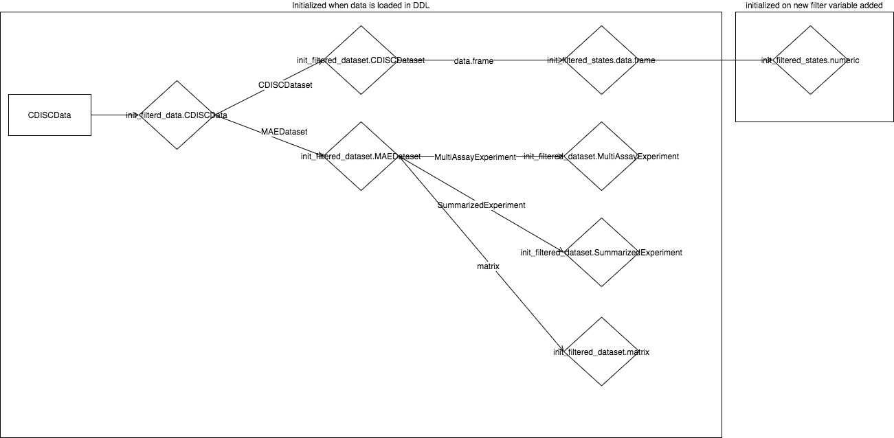
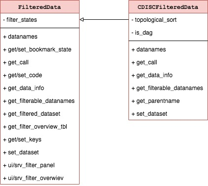
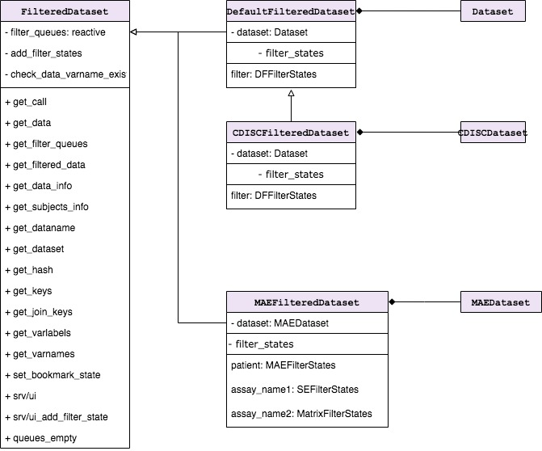
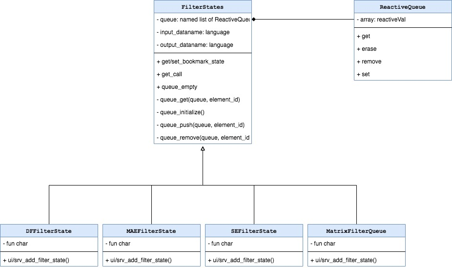
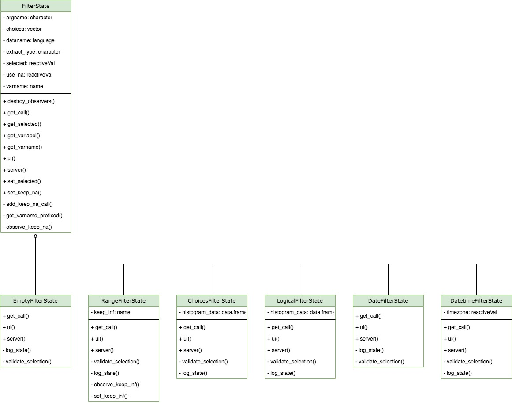
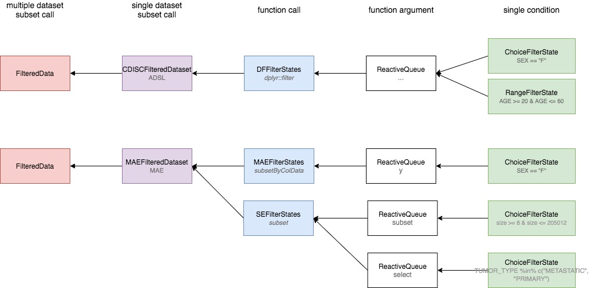
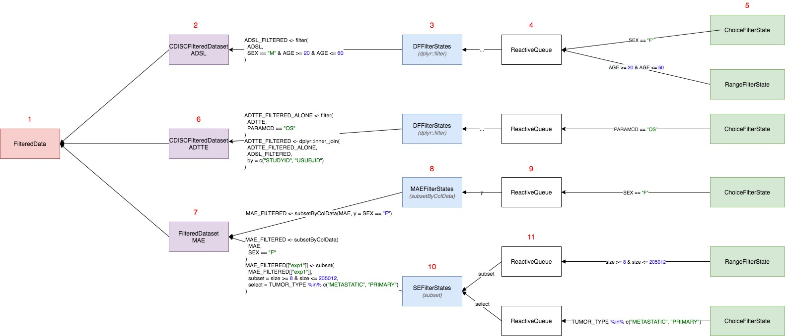

## Overview

Filter panel is located in the right side of the teal apps and is responsible for filtering data
globally for whole application. Filter panel is entirely encapsulated within `FilteredData` class,
which manages filter states, data filtering and reproducible filter code. Filter panel is composed
of several classes but `FilteredData` is the only class which app developer will face directly.
`FilteredData` is accessible in teal modules as a `dataset` argument.

```{r echo=FALSE, out.width='75%'}

```

`FilteredData` contains one-to-many `FilteredDataset` objects which contain `Dataset` passed from
`RelationalData` after all datasets are loaded. While `FilteredData` manages whole filter panel,
`FilteredDataset` is responsible for single dataset filtering. Depending on a variant of
`FilteredDataset` it can contain one or many `FilterStates`. `FilterStates` class object has one or
two `ReactiveQueue` where `FilterState` objects are stored. `FilterState` is a single filter applied
to one variable/column while `FilterStates` is a collection of filters combined within single filter
call.

## Initialization

```{r echo=FALSE, out.width='100%'}

```

`FilteredData` is initialized in `srv_teal` when `RelationalData$is_pulled()` returns `TRUE`.
`FilteredData` is dispatched on type of `RelationalData`, and if DDL is `CDISCData` then
`CDISCFilteredData` is initialized. Each `Dataset` from `CDISCData` determines the type of the
`FilteredDataset`. In above diagram `CDISCDataset` initializes `CDISCFilteredDataset` and
`MAEDataset` initializes `MAEFilteredDataset`.  
Most complicated concept in the new filter panel is `FilterStates`, which are initialized in
`FilteredDataset`. The type and number of `FilterStates` depends on the data kept in the
`FilteredDataset`. You can imagine `FilterStates` as one `subset` call. In case of
`data.frame` (`DFFilteredDataset`) case is simple, because we know that single `dplyr::filter` call
is sufficient to subset data rows. Consider `MultiAssayExperiment` object which contains patients
data in `@colData` and multiple experiments in `@ExperimentList`. Because `MultiAssayExperiment`
contains multiple objects and each must be filtered by separate call, this is why multiple
`FilterStates` objects are required for `MAEFilteredDataset`. `ReactiveQueue` are created within
`FilterStates` and their number also depends on the `FilterStates` type.  
Described objects are created instantly when data is loaded and they remain unchanged, whereas
`FilterState` is initialized each time when the new filter is added. Values of the `FilterState` can
change and also it can be removed and added once again.

## Classes description

This section describes in detail each class managing filter panel.

### `FilteredData`

```{r echo=FALSE, out.width='75%'}

```

`FilteredData` is exposed to the apps/modules developer as a `dataset` argument in the modules.
`FilteredData` manages filter panel by returning filtered data, combining reproducible filter call
from `FilteredDatasets`. `FilteredData` also contains all shiny modules displayed on the right panel
in teal apps. `FilteredData` is a single object which is initialized in `srv_teal` module and it's
variant depends on `RelationalData`. If DDL returns `CDISCData` then `CDISCFilteredData` is
initialized, otherwise `FilteredData`.

In the analytical modules `datasets` can be used to:

- obtain filtered and unfiltered data using `datasets$get_data(<dataname>, filtered = <TRUE/FALSE>)`.
- get available datanames using `datasets$datanames()`
- get reproducible filter call using `datasets$get_call(<dataname>)`
- get reproducible data loading call `datasets$get_code(<dataname>)`
- get `JoinKeys` between two datasets using `datasets$get_join_keys(<dataname1>, <dataname2>)`
- get variable labels using `datasets$get_varlabels(<dataname>)`
- get parent dataset name using `datasets$get_parentname(<dataname>)` (only in case of
  `CDISCFilteredData`)

### `FilteredDataset`

```{r echo=FALSE, out.width='100%'}

```

`FilteredDataset` is a class which keeps unfiltered data and returns filtered data based on the
filter call derived from `FilterStates`.
`FilteredDataset` class objects are initialized by `FilteredData`, one for each `Dataset`.
`FilteredDataset` contains single `Dataset` object and one-to-many `FilterStates` depending on the
type of object. `FilteredDataset` stores dataset attributes, join keys to other datasets, and also
combines and executes the code taken from `FilterStates`.

Following `FilteredDataset` derived classes are already implemented:

- `DefaultFilteredDataset` dispatched by `Dataset` to manage filters for `data.frame` object.
- `CDISCFilteredDataset` dispatched by `CDISCDataset` to manage filters for `data.frame` matching
  ADAM standards.
- `MAEFilteredDataset` dispatched by `MAEDataset` to manage filters for `MultiAssayExperiment`
  object.

### `FilterStates`

```{r echo=FALSE, out.width='100%'}

```

`FilterStates` are initialized by the `FilteredDataset` when teal app starts. The type and number of
`FilterStates` depends on the type of data included in `Dataset`. If data in `FilteredDataset`
is composed of multiple objects then the equivalent number of `FilterStates` is initialized. One
`FilterStates` object is responsible to make one subset call.
Consider the case of `MultiAssayExperiment` object which contains multiple experiments and patients data
stored in separate slots. Each of the objects within `MultiAssayExperiment` can be filtered by
separate calls. Each sub-element in `Dataset` needs also separate inputs to select subset variables,
which then should be applied to the same sub-element of the `Dataset`.

Currently following variants are possible:

- `DFFilterStates` dispatched by `data.frame`, uses `data.frame` columns for filtering.
- `MAEFilterStates` dispatched by `MultiAssayExperiment`, uses columns of object kept in `@colData`
  slot for filtering.
- `SEFilterStates` dispatched by `SummarizedExperiment`, uses columns of objects kept in `@colData`
  and `@rowData` for filtering.
- `MatrixFilterStates` dispatched by `matrix`, uses `matrix` columns for filtering.

`FilterStates` serve two Shiny related purposes:

- `ui/srv_add_filter_state` allow to add `FilterState` for selected variable. Variables included
  in module are the filterable colnames of provided dataset. Variable selection adds `FilterState` to
  `ReactiveQueue` (stored in list `private$queue[[queue_id]]`). `FilterState` is dispatched
  automatically on a selected column class.

### `FilterState`

```{r echo=FALSE, out.width='100%'}

```

This class controls single filter card and returns condition call depending on what is selected.
`FilterState` is initialized each time when user selects filter variable in
`FilterState$add_filter_variable` module. `FilterState` is dispatched on type of selected variable.
Depending on a type of filter state, there are different UI inputs - for example only numeric has
`use_inf` checkbox button.
`private$selected`, `private$use_na`, `private$use_inf` are reactive values and they trigger
re-execution of `FilterState$get_call` whenever their values change.
Constructor if `FilterState` has `extract_type` argument which impacts returned call. `extract_type`
can be unspecified, `"matrix"` or `"list"` and it's value corresponds to type of the variable prefix
in returned condition call. For example if `FilterState` is initialized with
`extract_type = "matrix"` then variable in condition call looks like
`<input_dataname>[, "<varname>"]`.

## Making reproducible filter call

### Overview

```{r echo=FALSE, out.width='100%'}

```

Above diagram presents filter panel classes and their responsibilities when composing filter calls.

- `FilterState$get_call()` returns single condition call based on single variable
- `ReactiveQueue` is a container which stores multiple condition calls. `ReactiveQueue` objects are
  kept in list where the names of each element is named after argument name.
- `FilterStates$get_call()` returns single filter call by gathering conditions returned from `FilterState` and
  combining them by `&` operator grouped by argument name.
- `FilteredDataset$get_call()` returns the list of calls taken from `FilterStates` object(s).
- `FilteredData$get_call(<dataname>)` returns list of calls from specified `FilteredDataset`.

### Example

```{r echo=FALSE, out.width='100%'}

```

Calling `datasets$get_call(<dataname>)` in teal modules executes chain of calls in all filter panel
classes. Consider scenario in which:

(1) `FilteredData` has three `FilteredDataset`(s) ADSL , ADTTE, MAE

(2) `CDISCFilteredDataset` contains `data.frame` (ADSL) which can be filtered only in one way
executing single `dplyr::filter` call (this is why `CDISCFilteredDataset` has a single `FilterStates`)

(3) `FilterStates` construct `dplyr::filter` call is based on the `FilterState` objects added to the
`ReactiveQueue`.

(4) `ReactiveQueue` is just a class to manage addition, storage and removal of `FilterStates`
objects. This is it's only responsibility and the class does not generate any code. `DFFilterState`
contains only one `ReactiveQueue` which is not named - this tells `FilterState` that calls from each
`FilterState` should go to unnamed argument in `dplyr::filter`.

(5) When end-user chooses some variable in "Add Filter Variable" section, then new `FilterState` is
added to the `ReactiveQueue` and this new conditions are added to `dplyr::filter(ADSL, ...)` call.
In the example `SEX` and `AGE` has been added - which are automatically dispatched to relevant
`FilterState` class (`ChoiceFilterState` and `RangeFilterState`).
Since (5) have been added or changed, conditions (`SEX == "F"` and `AGE >= 20 & AGE <= 60`) are
returned to the `DFFilterStates` (3) which combines them with `&` operator and puts to
`dplyr::filter` call. `CDISCFilteredDataset` takes this one call and return to `FilteredData` as a
list.

(6) Second `FilteredDataset` for `ADTTE` works the same way as `ADSL` with one difference.
`dplyr::filter` for `ADTTE` is followed by the merge call with `FILTERED_ADSL` - to be filtered by
keys available parent.

(7) `FilteredDatasetMAE` is based on `MAEDataset` where `raw_data` contains multiple object which can
be filtered on. In general `MultiAssayExperiment` contains `colData(MAE)` which is a `DataFrame`
with ADSL-like patient data. `MAE` contains also multiple experiments which can be extracted using
`MAE[["experiment name"]]` and they can also be filtered in filter-panel. This means that
`FilteredDatasetMAE` has multiple `FilterStates` objects: one for subjects data and one for each
experiment.

(8) `MAEFilterStates` object is initialized for subjects data and for this object
`SummarizedExperiment::subsetByColData` function is applied. `SummarizedExperiment::subsetByColData`
has two arguments `x` (data) and `y` (conditions). `MAEFilterStates` similar to `DFFilterStates`
has one `ReactiveQueue` (9) list for `y` argument in the function. Adding new `FilterStates`
triggers returning of the code similar to (4) and (5)

(10) `SEFilterStates` is initialized per one experiment in the MAE data. This class is specific
because `SummarizedExperiment` contains `colData` and `rowData` which correspond to `select` and
`subset` arguments in `subset.SummarizedExperiment` function. Similar to `subset.data.frame`
`subset` refers to the rows in the object, and `select` refers to the columns - but the call
execution is little different because subsetting and selecting call refers to columns in `colData`
and `rowData` (objects attached to this experiment).
