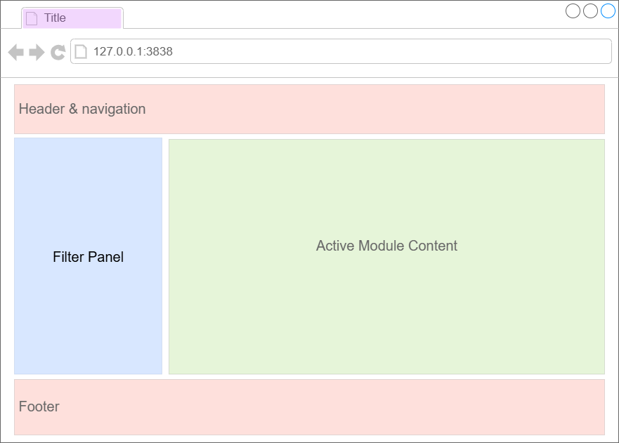
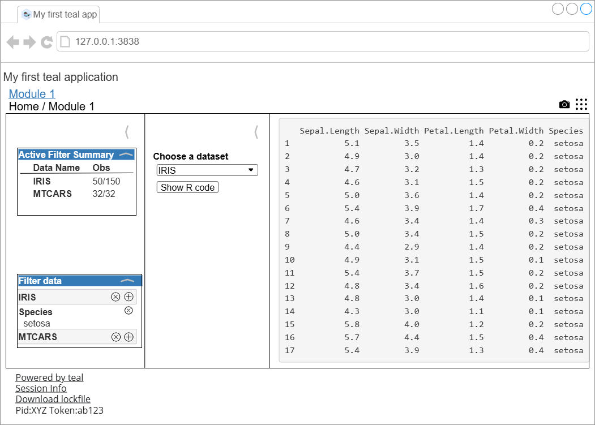

## Introduction

`teal` is a `shiny`-based interactive exploration framework for analyzing data, with particular emphasis on CDISC clinical trial data.
`teal` applications allow their users to:

* "Pull" in data from external data sources
* Dynamically filter of data to be used in the analyses
* Generate reproducible code to regenerate the on-screen analyses
* Create and download reports containing results of analyses (for analysis modules which support reporting)

In addition, the `teal` framework provides application developers with:

* A large suite of custom-made standard analysis modules to be included in applications
* A logging framework to facilitate debugging of applications

More advanced users of the framework can also create new analysis modules which can be added into any `teal` applications.

## Your first `teal` application:

This simple `teal` application takes the `iris` and `mtcars` datasets and displays their contents:

```{r setup, include=FALSE}
library(teal)
```

```{r app}
library(teal)

app <- init(
  data = teal_data(IRIS = iris, MTCARS = mtcars),
  modules = modules(
    example_module("Module 1"),
    example_module("Module 2")
  ),
  filter = teal_slices(
    teal_slice(dataname = "IRIS", varname = "Species", selected = "setosa")
  )
) |>
  modify_title("My first teal application") |>
  modify_header(h3("My first teal application")) |>
  modify_footer(tags$div(a("Powered by teal", href = "https://insightsengineering.github.io/teal/latest-tag/")))

if (interactive()) {
  shinyApp(app$ui, app$server)
}
```

<style>
  .teal-example {
    display: none;
  }
  span:hover .teal-components {
    display: none;
  }
  span:hover .teal-example {
    display: inline-block;
  }
</style>


_Hovering_ the image shows the `teal` application generated by this code.

<!-- These images can be edited in the `teal` repository under `inst/design/*.drawio` and exported to SVG format to be used here  -->
<!-- Then exported to .drawio.png so that the fonts look the same on all computers -->
<span>
  
  
</span>

Every `teal` application is composed of the following elements, all of which can be controlled by the app developer by passing arguments to the `init` function:

* <span style="color: #BF37F3;">Application Title</span> _(browser's tab title)_: is the title of the application.
* <span style="color: #FB6251;">Application Header and Footer</span> _(the top and the bottom of the app)_: any content to be placed at the top and bottom of the application.
* <span style="color: #f2b73f;">Teal Navigation</span> _(tabs under the header)_: drop-down widgets to navigate to different teal modules along with other application navigation buttons.
  * In the example code: there are two modules named "Module 1" and "Module 2".
* <span style="color: #83cc41;">Module Content</span> _(panel on the middle)_: the outputs of the currently active module.
* <span style="color: #3A88FE;">Filter Panel</span> _(panel on the right hand side)_: for filtering the data to be passed into all `teal` modules.
  * In the example code: the filter panel is being initialized with a filter for the `Species` variable in the `iris` dataset.

## Try the above app in `shinylive`

```{r appintro, message=FALSE, warning=FALSE, include=FALSE}
library(teal)
library(shiny)

app <- init(
  data = teal_data(IRIS = iris, MTCARS = mtcars),
  modules = modules(
    example_module("Module 1"),
    example_module("Module 2")
  ),
  filter = teal_slices(
    teal_slice(dataname = "IRIS", varname = "Species", selected = "virginica")
  )
) |>
  modify_title("My first teal application") |>
  modify_header(tags$div(
    tags$head(
      tags$link(
        rel = "stylesheet",
        href = "https://unpkg.com/intro.js/introjs.css"
      ),
      tags$style(HTML("
      .introjs-tooltip {
        background-color: white !important;
        border: 1px solid #ccc !important;
        border-radius: 5px !important;
        padding: 15px !important;
        box-shadow: 0 4px 6px rgba(0,0,0,0.3) !important;
        min-width: 250px !important;
        max-width: 400px !important;
      }

      .introjs-tooltip {
        z-index: 10000000 !important;
        display: block !important;
        visibility: visible !important;
        opacity: 1 !important;
        position: absolute !important;
      }
      .introjs-overlay {
        z-index: 9999999 !important;
        opacity: 0.8 !important;
      }
      .introjs-helperLayer {
        z-index: 9999998 !important;
      }
      .introjs-tooltipbuttons {
        display: block !important;
      }
      .introjs-button {
        display: inline-block !important;
      }
    ")),
      tags$script(
        src = "https://unpkg.com/intro.js/intro.js"
      ),
      # nolint start line_length_linter.
      tags$script(HTML('
      $(document).on("shiny:connected", function() {
        setTimeout(function() {
          console.log("Starting intro.js tour");
          introJs.tour().setOptions({
            steps: [
              {
                intro: "Welcome! This short tour will walk you through the key features of this teal application. Click Next to get started."
              },
              {
                element: "#teal-header",
                intro: "This is the title of your teal application."
              },
              {
                element: ".teal.dropdown-button",
                intro: "Use this dropdown to switch between available analysis modules."
              },
              {
                element: "#teal-teal_modules-nav-module_1-wrapper > div:first-child > div:first-child",
                intro: "This breadcrumb shows your current location in the app and which analysis module is active."
              },
              {
                element: "#teal-teal_modules-nav-module_1-data_summary_accordion",
                intro: "The Active Data Summary gives you an overview of the datasets currently loaded in the application."
              },
              {
                element: "#teal-teal_modules-nav-module_1-filter_panel-filters-main_filter_accordion",
                intro: "Use the Filter Data area to subset your datasets and refine the data used by each analysis.<br><br><ul><li>Click the <b>+</b> button to add a new column to filter on.</li><li>Select which values to include or exclude from the dataset.</li><li>Click the <b>x</b> button next to a filter to remove it from the dataset.</li></ul>"
              },
              {
                element: "#teal-teal_modules-nav-module_1-teal_module_ui > div.container-fluid.teal-widgets.standard-layout-wrapper > div > div > aside.sidebar",
                intro: "Input parameters for the active analysis are displayed here. Adjust them to update the output."
              },
              {
                element: "#teal-teal_modules-nav-module_1-teal_module_ui > div.container-fluid.teal-widgets.standard-layout-wrapper > div > div > div.main",
                intro: "Plots, tables, and statistics generated by the active analysis are displayed in this area."
              },
              {
                element: "#teal-teal_modules-nav-module_1-add_reporter_wrapper-report_add_wrapper",
                intro: "Happy with the current analysis? Click Add to Report to save it for later export."
              },
              {
                element: "#teal-reporter_menu_container",
                intro: "Open the Report menu to view, edit, organize, and export all analyses you have added to your report."
              },
              {
                element: "#teal-teal_modules-nav-module_1-source_code_wrapper-source_code-button",
                intro: "Click Show R Code to view the underlying R code that generated the current analysis output."
              },
              {
                element: "#teal-snapshot_manager_panel-show_snapshot_manager > span.icon",
                intro: "Use the Snapshot Manager to save your current inputs and settings so you can easily recreate this analysis later."
              },
              {
                element: "#teal-filter_manager_panel-show_filter_manager > span.icon",
                intro: "The Filter Manager shows a matrix of all active filters and which modules each filter is applied to."
              },
              {
                element: "#teal-footer-session_info-sessionInfo-button",
                intro: "Click Session Info to view details about the current R version and loaded packages."
              },
              {
                element: "#teal-footer-session_info-identifier",
                intro: "This app identifier helps support teams locate and diagnose this specific instance of the application.",
              },
              {
                intro: "That\'s the end of the tour! If anything was unclear, feel free to reach out for help.",
                dontShowAgain: true
              },
            ],
            showProgress: true,
            showBullets: false,
            exitOnOverlayClick: false,
            doneLabel: "Done",
            nextLabel: "Next →",
            prevLabel: "← Back"
          }).start();
        }, 2000);
      });
    '))
    ),
    # nolint end.
    h3("My first teal application")
  )) |>
  modify_footer(tags$div(a("Powered by teal", href = "https://insightsengineering.github.io/teal/latest-tag/")))

if (interactive()) {
  shinyApp(app$ui, app$server)
}
```

```{r shinylive_iframe, echo = FALSE, out.width = '150%', out.extra = 'style = "position: relative; z-index:1"', eval = requireNamespace("roxy.shinylive", quietly = TRUE) && knitr::is_html_output() && identical(Sys.getenv("IN_PKGDOWN"), "true")}
code <- paste0(c(
  "interactive <- function() TRUE",
  knitr::knit_code$get("appintro")
), collapse = "\n")
url <- roxy.shinylive::create_shinylive_url(code)
knitr::include_url(url, height = "800px")
```

## Creating your own applications

The key function to use to create your `teal` application is `init`, which requires two mandatory arguments: `data` and `modules`. There are other optional arguments for `init`, which can be used to customize the application. Please refer to the documentation for `init` for further details.

### Application data

The `data` argument in the `init` function specifies the data used in your application. All datasets which are about to be used in `teal` application must be passed through `teal_data` object.
It is also possible to specify relationships between the datasets using the `join_keys` argument but in this case the datasets are not related. See [this vignette](including-data-in-teal-applications.html) for details.
If data is not available and has to be pulled from a remote source, `init` must receive a `teal_data_module` that specifies how to obtain the desired datasets and put them into a `teal_data` object.
See [this vignette](data-as-shiny-module.html) for details.

In order to use CDISC clinical trial data in a `teal` application the `cdisc_data` function is used instead.
Custom `SDTM` standards can be handled with `teal_data` and `join_keys`.

For further details, we recommend exploring the [`teal.data`](https://insightsengineering.github.io/teal.data/) package documentation.

### Modules

The `modules` argument to `init` consists of a list of `teal` modules (which can be wrapped together using the function `modules`).
Core `teal` developers have created several universal `teal` modules that can be useful in any `teal` application.
To learn how to create your own modules, please explore [Creating Custom Modules vignette](creating-custom-modules.html).
To use our predefined modules, see the references below for links to these modules.

### Defining filters

The optional `filter` argument in `init` allows you to initialize the application with predefined filters.
For further details see [Filter Panel vignette](filter-panel.html).

### Reporting

If any of the `modules` in your `teal` application support reporting (see [`teal.reporter`](https://insightsengineering.github.io/teal.reporter/) for more details), users of your application can add the outputs of the modules to a report.
This report can then be downloaded and a special _Report Previewer_ module will be added to your application as an additional tab, where users can view and configure their reports before downloading them. See more details in [this vignette](adding-support-for-reporting.html).


### Reproducible code

`teal` hands over data with reproducible code to every module included in the application.
Note that `teal` does not display the code, that is the modules' responsibility.
For example, the `example_module` function used above shows the code in the main panel together with other outputs.
For more details see [this vignette](including-data-in-teal-applications.html).

### Embedding teal in shiny application

Advanced `shiny` users can include teal application in their `shiny` application. For further details see [teal as a module](teal-as-a-shiny-module.html).

## Where to go next

To learn more about the `teal` framework we recommend first exploring some of the available analysis modules.

For example see:

* [general analysis modules](https://insightsengineering.github.io/teal.modules.general/)
* [clinical trial reporting modules](https://insightsengineering.github.io/teal.modules.clinical/)
* [modules for analyzing `MultiAssayExperiment` objects](https://insightsengineering.github.io/teal.modules.hermes/)

For a demo of `teal` apps see:

* [The gallery of sample apps based on teal](https://insightsengineering.github.io/teal.gallery/)
* [A catalog of Tables, Listings and Graphs](https://insightsengineering.github.io/tlg-catalog/)
* [A catalog of Biomarker Analysis Templates of Tables And Graphs](https://insightsengineering.github.io/biomarker-catalog/)

The `teal` framework relies on a set of supporting packages whose documentation provides more in-depth information.
The packages which are of most interest when defining `teal`applications are:

* [`teal.data`](https://insightsengineering.github.io/teal.data/): defining data for `teal` application.
* [`teal.slice`](https://insightsengineering.github.io/teal.slice/): defining data filtering before passing into `teal` modules.
