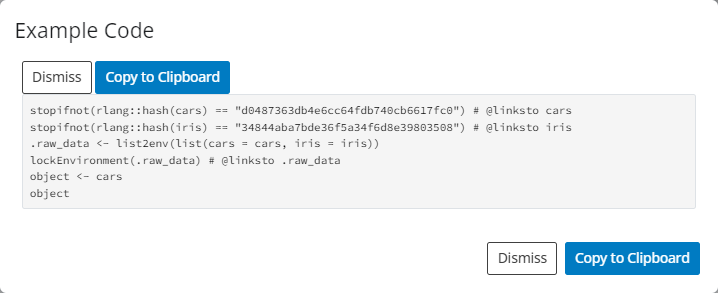
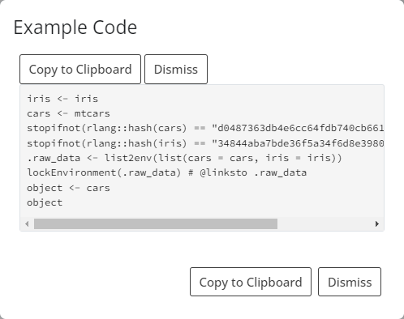

```{r, include = FALSE}
knitr::opts_chunk$set(
  collapse = TRUE,
  comment = "#>"
)
```

## Data in `teal` Applications

The `teal` framework readily accepts general, non-relational data.
Modules defined in the `teal.modules.general` package are designed to work well with that kind of data.
Relational data is handled just as well and the mechanism of passing data to applications is virtually the same.
This includes clinical data that conforms to the `ADaM` standard.
We are working on making the framework extendable so that support for other data structures can be added with relative ease.
Currently some support is offered for the `MultiAssayExperiment` class.

All applications use the `teal_data` class as a data container.
`teal_data` objects are passed to `init` to build the application, where they are modified by the filter panel (if applicable) and passed on to modules.
Thus, the first step of building a `teal` app is creating a `teal_data` object.

### General data

A `teal_data` object is created by calling the `teal_data` function and passing data objects as `name:value` pairs.

```{r message=FALSE, warning=FALSE}
library(teal)

# create teal_data
data <- teal_data(iris = iris, cars = mtcars)
```

Note that `iris` and `cars` have been added to the `datanames` property of `data` (see [`datanames` property](#datanames)).

This is sufficient to run a `teal` app.

```{r, eval=FALSE}
# build app
app <- init(
  data = data,
  modules = example_module()
)

# run app
shinyApp(app$ui, app$server)
```

### Reproducible data

A `teal_data` object stores data in a separate environment.
Therefore, modifying the stored datasets requires that processing code be evaluated in that environment.
Following that logic, one can create an empty `teal_data` object and populate it by evaluating code.
This can be done using the `eval_code` function or, more conveniently, using the `within` function.

```{r}
# create empty object
data_empty <- teal_data()

# run code in the object
data_populated_1 <- eval_code(data_empty, code = "iris <- iris
                                                  cars <- mtcars")
# alternative
data_populated_2 <- within(data_empty, {
  iris <- iris
  cars <- mtcars
})
```

The key difference between `eval_code` and `within` is that the former accepts code as character vector or language objects (calls and expressions), while `within` accepts _only_ inline code.
See `?qenv` for more details.

Note that in the first example `data` was created by passing data objects, so the code that was used to create the data objects is unknown and therefore the process cannot be reproduced.
Inspecting code the in the app created above reveals a note that the preprocessing code is absent.



The necessary code can be supplied to the `code` argument of the `teal_data` function.

```{r}
data_with_code <- teal_data(
  iris = iris, cars = mtcars,
  code = "iris <- iris
          cars <- mtcars"
)
```



Keep in mind this code is not executed in the `teal_data`'s environment, so it may not reproduce the environment.
Such an object is considered _unverified_ (see [`verified` property](#verified)).

If reproducibility is required, we recommend creating an empty `teal_data` object and then evaluating code.

#### code from file

The ability to pass code as a character vector to `eval_code` opens the door to using code stored in a file.
```{r, eval=FALSE}
# not run
data_from_file <- teal_data()
data_from_file <- eval_code(data, readLines("<path_to_file>"))
```

### Creating data in-app

The one departure from passing a `teal_data` object to `init` is when the data does not exist in the environment where the app is run, _e.g._ when it has to be pulled from a remote source.
In those cases a `teal_data_module` must be used.
See [this vignette](data-as-shiny-module.html) for a detailed description.

<br>

## Clinical data

Currently `teal` supports two specialized data formats.

### `ADaM` data

The `ADaM` data model, defined in CDISC standards, specifies relationships between the subject-level parent dataset and observation-level child datasets.
The `cdisc_data` function takes advantage of that fact to automatically set default joining keys (see [`join_keys` property](#join_keys)).
In the example below, two standard `ADaM` datasets (`ADSL` and `ADTTE`) are passed to `cdisc_data`.

```{r}
# create cdisc_data
data_cdisc <- cdisc_data(ADSL = teal.data::rADSL, ADTTE = teal.data::rADSL)

names(data_cdisc)
join_keys(data_cdisc)
```


```{r, eval=FALSE}
app <- init(
  data = data_cdisc,
  modules = example_module()
)
shinyApp(app$ui, app$server)
```

### `MultiAssayExperiment` data

The `MultiAssayExperiment` package offers a data structure for representing and analyzing multi-omics experiments that involve multi-modal, high-dimensionality data, such as DNA mutations, protein or RNA abundance, chromatin occupancy, etc., in the same biological specimens.

The `MultiAssayExperiment` class is described in detail [here](https://www.bioconductor.org/packages/release/bioc/vignettes/MultiAssayExperiment/inst/doc/MultiAssayExperiment.html).

`MultiAssayExperiment` objects (MAEs) are placed in `teal_data` just like normal objects.

```{r, eval=FALSE}
library(MultiAssayExperiment)
utils::data(miniACC)

data_mae <- teal_data(MAE = miniACC)

app <- init(
  data = data_mae,
  modules = example_module()
)
shinyApp(app$ui, app$server)
```

Due to the unique structure of a MAE, `teal` requires special considerations when building `teal` modules.
Therefore, we cannot guarantee that all modules will work properly with MAEs.
The package [`teal.modules.hermes`](https://insightsengineering.github.io/teal.modules.hermes/latest-tag/) has been developed specifically with MAE in mind and will be more reliable.

The filter panel supports MAEs out of the box.

<br>

## `teal_data` properties

##### `join_keys`

Using relational data requires specifying joining keys for each pair of datasets.
Primary keys are unique row identifiers in individual datasets and thus should be specified for each dataset.
Foreign keys describe mapping of variables between datasets.
Joining keys are stored in the `join_keys` property, which can be set when creating a `teal_data` object, using the `join_keys` argument, or using the `join_keys` function.

```{r}
ds1 <- data.frame(
  id = seq(1, 10),
  group = rep(c("A", "B"), each = 5)
)
ds2 <- data.frame(
  group = c("A", "B"),
  condition = c("condition1", "condition2")
)
keys <- join_keys(
  join_key("DS1", keys = "id"),
  join_key("DS2", keys = "group"),
  join_key("DS1", "DS2", keys = c("group" = "group"))
)
data_relational1 <- teal_data(DS1 = ds1, DS2 = ds2, join_keys = keys)
data_relational2 <- teal_data(DS1 = ds1, DS2 = ds2)
join_keys(data_relational2) <- keys
```

For a detailed explanation of join keys, see [this `teal.data` vignette](https://insightsengineering.github.io/teal.data/latest-tag/articles/join-keys.html).

[(back to `ADaM` Data)](#adam-data)

##### `verified`

`teal_data` allows for tracking code from data creation through data filtering through data analysis so that the whole process can be reproduced.
The `verified` property designates whether or not reproducibility has been confirmed.
`teal_data` objects that are created empty and only modified by evaluating code within them are considered verified by default.
Those created with data objects alone or with data objects and code are not verified by default, but can become verified by running the `verify` function.

```{r}
data_with_code

data_with_objects_and_code <- teal_data(iris = iris, cars = mtcars, code = expression(iris <- iris, cars <- mtcars))
data_with_objects_and_code

data_with_objects_and_code_ver <- verify(data_with_objects_and_code)
data_with_objects_and_code_ver
```


For a detailed explanation of verification, see [this `teal.data` vignette](https://insightsengineering.github.io/teal.data/latest-tag/articles/teal-data-reproducibility.html).

[(back to Reproducible Data)](#reproducible-data)

<br>

##### Hidden datasets

Objects which name starts with a dot (.) are hidden in teal_data and the whole teal application. This can be used to pass auxiliary objects in the `teal_data` instance, without exposing them to the app user. For example:

- Proxy variables for column modifications
- Temporary datasets used to create final ones
- Connection objects

```{r}
my_data <- teal_data()
my_data <- within(my_data, {
  .data1 <- data.frame(id = 1:10, x = 11:20)
  .data2 <- data.frame(id = 1:10, y = 11:20)
  data <- merge(.data1, .data2)
})

ls(my_data)
names(my_data)

app <- init(data = my_data, modules = example_module())

if (interactive()) {
  shinyApp(app$ui, app$server)
}
```

## Further reading

For a complete guide to the `teal_data` class, please refer to the [`teal.data` package](https://insightsengineering.github.io/teal.data/latest-tag/).
