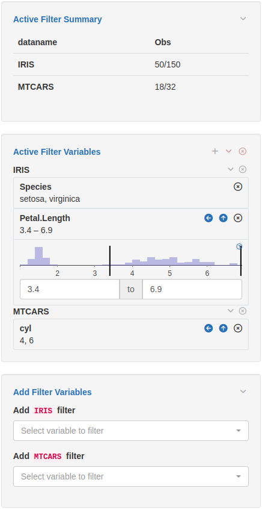

## Introduction

`teal` is a shiny-based interactive exploration framework for analyzing data, with particular emphasis on `CDISC` clinical trial data. 
`teal` applications allow their users to:

* "Pull" in data from external data sources
* Dynamically filter of data to be used in the analyses
* Generate reproducible code to regenerate the on-screen analyses
* Create and download reports containing results of analyses (for analysis modules which support reporting)

In addition, the `teal` framework provides application developers with:

* A large suite of custom-made standard analysis modules to be included in applications
* A logging framework to facilitate debugging of applications

More advanced users of the framework can also create new analysis modules which can be added into any `teal` applications.
See the _Creating Custom Modules_ vignette for a brief introduction to creating modules.

## Your first `teal` application:

This simple `teal` application takes the `iris` and `mtcars` datasets and displays their contents:

```{r, message=FALSE}
library(teal)

app <- init(
  data = teal_data(IRIS = iris, MTCARS = mtcars),
  modules = example_module(),
  header = "My first teal application"
)

if (interactive()) {
  shinyApp(app$ui, app$server)
}
```


As shown in the image above, this application consists of several distinct areas:

* Application header: the title of the application shown at the top.
* `teal` modules (bar at the top): in this case a simple module named "example teal module".
* Encoding panel (panel on the left hand side): Module specific UI components, in this case a drop-down to select a dataset name.
* Main output panel (panel on the middle): The outputs of the module, for this example module the chosen dataset is displayed.
* Filter panel (panels on the right hand side): for filtering the data to be passed into all `teal` modules.

### Encoding panel

The left hand side of the application is (usually) dedicated to module specific controls.
In modules which include reproducibility functionality it often contains a _Show R Code_ button that, when clicked, will display the code required to re-generate the output, including any filtering added by the filter panel and `library` calls to attach required packages.

### Filter panel

The filter panel allows app developers to select the datasets they wish to make available in the modules and define filters for those datasets.
The top section shows the number of records remaining in each dataset after filtering.
The middle section lists all currently defined filters. Typically these can be modified by the user.
The bottom section allows the user to add new filters.

In the example below:

* For the `IRIS` dataset, only rows satisfying the conditions `Petal.Length >= 3.4` and `Species %in% c("setosa", "virginica")` are included, thereby keeping 50 rows.
* For the `MTCARS` dataset, only rows satisfying the condition `cyl %in% c(4, 6)` are included, thereby keeping 18 rows.



## Creating your own applications

The key function to use to create your `teal` application is `init`, which requires two arguments: `data` and `modules`.

### Application Data

The `data` argument to the `init` function specifies the data used by your application. This can be data currently in your R session, as in the example above, but also `connectors`, which describe how to "pull" remote data when the application is run. Connectors can pull data from external sources, which may require authentication.

In the example above we call `teal_data` to convert raw datasets into `teal` specific datasets and to bind them in one `R` object. This function can also be used to specify relationships between different datasets. In order to use `CDISC` clinical trial data in a `teal` application the `cdisc_data` function is used instead.

For further details we recommend exploring the [`teal.data`](https://insightsengineering.github.io/teal.data/) package documentation.

### Modules

The `modules` argument to `init` consists of a list of `teal` modules (which can be wrapped together using the function `modules`). We recommend creating applications using predefined `teal` modules. See the references below for links to these modules.

### Defining Filters

The optional `filter` argument in `init` allows you to initialize the application with predefined filters. See the documentation for `init` for further details.

### Reporting

If any of the `modules` in your `teal` application support reporting (see [`teal.reporter`](https://insightsengineering.github.io/teal.reporter/) for more details), users of your application can add the outputs of the modules to a report.  This report can then be downloaded and a special _Report Previewer_ module will be added to your application as an additional tab, where users can view and configure their reports before downloading them.

## Where to go next

To learn more about the `teal` framework we recommend first exploring some of the available analysis modules.

For example see:

* [general analysis modules](https://insightsengineering.github.io/teal.modules.general/)
* [clinical trial reporting modules](https://insightsengineering.github.io/teal.modules.clinical/)
* [modules for analyzing `MultiAssayExperiment` objects](https://insightsengineering.github.io/teal.modules.hermes/)

The `teal` framework relies on a set of supporting packages whose documentation provides more in-depth information.
The packages which are of most interest when defining `teal`applications are:

* [`teal.data`](https://insightsengineering.github.io/teal.data/): defining data for `teal` application.
* [`teal.slice`](https://insightsengineering.github.io/teal.slice/): defining data filtering before passing into `teal` modules.
* [`teal.transform`](https://insightsengineering.github.io/teal.transform/): defining the way arguments are passed into `teal` modules.
