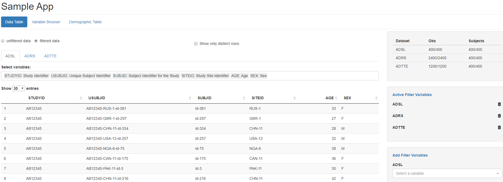

## Introduction

*teal* is a `shiny` based interactive exploration framework for analyzing clinical
trials data and more general relational data. `teal` currently provides a dynamic filtering facility and
different data viewers. `teal` shiny applications are built using standard
[shiny modules][shiny_modules].

The framework consists of a number of packages loaded by a single `library(teal)` call. Each package has a unique
responsibility:
* `teal`, for creating the server and the `UI` functions that can be used with `shiny` directly.
* [`teal.widgets`](https://insightsengineering.github.io/teal.widgets/), defining the customized widgets used in `teal` applications.
* [`teal.code`](https://insightsengineering.github.io/teal.code/), containing tools to ensure all the analysis done in `teal` can be reproduced using raw code in `R`.
* [`teal.data`](https://insightsengineering.github.io/teal.data/), making it easier to pass any data into a `teal` application.
* [`teal.slice`](https://insightsengineering.github.io/teal.slice/), supporting custom filtering, selecting and joining multiple data tables together.
* [`teal.transform`](https://insightsengineering.github.io/teal.transform/), delimiting the way `teal` users pass arguments to custom `teal` modules.

## Initializing A Teal application

The workflow to create a shiny app using teal is as follows. The `teal::init`
function is used to create a shiny `server` and `ui` function which in turn can
then be passed to the `shiny::shinyApp` function to start a shiny application.
The following code is sufficient for a single file shiny app.

Note this app require the libraries `teal.modules.general` and `teal.modules.clinical`
as these libraries provide standard modules for teal apps (see below for details of modules).

```{r, eval=FALSE}
library(teal)
library(teal.modules.general)
library(teal.modules.clinical)
library(scda)

adsl <- synthetic_cdisc_data("latest")$adsl
adrs <- synthetic_cdisc_data("latest")$adrs
adtte <- synthetic_cdisc_data("latest")$adtte

app <- teal::init(
  data = cdisc_data(
    cdisc_dataset("ADSL", adsl, code = "ADSL <- synthetic_cdisc_data(\"latest\")$adsl"),
    cdisc_dataset("ADRS", adrs, code = "ADRS <- synthetic_cdisc_data(\"latest\")$adrs"),
    cdisc_dataset("ADTTE", adtte, code = "ADTTE <- synthetic_cdisc_data(\"latest\")$adtte")
  ),
  modules = modules(
    teal.modules.general::tm_data_table("Data Table"),
    teal.modules.general::tm_variable_browser("Variable Browser"),
    teal.modules.clinical::tm_t_summary(
      label = "Demographic Table",
      dataname = "ADSL",
      arm_var = choices_selected(c("ACTARMCD", "ARMCD"), "ACTARMCD"),
      summarize_vars = choices_selected(c("BMRKR2", "SEX", "RACE"), c("BMRKR2", "SEX"))
    )
  ),
  title = "Sample app",
  header = tags$h1("Sample App"),
  footer = tags$p("Copyright 2020")
)

shinyApp(app$ui, app$server)
```

This will produce the following web app:



That is, we see a web app with a navigation bar at the top, the filter elements
on the right, and the data table viewer in the center. The data table and the
variable browser are two of the items that we provide with the libraries of teal modules
`teal.modules.clinical` and `teal.modules.general` . Other items can be added
using shiny modules. Note that if you would like to deploy the above app to a
shiny server then place the code into an `app.R` file.

Note that each function in the teal package is documented. Run

```{r, eval=FALSE}
library(teal)
help(package = "teal")
```

In the remainder of this section we will discuss all the elements that we
specified to get to this application.

### General Layout

The following mockup shows an abstraction of the elements that are created in
each teal application:


These containers correspond to actual html block elements and we use shiny's
default layout manager (currently [bootstrap 3](http://getbootstrap.com)) with a
fluid-container. Web-apps based on teal can control the following:

 - analysis data
 - header and footer content
 - the `navbar` menu items that define the tab content
 - and the content in the "Tab Content" element by using [shiny
modules](https://shiny.rstudio.com/articles/modules.html)
 - whether the filter panel is shown or not and what filters are shown

And the following items can currently not be controlled:

 - layout outside of the "Tab Contents" box
 - filter setup

### Data

In the code listing above we specified the analysis data with a named list that
is passed to the `data` argument of `teal::init`. Because we filter every other
data set with the ADSL filters (more on this below) you always need to specify
the `ADSL` data with the `USUBJID` variable. Note that the dataset names are case
sensitive.


### Navigation Tabs, Application Content, Shiny Modules

The second argument of `teal::init` that we specified in the code listing above
is the `modules` arguments. Modules define the elements displayed with tabs in
the *`Navbar`* and their corresponding content in the *Tabs Content* box. A
`modules` object can contain `module` and `modules` objects.

We start the tree with the `modules` function without a label argument which sets
the `label` argument to `"root"`.

The [shiny modules][shiny_modules] are specified in the `module` function with
the `server` and `ui` argument. Both, `module` and `modules` are documented
in the `teal` package, see `?module` and `?modules`.


## Accessing the Analysis Data in Shiny Modules

`teal` encapsulates all analysis datasets and provides the filtering facility.
The filtered and unfiltered data is then made accessible via a `FilteredData`
object that we usually assign to a `datasets` variable. The `FilteredData` class
is based on the [R6][R6] object system. The key method for the `FilteredData` object
is `get_data` method which returns either the filtered or unfiltered dataset of interest.

Assume we create the following `module` with the shiny modules

```{r, eval = FALSE}
module(
  label = "Frequency Table",
  ui = function(id, ...) {
    ns <- NS(id)
    tableOutput(ns("freq_table"))
  },
  server = function(input, output, session, datasets) {
    output$freq_table <- renderTable({
      adsl <- datasets$get_data("ADSL", filtered = TRUE)
      table(adsl$SEX)
    })
  },
  filters = "ADSL"
)
```

This analysis item shows up as *Frequency Table* in the `navbar` and displays a
table of the `ADSL.SEX` variable in the *Tab Contents* section of the app. The
`ui` function requires the `id` argument, as defined in [shiny
modules][shiny_modules] and the `server` function requires the three arguments
`input`, `output`, and `session`. The `dataset` argument is added to the
`server` function call by `teal` based on the `server_args` argument list
specified in the `module` function. The `server_args` expects a named list
with additional arguments that should be passed to the server function. The list
names (e.g. `datasets` in the above code) map to the argument names and the
content is usually mapped one-to-one with the exception of some keywords such as
`teal_datasets` which will be replaced by teal with the `FilteredData` object
mentioned above.

## Filtering

For clinical trial data analysis (as opposed to more general relational data)
we apply a specific filtering mechanism that requires an `ADSL` analysis dataset to be part of every
`teal` app. That is, the filter framework lets the user dynamically
specify which variables she/he wants to use for filtering (using ranges or
categories). Teal then creates the `filter` code for each filter condition and
links them with an elementwise logical **AND**  operator (i.e. `&`). Further,
all datasets other than `ADSL` will also be filtered with the remaining subjects
in `ADSL` through the `ADSL.USUBJID` and `ADSL.STUDYID` variables. Hence, assume
you have the following three filters

 - `ADSL.STUDYID %in% c("BP29392", "WP29945")`
 - `ADSL.AGE > 15 & ADSL.AGE < 35`
 - `ADRS.ADY > 0 & ADRS.ADY < 500`

Then then `FilteredData` object will perform the following operations to obtain
the filtered `ADRS` object in one of your modules:

```{r, eval=FALSE}
adsl_filtered <- dplyr::filter(adsl, STUDYID %in% c("BP29392", "WP29945") & AGE > 15 & AGE < 35)
adrs_filtered_alone <- dplyr::filter(adrs, ADY > 0 & ADY < 500)

adrs_filtered <- dplyr::inner_join(
  x = adsl_filtered,
  y = adrs_filtered_alone,
  by = c("USUBJID", "STUDYID")
)
```


## Additional Information

### Defining Custom Header and Footers

The `teal::init` function also has the `header` and `footer` arguments that
expects an object of class `shiny.tag` which can be created with the functions
stored in the `tags` list (exported by shiny). So, a possible header could be
defined as follows:

```{r, eval=FALSE}
tags$div(tags$h1("My New Analysis Web-app"), tags$p(class = "pull-left", "Logo"))
```


[shiny_modules]: https://shiny.rstudio.com/articles/modules.html "Modularizing Shiny app code"
[R6]: https://r6.r-lib.org/articles/Introduction.html "Introduction to R6 classes"
