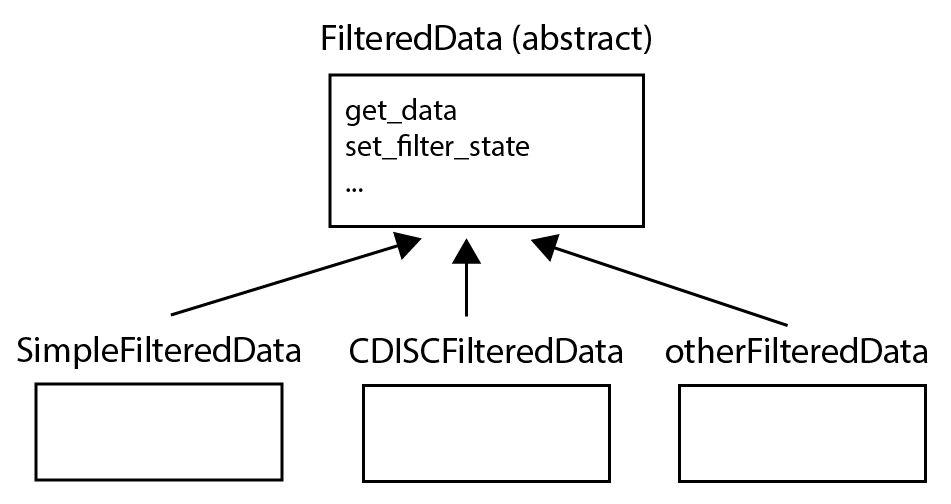

```{r setup, include=FALSE}
knitr::opts_chunk$set(echo = TRUE)
```

# Introduction

This vignette describes the core design of `teal` and explains some of `teal`s
implementation details.

`teal` is a framework built on top of `shiny` that adds

* data filtering: on a variable basis combined with `&` logic
* API to request the underlying R code of an output
* modularized approach to build customized web-apps with `teal`-modules

`teal` modules are `shiny` modules with an additional `datasets` argument for
the `server` function that provides an access to the filtered data.

# Shiny Basics

Shiny apps have the following two main components: the `server` function and an
`ui` object. The `ui` object is a representation of the `html` for the webpage
and the `server` function provides the logic to modify the html code. Hence, a
minimal shiny app with no server logic is as follows:

```{r, echo=FALSE}
library(shiny)
```

```{r, eval = FALSE}
library(shiny)
shinyApp(
  ui = tags$p("Hello World"),
  server = function(input, output, session) {}
)
```

You can paste this code to the `R` command line which will initialize the shiny
app. `shiny` provides a [reactivity programming model][shiny_reactivity] to
update and get information from the ui:

```{r, eval = FALSE}
shinyApp(
  ui = fluidPage(
    selectInput(inputId = "select_data", label = "select data", choices = c("iris", "mtcars")),
    plotOutput(outputId = "scatterplotmatrix")
  ),
  server = function(input, output, session) {
    output$scatterplotmatrix <- renderPlot({
      data <- input$select_data
      if (data == "iris") {
        pairs(iris[,-5], col = iris$Species)
      } else {
        pairs(mtcars[, -2], col = mtcars$cyl)
      }
    })
  }
)
```

Note that reactivity is used on the server side for capturing the input (i.e.
`input$select_data`) and to update the output (i.e. `output$scatterplot`). On
the ui side shiny keeps the `html` code up-to-date and propagates user interface
input changes to the reactive environment on the server side. Please inspect the
`html` code from the previous example app while the app is running with Chrome's
developer tools and then stop the shiny app and compare that html code with the
ui code created by running the following code in the R console:

```{r, eval = FALSE}
fluidPage(
  selectInput(inputId = "select_data", label = "select data", choices = c("iris", "mtcars")),
  plotOutput(outputId = "scatterplotmatrix")
)
```

[Shiny modules][shiny_modules] provide an elegant way to split both the *ui*
object and *server* function into reusable and self-contained functions. Please
read the [official tutorial][shiny_modules] and note that input and output
elements are separated by using namespaces. For the above example, we can
modularize the selection and the plotting of the data as follows:


```{r, eval = FALSE}
ui_example <- function(id) {
  ns <- NS(id)
  tagList(
    selectInput(inputId = ns("select_data"), label = "select data", choices = c("iris", "mtcars")),
    plotOutput(outputId = ns("scatterplotmatrix"))
  )
}

srv_example <- function(input, output, session) {
  output$scatterplotmatrix <- renderPlot({
    data <- input$select_data
    if (data == "iris") {
      pairs(iris[,-5], col = iris$Species)
    } else {
      pairs(mtcars[, -2], col = mtcars$cyl)
    }
  })
}
```

Note that `ui_example` and `srv_example` functions constitute our *example*
module. To use this module twice in an app run the following code:

```{r, eval = FALSE}
shinyApp(
  ui = function() {
    tagList(
      ui_example(id = "first"),
      ui_example(id = "second")
    )
  },
  server = function(input, output, session) {
    callModule(srv_example, id = "first")
    callModule(srv_example, id = "second")
  }
)
```

Note that because of the namespace `id` the two modules do not conflict with
their `html` ids and reactivity names. Please inspect the `html` code for the
above example and pay attention to the `html` `id` attributes.

Here is a visual representation of this modularization:

```{r echo=FALSE}
knitr::include_graphics('./images/design_shiny_module.png')
```

This modularized construction of shiny apps is one of the foundations of `teal`.
Modularizing code also makes it easier to build a company wide standard for
creating and sharing shiny code and also for creating project specific
applications quickly.

Finally, the user interface layout is based on [Bootstrap 3][bootstrap_3] when
using the `fluidPage` and `fixedPage` layout functions (which we do for `teal`).
Understanding the bootstrap framework for layout, class and css association is
useful for creating clean user interfaces.

# The Teal Overall Design

The general `teal` workflow is as follows:

1. pass a collection of data sets and a collection of configured teal modules to
the `teal::init` function.

2. `teal::init` composes the `ui` and `server` functions that can then be passed
to the `shiny::shinyApp` function

```{r echo=FALSE}
knitr::include_graphics('./images/design_use_teal.png')
```

A simple example for a completely custom `teal` module is the following

```{r, eval = FALSE}
library(teal)
library(magrittr)
library(dplyr)
 
app <- teal::init(
  data = cdisc_data(cdisc_dataset("ADSL", data = iris %>% mutate(USUBJID = 1:dplyr::n(), STUDYID = "A"))),
  modules = root_modules(
    module(
      label = "sample module",
      server = function(input, output, session, datasets) {
        output$scatterplot <- renderPlot({
          iris <- datasets$get_data("ADSL", filtered = TRUE)
          with(iris, plot(Sepal.Length, Sepal.Width, col = Species))
        })
      },
      ui = function(id, datasets) {
        ns <- NS(id)
        plotOutput(ns("scatterplot"))
      },
      filters = "ADSL"
    )
  )
)
bookmarkableShinyApp(app$ui, app$server)
# or, without bookmarking: shinyApp(app$ui(), app$server)
```

Please run the above code by copy pasting it to the command line. The example
shows how simple it is to create a module that has no dynamic encodings but
still is interactive due to the possibility of filtering the data. The example
also highlights a current issue where we require a dataset with the name `ADSL`
that has the variables `USUBJID` and `SUBJID`. We describe the reason and the
future refactoring needed to overcome this later in this document.


The default `teal` web application has the following components

```{r echo=FALSE}
knitr::include_graphics('./images/teal_containers.png')
```

and the composition of the shiny app `ui` object is based on the [`tabsetPanel`]
and the composition of the `server` function is based on the modules as
illustrated here:

```{r echo=FALSE}
knitr::include_graphics('./images/design_teal.png')
```

The important new parts in the above diagram are:

* the `datasets` object that filters the analysis data and provides an interface
to access and modify the data and variable based filtering. The `datasets`
object is of class `FilteredData` which uses the [`R6`][R6] object system.

* Filter panel related code: that is, a view and controller for the `FiltereData`
object.

* shiny's [`tabsetPanel`] for displaying only one analysis module at a time (e.g.
the one with a bold outline). The modules that are not active (visible) get the
attribute `class=invisible` in the html code. Note that the `html` for each
module is always present in your app ui `html` code.

These have been the three main challenges (in addition to code reproducibility)
when designing and implementing `teal`. The relevant R-code for these main parts
are in the [teal repository][tealGitHub] in the following files:

* `R/FilteredData.R`
* `R/init.R`, `R/module_filter_items.R`, `R/module_add_filter_variables.R`
* `R/init.R`

We have also a logging facility with the `.log` function with the corresponding
code saved in `R/logging.R`. Logging to the prompt can be disabled with
`options(teal_logging = FALSE)`.

We now discuss each of the three core components in detail. This would be a good
time to browse through the just mentioned `.R` files and see how much of what
has just been said/written can be spotted in the code without further
explanation.

## FilteredData

The `FilteredData` class is an [`R6`][R6] reference class to handle the datasets
and the filtering state. In general, every dataset can be filtered based on
values of its variables.

* if a variable `xi` is continuous then the filtering is based on a range: `xi in
[a,b]` where `min(xi)<=a<b<=max(xi)`

* if a variable `xi` is categorical then the filtering is based on a set:
`xi in A` where `A` is a subset of the elements in `xi`.

When filtering a dataset, say `ADSL`, with `10` of its variables then the `10`
subsetting conditions are combined with an logical AND (`&`). If a more
complicated subsetting is needed then it is easiest to add a new variable to the
analysis dataset that contains the desired logic which then in turn can be
combined via `&` logic with other variable based subsetting conditions.

### Clinical Trials Data

In order to understand the current implementation of the `FilteredData` class it
is useful to have some background of the data standards used in clinical trials.

For clinical trials the datasets are standardized following the [CDISC][CDISC]
standards [SDTM][SDTM] and [ADaM][ADAM]. Both SDTM and ADaM are based on
rectangular data structures and a simplified generalization is that SDTM
contains observed raw data and ADaM adds meta data and derives new data so that
an output (table/graph) can be computed directly from a single ADaM data set.
Here is a diagram of some SDTM datasets:

```{r echo=FALSE, out.width='80%'}
knitr::include_graphics('./images/sdtm_overview.png')
```

The names of ADaM datasets often prefix a `AD` or `A` to their corresponding
`SDTM` dataset names.

There is one particularly important dataset called `ASL` or `ADLS` that contains
patient information (e.g. Unique Subject Identifier `USUBJID`, `ARM`, `SEX`,
`Age`, randomization date, etc.) with one row per patient. Often this dataset is
merged to all other `ADaM` datasets as its information is frequently used for
most outputs (e.g. `ARM`). The key for merging `ADSL` and any other analysis
dataset is the `USUBJID` and `STUDYID` variable (if not specified otherwise).

### FilteredData Class for Clinical Trials Data

Because of the central role of the `ADSL` dataset and due to tight project
delivery timelines I have unfortunately implemented a filtering mechanism that
always depends on `ADSL` as illustrated here:

```{r echo=FALSE, out.width='100%'}
knitr::include_graphics('./images/design_cdisc_filtered_datasets.png')
```

This filtering will now be explained step by step for two example datasets (`ADSL`
and `ATE`):

```{r}
# for reproducibility
set.seed(1)

ADSL <- data.frame(
  USUBJID = paste0("id-", 1:100),
  STUDYID = "studyA",
  AGE = abs(rnorm(100, sd = 20) + 40),
  SEX = sample(c('M', 'F'), 100, TRUE),
  stringsAsFactors = FALSE
)

ADTTE <- data.frame(
  USUBJID = paste0("id-", 1:100),
  STUDYID = "studyA",
  AVAL = abs(rexp(100, rate = 1/20)),
  CNSR = sample(c(0,1), 100, TRUE),
  PARAMCD = "OS",
  stringsAsFactors = FALSE
)

set.seed(0)
```

The `datasets` object of class `FilteredData` that is passed an argument to the
`server` function is created by `teal` as follows:

```{r}
library(teal)
options(teal_logging = FALSE)
datasets <- teal:::FilteredData$new()

# the `datasets` object contains reactives
# we activate this option, so we don't need to wrap all reactives in isolate calls
options(shiny.suppressMissingContextError = TRUE)

attr(ADSL, "keys") <- teal::get_cdisc_keys("ADSL")
attr(ADTTE, "keys") <- teal::get_cdisc_keys("ADTTE")

isolate({
  # todo: remove isolate
  datasets$set_data("ADSL", ADSL)
  datasets$set_data("ADTTE", ADTTE)
})
shiny:::flushReact()
```

Note that this code also runs outside of a teal instance. The public methods of
the `FilteredData` class are:

```{r}
names(datasets)
```

these public methods are currently a bit too numerous because I initially
thought that I can hide the `FilteredData` instance (i.e. the `datasets` object)
and pass only the reactive filtered datasets to the modules (using argument
matching). However that is difficult due to the use of `do.call` when composing
the `server` function (and time pressure). We can query the `datasets` object to
display the filter options for each variable:


```{r}
datasets$print_filter_info("ADSL")
# for all variables
# datasets$print_filter_info("ADSL", filtered_vars_only = FALSE)
```

Now say we want to filter out all the patients except patients with `USUBJID`
equal to `id-1`, `id-2`, `id-3`, or `id-4`:

```{r}
datasets$set_filter_state("ADSL", "USUBJID", state = list(choices = paste0("id-", 1:4), keep_na = FALSE))
shiny:::flushReact()

datasets$get_data("ADSL", filtered = TRUE)
```

Note that this `USUBJID` variable based filtering also filters the `ATE` data
(with an inner join based on `USUBJID` and `STUDYID`), as illustrated in the
previous figure:

```{r}
datasets$get_data("ADTTE", filtered = TRUE)
```

The two `get_data` method calls return the `ADSL_FILTERED` and `ADTTE_FILTERED`
data, respectively, as illustrated from the above figure. We can also get the
`call` object that was used for the filtering:

```{r}
datasets$get_filter_call("ADTTE")
```

Note that when setting `reactive = TRUE` in the `datasets$get_data` method then
a reactive value with the requested dataset gets returned which can be directly
used in the reactive environment of the teal module `server` functions.


### Needed Generalization of FilteredData

The CDISC filtering mechanism which we have introduced in the previous section
can be abstracted with the following diagram:

```{r echo=FALSE}
knitr::include_graphics('./images/design_cdisc_filtered_data.png')
```

This is, however, a very particular filtering setup that has not much use
besides analyzing clinical trials data that follows CDISC standards. A more
general filtering setup would be to have variable based filtering for an
arbitrary dataset:

```{r echo=FALSE}
knitr::include_graphics('./images/design_one_dataset_filtered_data.png')
```

or more generally a collection of independently filtered datasets:

```{r echo=FALSE}
knitr::include_graphics('./images/design_simple_filtered_data.png')
```

Lets call this particular filtering the `SimpleFilteredData` class.


Finally we would also need a filtering for [expression sets][expressionSets]

```{r echo=FALSE}
knitr::include_graphics('./images/expressionset.png')
```

that is, filtering expression sets is a slightly more advanced filtering as one
probably wants to filter the biomarker data on a sample level but also on
gene-meta data level (filter columns and rows).

In terms of refactoring `teal` this means that the `FilteredData` class needs to
become abstract with multiple concrete classes that inherit from `FilteredData`:

```{r echo=FALSE}

```

### Optimizing The FilteredData Class

The arrows that point downwards in the filtering related diagrams above indicate
a propagation mechanism that happens to be inefficient. That is, when filtering
with `ADSL` variables then all the dependent datasets (that is currently every
other dataset) gets updated regardless if there is any output currently
displayed that requires the information from a particular dataset. Hence we
loose the lazy evaluation that is provided with shiny's reactivity framework. It
would be better to set up the datasets reactive and only have them apply the
filtering and merging if there is actually something displayed in the shiny app
that requires the particular dataset.


```{r echo=FALSE}
knitr::include_graphics('./images/design_reactive_filtered_data.png')
```

### Summary of filtering related issues

First the main issues mentioned above:

* make `FilteredData` class abstract and implement concrete classes (as outlined
above) inheriting from `FilteredData`.

* make the filtering lazy by making better use of reactivity (using
`reactiveValues()`).


Also, a simple feature but still useful improvement is to support:

* filtering with variables of class `Date`


## Composition of the ui and server functions with `teal::init`


In this section we discuss the code in `R/init.R`. The `init` function composes
the `ui` object and the `server` function which are returned and then passed to
`shinyApp` to start the web app.

The datasets passed to the `data` arguments get encapsulated within the `init`
function into a local instance of `FilteredData` (i.e. the `datasets` object).

Next, the `ui` object is created. The composition of ui and server happens
entirely with the object passed via `modules`, `header`, and `footers`
arguments. The `modules` object is a tree of `modules()` (nested lists) with
currently a constrained depth of 2. The composition of the ui functions defined
in `modules` happens recursively via the `create_ui` function. Note that the
`create_ui` function call happens in a local environment as we modify the
returned object structure to add the filter panel on the right hand side (this
improves the UI as it places the filter panel below the `tabsetPanel` menu).

There are two major improvement opportunities in creating the ui object:

1) the ui object should optionally be a `ui` function so that the whole `teal`
application can be modularized

2) the filter panel has not been abstracted and encapsulated nicely enough to be
a reusable view/controller for the `datasets` object (i.e. for the class
`FilteredData`). This currently does not limit the teal functionality. However
it has implications for the server function composition as will be illustrated
below.

Also note that the added javascript in the `ui` object is necessary to manually
interrupt reactivity when hiding the ui elements for filtering based on variables
that are not relevant for a particular analysis (i.e. we do not show `ARS`
filter variables if we analyse an output based on `ATE`).

Next: the creation of the server function. The easy part is the composition of
the module server functions which happens with the `call_modules` function call.

The rest of the server function creation related code revolves around the
filtered data panel. Again, a nice improvement here would be to

* make the filter panel a module

## Reproducibility

There are multiple parts to create reproducible code for the displayed outputs:

1. what `R` version is used and on which platform

1. what libraries are used, and which version

1. data used and hash sum (currently on BCE the path is the identifier and the
hash sum in needed as the data may change over time)

1. subset call to get the filtered data

1. code to create the output

In `teal` we started to streamline 1) and 2) with the `get_rcode_header`
function. This function needs to be improved but that is a simple exercise.
Next, 3) can either be achieved via the `get_filter_call` method of the
`datasets` object or simpler via the `get_filter_txt` function. Finally 4) is
currently the most difficult to achieve well. We have tried to create the R call
(in a string to preserve the formatting) and then evaluating that string to
create the output, however that is not a good approach as it makes it
essentially impossible to debug the modules. Another approach that we have tried
is to use tagging with `@start_label` and `@end_label` as documented in the
`02_reproducible-code` vignette. Two more promising approaches are to tag the
code chunks via a function call with tag and chunk-code and then remove the
function call but leave the code when creating the server function (as proposed
by Michael) and another approach is developed by Doug and Gabe.


After having created a number of modules for
[`teal.modules.clinical`](https://github.roche.com/NEST/teal.modules.clinical) it seems
probably easiest to keep the modules simple by making a module to be a user
interface for a simple function call with dynamic arguments. E.g. we created am
analysis package [tern](https://github.roche.com/NEST/tern) which has the
function `kmplot` to create a Kaplan-Meier plot. We have then also created the
[`teal.modules.clinical`](https://github.roche.com/NEST/teal.modules.clinical) R package
which has the module `tm_kplot` which provides a user interface that allows one
to modify certain arguments of `tern::kmplot` via the encodings panel. This
reduces 4) essentially to an argument tracking problem. This is, however, work
in progress.

## Desiderata

* save the state of an app and provide shareable links that capture the state of
the analysis/app

* inheritance model for teal modules, e.g. make slightly modified modules (this
needs to be better formulated, e.g. what exactly changes: output arguments,
encoding ui/logic, etc...?

* `teal` modules probably need a shared state such as selected arm variable.
This could be achieved by a reactive value that is passed as an argument to the
modules.

# Embed teal into other applications
Here is an example of an app with two independent teal applications side-by-side. The same idea can be used to embed it into other Shiny modules.
We use the `id` argument of the `init` function for this.

```{r, eval = FALSE}
library(random.cdisc.data)

ADSL <- radsl(cached = TRUE)

options(teal_logging = FALSE)

# Code to have two teal apps side-by-side or embed it in a larger application
create_teal_app <- function(title) {
  init(
    data = cdisc_data(
      cdisc_dataset("ADSL", ADSL),
      code = "ADSL <- radsl(seed = 1)"
    ),
    modules = root_modules(
      module(
        "data source",
        server = function(input, output, session, datasets) {},
        ui = function(id, ...) div(p("information about data source")),
        filters = "all"
      ),
      module(
        "ADSL AGE histogram",
        server = function(input, output, session, datasets) {
          output$hist <- renderPlot(
            hist(datasets$get_data("ADSL", filtered = TRUE)$AGE)
          )
        },
        ui = function(id, ...) {
          ns <- NS(id)
          plotOutput(ns("hist"))
        },
        filters = "ADSL"
      )
    ),
    filter_states = list(ADSL = list(AGE = "default")),
    header = tags$h1(title),
    footer = tags$p("Copyright 2017 - 2020")
  )
}
app1 <- create_teal_app("Sample App1")
app2 <- create_teal_app("Sample App2")
bookmarkableShinyApp(ui = fluidPage(
  fluidRow(
    column(6, app1$ui("app1")),
    column(6, app2$ui("app2"))
  )
), server = function(input, output, session) {
  callModule(app1$server, "app1")
  callModule(app2$server, "app2")
})
```


[shiny_modules]: https://shiny.rstudio.com/articles/modules.html
[shiny_reactivity]: https://shiny.rstudio.com/articles/reactivity-overview.html
[bootstrap_3]: http://bootstrapdocs.com/v3.0.3/docs/
[R6]: https://cran.r-project.org/web/packages/R6/vignettes/Introduction.html
[SDTM]: https://www.cdisc.org/standards/foundational/sdtm
[ADAM]: https://www.cdisc.org/standards/foundational/adam
[CDISC]: https://www.cdisc.org
[tabsetPanel]: https://shiny.rstudio.com/reference/shiny/1.0.5/tabsetPanel.html
[tealGitHub]: https://github.roche.com/NEST/teal
[expressionSets]: https://www.bioconductor.org/packages/3.7/bioc/vignettes/Biobase/inst/doc/ExpressionSetIntroduction.pdf
