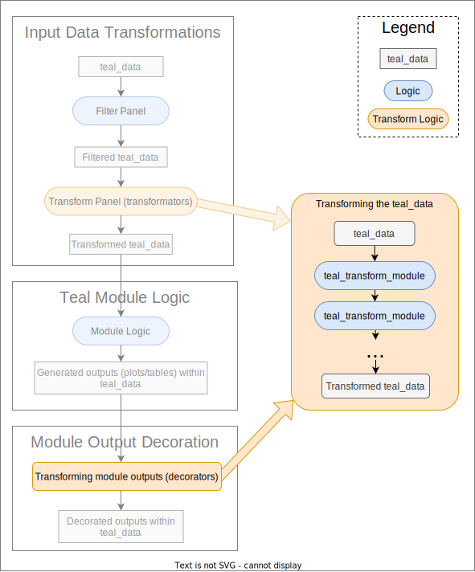

```{r setup, include=FALSE}
library(teal)
library(ggplot2)
```


## Introduction

The outputs produced by `teal` modules, like graphs or tables, are created by the module developer and look a certain way.
It is hard to design an output that will satisfy every possible user, so the form of the output should be considered a default value that can be customized.
In [Transform Input Data](transform-input-data.html) we described how `teal_module`'s input data can be modified using `teal_transform_module`. Here we present how to utilize `teal_transform_module` to modify an output created by a `teal_module`, enabling you to tailor outputs to your specific requirements without rewriting the original module code.



## How to Transform outputs?

Custom transformations for the output objects can be created with `teal_transform_module()` and thus they are `shiny` modules.
They are passed to `teal_module` constructors as arguments (see below).
Their server logic will be used to modify objects such as plots or tables that exist in the server function of a `teal_module`.
A `ui` function can provide interactivity but that is optional, an app developer is free to transform outputs objects of a `teal` module that do not require user input.


### Requirements and Limitations

Transforming `teal` module output requires the following:

1. **Module Support**:<br>
`teal` will apply transformations to `teal_module` outputs, but the module in question must explicitly support this functionality.
It is the responsibility of to the module developer to accept and consume the list of `teal_transform_module`.
2. **Matching Object Names**:<br>
Transformations have to reference variables that already exist in the `teal_module` server function and therefore must use the appropriate variable names.
Think of it as extending the plot/table code that already exists in the module.
Module developers are encouraged to provide the relevant names in the module's documentation, otherwise the person writing the output transformation must follow the source code.
3. **Maintaining Object Classes**:<br>
A transformation must not alter the class of the object that it modifies.
This is because a different class may require a different rendering function and that is part of the module structure, which beyond the control of decorators.
If change of this magnitude is required, it is recommended to create a new module.

## Building Output Transformations (Decorators)

For simplicity, we will refer to the output transformers as **decorators** in the code examples below.

### Server

Here we create a simple transformator that does not provide any user input.
Knowing that the module contains an object of class `ggplot2` named `plot`, we will modify its title and x-axis title:

```{r static_decorator}
static_decorator <- teal_transform_module(
  label = "Static decorator",
  server = function(id, data) {
    moduleServer(id, function(input, output, session) {
      reactive({
        req(data())
        within(data(), {
          plot <- plot +
            ggtitle("This is a better title") +
            xlab("the real x axis")
        })
      })
    })
  }
)
```


### UI

If the transformation requires a user input, a `ui` function can be added.
Here, the x-axis title is obtained from a `textInput` widget, giving the user some flexibility.
Note how the input values are passed to the `within()` function using its `...` argument.
See `?teal.code::within.qenv` for more examples.

```{r interactive_decorator}
interactive_decorator <- teal_transform_module(
  label = "Interactive decorator",
  ui = function(id) {
    ns <- NS(id)
    div(
      textInput(ns("x_axis_title"), "X axis title", value = "the suggested x axis")
    )
  },
  server = function(id, data) {
    moduleServer(id, function(input, output, session) {
      reactive({
        req(data())
        within(data(),
          {
            plot <- plot +
              ggtitle("This is a better title") +
              xlab(my_title)
          },
          my_title = input$x_axis_title
        )
      })
    })
  }
)
```


### Variable Names as Arguments

The server function of a transforming `teal_transform_module` must conform to the names of the variables that exist in the server function of the transformed `teal_module`.
Writing a universal transformator that applies to any module is impossible because different modules may use different variable names for their output elements.
It is possible, however, to create a transformator that will take the relevant variable names as arguments.
Here, the `output_name` variable name is passed to a transformator, allowing it to work with multiple modules.

```{r dynamic_decorator}
dynamic_decorator <- function(output_name) {
  teal_transform_module(
    label = "Dynamic decorator",
    ui = function(id) {
      ns <- NS(id)
      div(
        textInput(ns("x_axis_title"), "X axis title", value = "the syggested x axis")
      )
    },
    server = function(id, data) {
      moduleServer(id, function(input, output, session) {
        reactive({
          req(data())
          within(data(),
            {
              output_name <- output_name +
                xlab(x_axis_title)
            },
            output_name = as.name(output_name),
            x_axis_title = input$x_axis_title
          )
        })
      })
    }
  )
}
```

Note that when the function is used, `output_name` will be passed a character string but the expression passed to `within` needs a `name`/`symbol`, a language object, hence the argument value must be converted to a `name`.


## Using Output Transformations (Decorators)

Transformations are applied to a `teal` module as follows:

1. A list of transformations is passed to the module constructor function (_e.g._ `tm_my_module`).
2. The module constructor calls the module generator function (`teal::module`) and passes the transformations to the `ui_args` and `server_args` arguments.
3. The module functions, UI and server, take a list of transformations as arguments and resolve them using `ui_transform_teal_data` and `srv_transform_teal_data`, respectively.

Here is a minimal illustration:

```{r pseudo_module, eval = FALSE}
# styler: off
pseudo_decorated_module <- function(
  label = "Pseudo Module with Decorator Support",
  decorators = list()                                                       # <--- added block (1)
) {
  module(
    label = label,
    ui_args = list(decorators = decorators),                                  # <--- added block (2)
    server_args = list(decorators = decorators),                              # <--- added block (2)
    ui = function(id, decorators) {
      ns <- NS(id)
      div(
        # <input widgets>,
        # <output widgets>,
        ui_transform_teal_data(ns("decorate"), transformators = decorators)   # <--- added block (3)
      )
    },
    server = function(id, data, decorators) {
      moduleServer(id, function(input, output, session) {
        # <receive inputs>
        # <process data>
        data_with_output <- reactive({
          within(data(), output_item <- generate_output())
        })
        data_with_output_decorated <- srv_transform_teal_data(                # <--- added block (3)
          "decorate",                                                         # <-
          data = data_with_output,                                            # <-
          transformators = decorators                                         # <-
        )                                                                     # <--- added block (3)
        # <render output>
      })
    }
  )
}
# styler: on
```

The following examples demonstrate various uses of output transformations.

### Single Transformation (Decoration)

In the first example we will apply one transformation to one output.

### Module

This module has one output, a plot created with `ggplot2`, and it displays the reproducible code used to obtain the plot.

```{r tm_decorated_plot}
tm_decorated_plot <- function(label = "module", decorators = list()) {
  checkmate::assert_list(decorators, "teal_transform_module", null.ok = TRUE)

  module(
    label = label,
    ui_args = list(decorators = decorators),
    server_args = list(decorators = decorators),
    ui = function(id, decorators) {
      ns <- NS(id)
      div(
        selectInput(ns("dataname"), label = "select dataname", choices = NULL),
        selectInput(ns("x"), label = "select x", choices = NULL),
        selectInput(ns("y"), label = "select y", choices = NULL),
        ui_transform_teal_data(ns("decorate"), transformators = decorators),
        plotOutput(ns("plot")),
        verbatimTextOutput(ns("text"))
      )
    },
    server = function(id, data, decorators) {
      moduleServer(id, function(input, output, session) {
        observeEvent(data(), {
          updateSelectInput(inputId = "dataname", choices = names(data()))
        })

        observeEvent(input$dataname, {
          req(input$dataname)
          updateSelectInput(inputId = "x", choices = colnames(data()[[input$dataname]]))
          updateSelectInput(inputId = "y", choices = colnames(data()[[input$dataname]]))
        })

        dataname <- reactive(req(input$dataname))
        x <- reactive({
          req(input$x, input$x %in% colnames(data()[[dataname()]]))
          input$x
        })
        y <- reactive({
          req(input$y, input$y %in% colnames(data()[[dataname()]]))
          input$y
        })

        # Plot is created within the teal_data object
        data_with_plot <- reactive({
          req(dataname(), x(), y())
          within(data(),
            {
              plot <- ggplot2::ggplot(dataname, ggplot2::aes(x = x, y = y)) +
                ggplot2::geom_point()
            },
            dataname = as.name(dataname()),
            x = as.name(x()),
            y = as.name(y())
          )
        })

        # Decorators are applied
        data_with_plot_decorated <- srv_transform_teal_data(
          "decorate",
          data = data_with_plot,
          transformators = decorators
        )

        # (Decorated) plot object is extracted for rendering
        plot_r <- reactive({
          data_with_plot_decorated()[["plot"]]
        })

        # Add plot printing statement to reproducible code
        ## This does not affect the analysis but when the code is "replayed"
        ## in an interactive session it will send the plot to a graphics device.
        reproducible_code <- reactive({
          within(data_with_plot_decorated(), expr = plot) |>
            teal.code::get_code()
        })

        output$plot <- renderPlot(plot_r())
        output$text <- renderText(reproducible_code())
      })
    }
  )
}
```

#### Application

Note that every call to the module constructor (`tm_decorated_plot`) takes a list containing _one_ transformator.

```{r app_1}
app <- init(
  data = teal_data(iris = iris, mtcars = mtcars),
  modules = modules(
    tm_decorated_plot("undecorated"),
    tm_decorated_plot("static", decorators = list(static_decorator)),
    tm_decorated_plot("interactive", decorators = list(interactive_decorator)),
    tm_decorated_plot("dynamic", decorators = list(dynamic_decorator("plot")))
  )
)

if (interactive()) {
  shinyApp(app$ui, app$server)
}
```

```{r shinylive_iframe_1, echo = FALSE, out.width = '150%', out.extra = 'style = "position: relative; z-index:1"', eval = requireNamespace("roxy.shinylive", quietly = TRUE) && knitr::is_html_output() && identical(Sys.getenv("IN_PKGDOWN"), "true")}
code <- paste0(c(
  "interactive <- function() TRUE",
  knitr::knit_code$get("setup"),
  knitr::knit_code$get("static_decorator"),
  knitr::knit_code$get("interactive_decorator"),
  knitr::knit_code$get("dynamic_decorator"),
  knitr::knit_code$get("tm_decorated_plot"),
  knitr::knit_code$get("app_1")
), collapse = "\n")
url <- roxy.shinylive::create_shinylive_url(code)
knitr::include_url(url, height = "800px")
```


### Transforming Multiple Outputs (Decorators)

Here we will apply transformation to two outputs in one module.

#### Transformators

The plot transformators adds a user-provided title to a `ggplot2` object.

```{r plot_decorator}
plot_decorator <- teal_transform_module(
  label = "Decorate plot",
  ui = function(id) {
    ns <- NS(id)
    textInput(ns("plot_title"), "Plot Title", value = "Title (editable)")
  },
  server = function(id, data) {
    moduleServer(id, function(input, output, session) {
      reactive({
        req(data())
        within(data(),
          {
            plot <- plot + ggplot2::ggtitle(ptitle) +
              ggplot2::theme_minimal() +
              ggplot2::theme(
                plot.title = element_text(face = "bold", size = 30, color = "blue")
              )
          },
          ptitle = input$plot_title
        )
      })
    })
  }
)
```

The table transformators adds a column to a `data.frame`.

```{r table_decorator}
table_decorator <- teal_transform_module(
  label = "Decorate table",
  ui = function(id) shiny::tags$p("No UI needed for table decorator and could be ommited."),
  server = function(id, data) {
    moduleServer(id, function(input, output, session) {
      reactive({
        req(data())
        within(data(), {
          table_data[["Added by decorator"]] <- paste0("Row ", seq_len(nrow(table_data)))
        })
      })
    })
  }
)
```


#### Module

The following module uses `ggplot2` to generate a scatter plot, and presents a simple `data.frame` as a summary table.
Code for both outputs is also displayed.

Note that the module constructor accepts one list of transformations and the transformations are then manually separated in the module functions.

```{r tm_decorated_plot_table}
tm_decorated_plot_table <- function(label = "module with two outputs", decorators = list()) {
  checkmate::assert_list(decorators, "teal_transform_module", null.ok = TRUE)

  module(
    label = label,
    ui_args = list(decorators = decorators),
    server_args = list(decorators = decorators),
    ui = function(id, decorators) {
      ns <- NS(id)
      div(
        selectInput(ns("dataname"), label = "Select dataset", choices = NULL),
        selectInput(ns("x"), label = "Select x-axis", choices = NULL),
        selectInput(ns("y"), label = "Select y-axis", choices = NULL),

        # Separately inject UI for plot and table decorators
        ui_transform_teal_data(ns("decorate_plot"), transformators = decorators$plot),
        ui_transform_teal_data(ns("decorate_table"), transformators = decorators$table),
        plotOutput(ns("plot")),
        tableOutput(ns("table")),
        verbatimTextOutput(ns("text"))
      )
    },
    server = function(id, data, decorators) {
      moduleServer(id, function(input, output, session) {
        observeEvent(data(), {
          updateSelectInput(inputId = "dataname", choices = names(data()))
        })

        dataname <- reactive(req(input$dataname))

        observeEvent(dataname(), {
          updateSelectInput(inputId = "x", choices = colnames(data()[[input$dataname]]))
          updateSelectInput(inputId = "y", choices = colnames(data()[[input$dataname]]))
        })
        x <- reactive({
          req(input$x, input$x %in% colnames(data()[[dataname()]]))
          input$x
        })
        y <- reactive({
          req(input$y, input$y %in% colnames(data()[[dataname()]]))
          input$y
        })

        # Separately create outputs within teal_data objects in separate reactive expressions
        plot_data <- reactive({
          req(dataname(), x(), y())
          within(data(),
            {
              plot <- ggplot2::ggplot(dataname, ggplot2::aes(x = xvar, y = yvar)) +
                ggplot2::geom_point()
            },
            dataname = as.name(dataname()),
            xvar = as.name(x()),
            yvar = as.name(y())
          )
        })
        table_data <- reactive({
          req(dataname())
          within(data(),
            {
              table_data <- data.frame(lapply(dataname, mean, na.rm = TRUE))
            },
            dataname = as.name(dataname())
          )
        })

        # Separately apply decoration to the outputs
        decorated_plot <- srv_transform_teal_data(
          "decorate_plot",
          data = plot_data,
          transformators = decorators$plot
        )
        decorated_table <- srv_transform_teal_data(
          "decorate_table",
          data = table_data,
          transformators = decorators$table
        )

        output$plot <- renderPlot(decorated_plot()[["plot"]])
        output$table <- renderTable(decorated_table()[["table_data"]])

        output$text <- renderText({
          plot_code <- teal.code::get_code(req(decorated_plot()))
          table_code <- teal.code::get_code(req(decorated_table()))
          paste("# Plot Code:", plot_code, "\n\n# Table Code:", table_code)
        })
      })
    }
  )
}
```


#### Application

Note that a named list of transformations is passed to the module constructor.

```{r app_2}
app <- init(
  data = teal_data(iris = iris, mtcars = mtcars),
  modules = modules(
    tm_decorated_plot_table(
      "plot_and_table",
      decorators = list(
        plot = plot_decorator,
        table = table_decorator
      )
    )
  )
)

if (interactive()) {
  shinyApp(app$ui, app$server)
}
```

```{r shinylive_iframe_2, echo = FALSE, out.width = '150%', out.extra = 'style = "position: relative; z-index:1"', eval = requireNamespace("roxy.shinylive", quietly = TRUE) && knitr::is_html_output() && identical(Sys.getenv("IN_PKGDOWN"), "true")}
code <- paste0(c(
  "interactive <- function() TRUE",
  knitr::knit_code$get("setup"),
  knitr::knit_code$get("plot_decorator"),
  knitr::knit_code$get("table_decorator"),
  knitr::knit_code$get("tm_decorated_plot_table"),
  knitr::knit_code$get("app_2")
), collapse = "\n")
url <- roxy.shinylive::create_shinylive_url(code)
knitr::include_url(url, height = "800px")
```


## Convenience

Here we present some ways to work with transformators more conveniently.
These are purely optional.

### Reducing Boilerplate

The function `make_teal_transform_server` can be used to reduce the amount of boilerplate code when writing new transformators.
It takes `language` as input and requires you to use `input` object names directly in the expression.
The following calls yield the same transformator module.
Note that the combination of `my_title = input$x_axis_title` and `xlab(my_title)` is replaced by a simple `xlab(x_axis_table)`.
```{r, eval=FALSE}
teal_transform_module(
  label = "Static decorator",
  ui = function(id) {
    ns <- NS(id)
    div(
      textInput(ns("x_axis_title"), "X axis title", value = "x axis")
    )
  },
  server = function(id, data) {
    moduleServer(id, function(input, output, session) {
      reactive({
        req(data())
        within(
          data(),
          {
            plot <- plot + ggtitle("This is a better title") + xlab(x_axis_title)
          },
          x_axis_title = input$x_axis_title
        )
      })
    })
  }
)

teal_transform_module(
  label = "Static decorator (language)",
  ui = function(id) {
    ns <- NS(id)
    div(
      textInput(ns("x_axis_title"), "X axis title", value = "x axis")
    )
  },
  server = make_teal_transform_server(
    expression(
      plot <- plot + ggtitle("This is a better title") + xlab(x_axis_title)
    )
  )
)
```


### Multiple Transformations

Consider these constructs to accommodate an arbitrary number of transformators in your module.
Note that with this method all decorations will be applied to one output.
```{r, eval=FALSE}
# in the module UI function
div(
  id = ns("deorator_container"),
  lapply(names(decorators), function(decorator_name) {
    div(
      id = ns(paste0("decorate_", decorator_name)),
      ui_transform_teal_data(
        ns(paste0("decorate_", decorator_name)),
        transformators = decorators[[decorator_name]]
      )
    )
  })
)
# in the module server function
output_data <- reactive(teal_data())
decorations <- lapply(names(decorators), function(decorator_name) {
  function(data) {
    srv_transform_teal_data(
      paste0("decorate_", decorator_name),
      data = data,
      transformators = decorators[[decorator_name]]
    )
  }
})
output_data_decorated <- Reduce(function(f, ...) f(...), decorations, init = output_data, right = TRUE)
```
